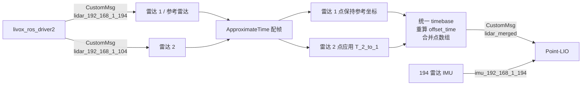
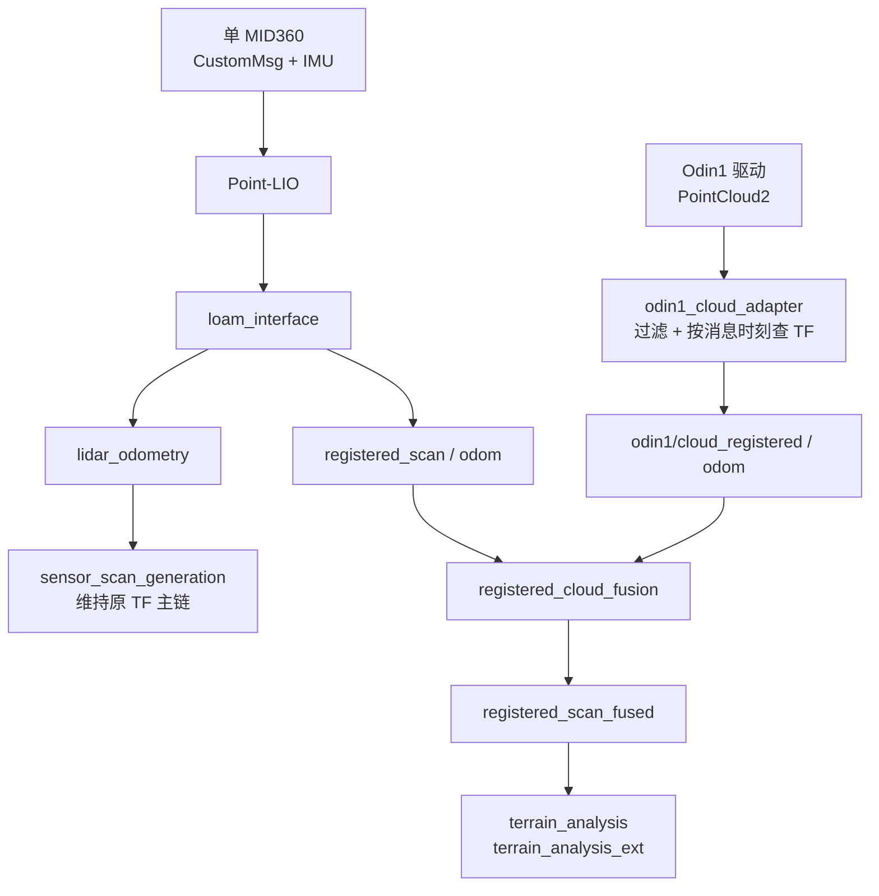

# dual_mid360_merge

`dual_mid360_merge` 是一个 ROS 2 点云融合包，用于将两台 Livox MID360 发布的
`livox_ros_driver2/msg/CustomMsg` 融合为一路点云，并供 Point-LIO 等需要逐点时间戳的
下游节点使用。

当前工程中：

- 雷达 1：`192.168.1.194`，作为参考雷达；
- 雷达 2：`192.168.1.104`，点云会通过标定外参变换到雷达 1 坐标系；
- 融合坐标系：`front_mid360`；
- 融合输出：`livox/lidar_merged`；
- Point-LIO 使用 194 雷达的 IMU：`livox/imu_192_168_1_194`。

该节点不仅拼接点数组，还会完成帧级近似时间同步、雷达 2 的刚体变换、两路点云
时间基准统一、异常逐点时间过滤，以及输出 ROS 时间戳的单调性保护。

## 1. 功能概览



节点名称和可执行文件如下：

| 项目 | 值 |
| --- | --- |
| ROS 2 包名 | `dual_mid360_merge` |
| 可执行文件 | `merge_cloud_node` |
| 默认节点名 | `merge_cloud_node` |
| 输入消息类型 | `livox_ros_driver2/msg/CustomMsg` |
| 输出消息类型 | `livox_ros_driver2/msg/CustomMsg` |

## 2. 为什么需要单独的融合节点

Livox 驱动可以连接多台雷达，但两台雷达的原始点不能直接当作同一帧使用：

1. 两台雷达具有不同的安装位置和姿态，点坐标不在同一坐标系中；
2. 两帧点云的采集起始时刻可能不同；
3. `CustomPoint.offset_time` 是相对各自 `CustomMsg.timebase` 的时间偏移，直接拼接会
   破坏逐点时间含义；
4. Point-LIO 依赖逐点时间进行去畸变和状态估计。

因此驱动使用 `multi_topic: 1` 分别发布两路 `CustomMsg`，再由本节点统一空间坐标和
逐点时间。

## 3. 依赖与构建

### 3.1 依赖

- ROS 2（本仓库按 Humble 使用）；
- `ament_cmake`；
- `rclcpp`；
- `message_filters`；
- `livox_ros_driver2`；
- Eigen3；
- `sensor_msgs`（包依赖中声明，当前节点源码未直接使用）。

`livox_ros_driver2` 必须能够生成 `CustomMsg` 和 `CustomPoint` 消息接口。建议在仓库
工作空间根目录执行构建：

```bash
source /opt/ros/humble/setup.bash
colcon build --symlink-install --packages-up-to dual_mid360_merge
source install/setup.bash
```

仅重编译本包时可以使用：

```bash
colcon build --symlink-install --packages-select dual_mid360_merge
source install/setup.bash
```

如果依赖包尚未构建，优先使用 `--packages-up-to`。

## 4. 话题与 QoS

### 4.1 默认话题

| 方向 | 话题参数默认值 | 消息类型 | 说明 |
| --- | --- | --- | --- |
| 订阅 | `livox/lidar_192_168_1_194` | `livox_ros_driver2/msg/CustomMsg` | 雷达 1，参考点云 |
| 订阅 | `livox/lidar_192_168_1_104` | `livox_ros_driver2/msg/CustomMsg` | 雷达 2，待变换点云 |
| 发布 | `livox/lidar_merged` | `livox_ros_driver2/msg/CustomMsg` | 融合结果 |

这些默认值是相对话题名。如果节点位于命名空间 `red_standard_robot1`，实际话题会是：

```text
/red_standard_robot1/livox/lidar_192_168_1_194
/red_standard_robot1/livox/lidar_192_168_1_104
/red_standard_robot1/livox/lidar_merged
```

输入和输出均使用 `rclcpp::SensorDataQoS()`，其典型特征是 best effort、volatile，并
保留有限深度的最新消息。若自行编写发布者或订阅者，应使用兼容的 QoS。

## 5. 参数说明

| 参数 | 类型 | 源码默认值 | 当前实车配置 | 说明 |
| --- | --- | --- | --- | --- |
| `lid_topic_1` | string | `livox/lidar_192_168_1_194` | 同默认值 | 参考雷达点云话题 |
| `lid_topic_2` | string | `livox/lidar_192_168_1_104` | 同默认值 | 第二雷达点云话题 |
| `output_topic` | string | `livox/lidar_merged` | 同默认值 | 融合点云输出话题 |
| `output_frame_id` | string | `front_mid360` | 同默认值 | 输出消息的 `header.frame_id` |
| `sync_queue_size` | int | `30` | `30` | 输入订阅缓存和同步器队列深度；小于 1 时按 1 使用 |
| `max_sync_slop_sec` | double | `0.05` | `0.03` | 两路 `header.stamp` 允许的最大配帧间隔，单位秒 |
| `max_point_offset_ns` | int64 | `150000000` | 使用默认值 | 重算后允许的最大逐点偏移，单位 ns，默认 150 ms |
| `output_queue_depth` | int | `30` | `30` | 输出发布队列深度；小于 1 时按 1 使用 |
| `extrinsic_cloud2_rpy` | double[3] | `[0, 0, 0]` | `[0, 1.0471975511965976, 3.141592653589793]` | 雷达 2 到雷达 1 的 RPY，单位 rad |
| `extrinsic_cloud2_xyz` | double[3] | `[0, 0, 0]` | `[-0.3204640400194386, 0, -0.18502]` | 雷达 2 原点在雷达 1 坐标系中的平移，单位 m |

参数只在节点构造时读取，目前没有动态参数更新回调。修改参数后需要重启节点。

`extrinsic_cloud2_rpy` 和 `extrinsic_cloud2_xyz` 必须各包含 3 个数。任一数组长度不为
3 时，两组外参都会保留为零值；当前实现不会为此输出单独的错误日志。

## 6. 融合算法

### 6.1 帧级近似时间同步

节点使用 `message_filters::sync_policies::ApproximateTime` 为两路输入配帧：

- 队列大小由 `sync_queue_size` 控制；
- 最大时间间隔由 `max_sync_slop_sec` 控制；
- 配帧依据是 ROS 消息的 `header.stamp`，不是 Livox 的 `timebase`；
- 只有成功配对的两帧才会进入融合回调。

减小 `max_sync_slop_sec` 可以提高帧级时间一致性，但两台设备或主机时间不同步时可能
长期无法配帧；增大该值更容易产生输出，但会增加一帧内的最大时间跨度。

### 6.2 空间坐标变换

雷达 1 被直接视为输出参考坐标系。节点只变换雷达 2 的点：

```text
p_1 = R_2_to_1 * p_2 + t_2_to_1
```

旋转矩阵的构造顺序为：

```text
R_2_to_1 = Rz(yaw) * Ry(pitch) * Rx(roll)
```

也就是参数数组按 `[roll, pitch, yaw]` 输入，分别绕 X、Y、Z 轴旋转，单位为弧度。
变换后的点会保留雷达 2 原始点的 `reflectivity`、`tag` 和 `line`。

> 该节点不查询 TF，也不会自动从 URDF 获取外参。`output_frame_id` 只设置消息标签，
> 不会触发任何坐标变换；真正的几何关系必须通过 `extrinsic_cloud2_*` 正确给出。

### 6.3 统一时间基准

每条 Livox 点云包含帧时间基准 `timebase`，每个点包含相对偏移 `offset_time`。节点取
两路输入中较早的 `timebase` 作为输出时间基准：

```text
out_base = min(msg1.timebase, msg2.timebase)
```

然后按点的绝对采集时间重算偏移：

```text
point_absolute_time = input.timebase + input.offset_time
output.offset_time  = point_absolute_time - out_base
```

计算后的偏移必须：

- 不小于 0；
- 不超过 `uint32` 的表示范围；
- 不超过 `max_point_offset_ns`。

不符合条件的点会被丢弃，并以最多每 2 秒一次的节流日志报告过滤数量。

实现上的一个细节是：当雷达 1 自身的 `timebase` 已等于 `out_base` 时，其点会直接
复制，不再执行 `max_point_offset_ns` 检查；雷达 2 的点始终会重算并检查时间偏移。

### 6.4 输出消息字段

| 字段 | 生成规则 |
| --- | --- |
| `header.frame_id` | 使用 `output_frame_id` |
| `header.stamp` | 使用雷达 1 的 ROS 时间戳，并执行单调性保护 |
| `timebase` | 两路输入 `timebase` 的较小值 |
| `point_num` | 实际保留下来的融合点数 |
| `lidar_id` | 沿用雷达 1 的 `lidar_id` |
| `rsvd` | 3 个字节全部置 0 |
| `points` | 先追加雷达 1 的点，再追加变换后的雷达 2 的点 |

融合点数组不会按 `offset_time` 再排序。因此它保持“雷达 1 点在前、雷达 2 点在后”的
分组顺序，而不是严格的采集时间顺序。

### 6.5 ROS 时间戳单调保护

输出 `header.stamp` 以雷达 1 为准，以便与 194 雷达的 IMU 时间轴保持一致。如果当前
时间戳小于或等于上一条已发布消息，节点将它改为：

```text
last_output_stamp + 1 ns
```

这样可避免 Point-LIO 将相同或回退的点云时间判断为 lidar loop back。该保护只修改
ROS `header.stamp`，不会同步修改 Livox `timebase` 或逐点 `offset_time`。

### 6.6 空点云处理

- 雷达 1 点云为空：整次融合被跳过；
- 雷达 2 点云为空：只要同步器触发，仍可发布雷达 1 的有效点；
- 时间过滤后没有任何有效点：跳过发布；
- 节点启动 5 秒后仍未发布过融合消息：输出一次诊断警告。

## 7. 当前工程配置

实车参数位于：

```text
src/spr_sentry_nav/spr_nav_bringup/config/reality/nav2_params.yaml
```

关键配置如下：

```yaml
livox_ros_driver2:
  ros__parameters:
    xfer_format: 1
    multi_topic: 1
    publish_freq: 20.0
    frame_id: front_mid360
    user_config_path: $(find-pkg-share spr_nav_bringup)/config/reality/mid360_user_config.json

merge_cloud_node:
  ros__parameters:
    use_sim_time: false
    lid_topic_1: "livox/lidar_192_168_1_194"
    lid_topic_2: "livox/lidar_192_168_1_104"
    output_topic: "livox/lidar_merged"
    output_frame_id: "front_mid360"
    sync_queue_size: 30
    max_sync_slop_sec: 0.03
    output_queue_depth: 30
    extrinsic_cloud2_rpy: [0.0, 1.0471975511965976, 3.141592653589793]
    extrinsic_cloud2_xyz: [-0.3204640400194386, 0.0, -0.18502]

point_lio:
  ros__parameters:
    common:
      lid_topic: "livox/lidar_merged"
      imu_topic: "livox/imu_192_168_1_194"
    preprocess:
      lidar_type: 1
      timestamp_unit: 3
```

驱动配置中的两个关键参数不能遗漏：

- `xfer_format: 1`：发布带逐点时间的 Livox `CustomMsg`；
- `multi_topic: 1`：两台雷达分别发布到按 IP 区分的话题。

当前 `mid360_user_config.json` 将两台雷达的驱动外参都配置为零。本节点使用自己的
`extrinsic_cloud2_*` 完成雷达 2 到雷达 1 的变换，维护时不要在驱动和融合节点中重复
应用同一组外参。

## 8. 运行方式

### 8.1 随实车导航启动

本节点已由以下实车 launch 文件启动：

- `spr_nav_bringup/launch/rm_navigation_reality_launch.py`；
- `spr_nav_bringup/launch/rm_navigation_reality_lio_launch.py`。

例如：

```bash
source /opt/ros/humble/setup.bash
source install/setup.bash
ros2 launch spr_nav_bringup rm_navigation_reality_launch.py
```

launch 会让驱动、融合节点和 Point-LIO 处于相同命名空间，并将
`config/reality/nav2_params.yaml` 中的参数传给它们。

### 8.2 单独启动节点

使用默认参数：

```bash
source /opt/ros/humble/setup.bash
source install/setup.bash
ros2 run dual_mid360_merge merge_cloud_node
```

通过命令行覆盖参数：

```bash
ros2 run dual_mid360_merge merge_cloud_node --ros-args \
  -p lid_topic_1:=livox/lidar_192_168_1_194 \
  -p lid_topic_2:=livox/lidar_192_168_1_104 \
  -p output_topic:=livox/lidar_merged \
  -p output_frame_id:=front_mid360 \
  -p sync_queue_size:=30 \
  -p max_sync_slop_sec:=0.03 \
  -p max_point_offset_ns:=150000000 \
  -p output_queue_depth:=30 \
  -p extrinsic_cloud2_rpy:="[0.0, 1.0471975511965976, 3.141592653589793]" \
  -p extrinsic_cloud2_xyz:="[-0.3204640400194386, 0.0, -0.18502]"
```

使用命名空间时，驱动和融合节点必须能解析到同一组话题。例如：

```bash
ros2 run dual_mid360_merge merge_cloud_node --ros-args -r __ns:=/red_standard_robot1
```

也可以把话题参数写成绝对名称；绝对名称不会再自动附加节点命名空间。

## 9. 外参标定与修改

### 9.1 外参方向

配置需要的是 `T_2_to_1`，即：

```text
雷达 2 坐标中的点  --T_2_to_1-->  雷达 1 / front_mid360 坐标中的点
```

若标定工具给出的是反方向 `T_1_to_2`，必须先求逆：

```text
R_2_to_1 = transpose(R_1_to_2)
t_2_to_1 = -transpose(R_1_to_2) * t_1_to_2
```

再将旋转矩阵按该节点采用的 `Rz * Ry * Rx` 约定转换成 RPY。

### 9.2 基本验证方法

修改外参后，建议使用包含墙面、立柱、地面等明显几何结构的静态场景验证：

1. 保持机器人和两台雷达静止；
2. 确认两路输入频率稳定且能持续产生融合输出；
3. 将融合结果转换或交给下游节点显示为 `PointCloud2`；
4. 检查两台雷达重叠视场中的墙面是否重合，是否出现双边、倾斜或固定平移；
5. 再进行缓慢运动测试，区分空间外参误差和时间同步误差。

常见现象：

| 现象 | 更可能的原因 |
| --- | --- |
| 静止时就有固定双影 | XYZ、RPY 数值或外参方向错误 |
| 中心附近重合，距离越远偏差越大 | 旋转外参错误 |
| 不同方向整体保持近似固定间距 | 平移外参错误 |
| 静止时正常，运动时出现拖影 | 两路时间同步、时间基或设备时钟问题 |
| 点云整体方向正确但 `frame_id` 不一致 | `output_frame_id` 或 TF 树配置错误 |

## 10. 运行检查

以下命令中的话题以无命名空间运行为例；使用导航默认命名空间时需加上
`/red_standard_robot1` 前缀。

### 10.1 检查两路输入

```bash
ros2 topic list | grep livox
ros2 topic type /livox/lidar_192_168_1_194
ros2 topic type /livox/lidar_192_168_1_104
ros2 topic hz /livox/lidar_192_168_1_194
ros2 topic hz /livox/lidar_192_168_1_104
```

两路类型都应为：

```text
livox_ros_driver2/msg/CustomMsg
```

### 10.2 检查融合输出

```bash
ros2 topic type /livox/lidar_merged
ros2 topic hz /livox/lidar_merged
ros2 topic info /livox/lidar_merged --verbose
ros2 topic echo /livox/lidar_merged --field point_num --once
ros2 topic echo /livox/lidar_merged --field header --once
```

正常情况下：

- 输出频率应接近两路输入成功配帧后的频率；
- `point_num` 通常接近两路输入有效点数之和；
- `header.frame_id` 应为 `front_mid360`；
- 日志会在首次成功发布时打印融合点数和输出话题。

### 10.3 检查节点参数

```bash
ros2 param dump /merge_cloud_node
```

若使用命名空间：

```bash
ros2 param dump /red_standard_robot1/merge_cloud_node
```

## 11. 常见问题排查

### 11.1 启动后没有 `lidar_merged`

按以下顺序检查：

1. 驱动是否使用 `xfer_format: 1`；
2. 驱动是否使用 `multi_topic: 1`；
3. 两路输入话题是否都存在且消息类型为 `CustomMsg`；
4. 驱动和融合节点的话题命名空间是否一致；
5. 两路输入的 `header.stamp` 差是否小于 `max_sync_slop_sec`；
6. 发布者和订阅者 QoS 是否兼容；
7. 是否有“融合后无有效点”或时间偏移过滤警告。

节点会在启动约 5 秒后、尚未成功发布任何融合消息时输出一次提示。该提示只输出一次，
后续仍需结合话题频率和时间戳继续排查。

### 11.2 两路输入都有频率，但同步回调不触发

`ApproximateTime` 比较的是 `header.stamp`。检查两路消息头时间是否来自同一时间源，以及
系统时钟、PTP/GPS 或 Livox 时间同步配置是否正常。可以临时适当增大
`max_sync_slop_sec` 做定位，但不应以过大的容差长期掩盖设备时钟问题。

### 11.3 大量 `over_max` 点被过滤

这说明重算后的 `offset_time` 超过 `max_point_offset_ns`。常见原因包括：

- 两台雷达的 `timebase` 不在同一时钟基准；
- 帧被错误配对；
- 配帧容差过大；
- 雷达数据或录包回放的时间字段异常。

先解决时间源和配帧问题，再谨慎调整 `max_point_offset_ns`。盲目增大阈值可能让时间上
相距很远的点进入同一帧，降低去畸变和里程计质量。

### 11.4 Point-LIO 报 lidar loop back

节点已经对输出 `header.stamp` 做单调保护。如果仍出现该问题，检查：

- 是否有其他发布者同时向 `lidar_merged` 发布；
- rosbag 是否发生循环播放或 `/clock` 回退；
- Point-LIO 实际订阅的是否为本节点输出；
- 命名空间或 remap 是否连接到了旧话题。

### 11.5 融合点云出现双影

静止时双影通常来自外参；运动时才明显的双影更可能来自时间问题。还需确认没有同时在
Livox 驱动和本节点中应用同一组外参，否则雷达 2 会被重复变换。

### 11.6 RViz 无法直接显示输出

本节点发布的是 Livox `CustomMsg`，不是 `sensor_msgs/msg/PointCloud2`。标准 RViz 点云
显示通常不能直接订阅该类型，需要使用 Point-LIO 的点云输出或额外的 CustomMsg 到
PointCloud2 转换节点。不要仅为了显示而把驱动改成 `xfer_format: 0`，否则当前
Point-LIO 链路会失去所需的 Livox 逐点时间格式。

## 12. 已知限制与维护注意事项

- 仅支持两路 `livox_ros_driver2/msg/CustomMsg`；
- 雷达 1 固定作为参考坐标和输出 ROS 时间轴；
- 只变换雷达 2，不处理雷达 1 到其他机体坐标系的变换；
- 不读取 TF/URDF，外参完全依赖节点参数；
- 外参和同步参数不支持运行时动态更新；
- 点数组在合并后不按逐点时间排序；
- 不做体素降采样、重叠点去重、盲区过滤或运动补偿；
- 不检查坐标是否为 NaN/Inf；
- `lidar_id` 只保留雷达 1 的值，融合后不能通过该字段区分点的来源；
- `line`、`tag` 和 `reflectivity` 原样保留，但没有新增字段标记来源雷达；
- `header.stamp` 的单调修正和 Livox 逐点时间是两套独立机制；
- 参数值缺少完整的范围校验，配置时应保证同步容差和时间阈值为非负数。

修改算法时，应至少回归以下内容：

1. 单台输入断流后是否符合预期；
2. 两路 `timebase` 先后关系互换时，逐点绝对时间是否保持不变；
3. 非零旋转和平移是否符合 `T_2_to_1` 方向；
4. 过滤后的 `point_num` 是否等于 `points.size()`；
5. 输出 `header.stamp` 是否严格递增；
6. Point-LIO 是否能持续处理且不出现时间回退；
7. 命名空间下的相对话题是否正确解析。

## 13. 后续将一台 MID360 替换为 Odin1

> 本节是后续改造规划，不代表相关功能已经在当前仓库中实现。当前仓库尚未包含
> `odin1_ros2_driver`、`odin1_cloud_adapter`、`registered_cloud_fusion` 或
> `mid360_odin1_merge`。接入前必须根据实际 Odin1 固件和驱动分支重新确认包名、话题、
> 消息字段、时间单位及 TF 行为。

### 13.1 改造目标与推荐边界

以下方案假设：

- 保留当前参考雷达 `192.168.1.194`，移除 `192.168.1.104`；
- 保留雷达坐标系 `front_mid360`；
- Point-LIO 继续使用保留 MID360 的点云和内置 IMU；
- Odin1 首阶段只作为辅助点云传感器，扩展近场障碍物和地形感知；
- Odin1 掉线不能影响 Point-LIO、TF 主链和 Nav2 的基本运行。

如果实际保留的是 `192.168.1.104`，必须同时重新确认参考坐标系、MID360–IMU 外参和
Odin1 安装外参，不能只交换两个 IP。

推荐首阶段采用“定位后融合”：



该方案中，`dual_mid360_merge` 不再位于运行链路内。原因是它的两路输入都固定为 Livox
`CustomMsg`，而 Odin1 通常输出 `sensor_msgs/msg/PointCloud2`；同时 Odin1 当前驱动的
逐点时间语义还需要单独验证，不能仅通过话题 remap 直接替代第二路 MID360。

### 13.2 为什么不建议首版直接让 Odin1 参与 Point-LIO

Livox `CustomMsg` 为每个点提供相对 `timebase` 的纳秒级 `offset_time`，当前融合节点和
Point-LIO 都依赖这一信息进行帧内运动补偿。Odin1 点云即使包含同名字段，也必须先确认：

- 字段是否真的被驱动逐点填写，而不是全 0；
- 单位是秒、毫秒、微秒还是纳秒；
- `header.stamp` 表示帧起始、帧结束还是主机接收时刻；
- 一帧内时间偏移是否单调且与实际帧周期一致；
- 过滤无效点后，时间字段与点数据是否仍一一对应；
- 设备重连或切换时间模式后是否出现回退。

在这些条件没有验证前，把 Odin1 点伪装成 Livox 点会造成错误去畸变，运动时可能表现为
地图分层、拖影、残差增大、里程计抖动甚至滤波器发散。因此推荐让单 MID360 保持唯一
的 LIO 输入，先在 `odom` 坐标系中融合 Odin1 作为感知补充。

### 13.3 需要修改和新增的文件

| 类型 | 文件或包 | 改动 |
| --- | --- | --- |
| 新增 | `spr_nav_bringup/config/reality/mid360_single_user_config.json` | 只保留一台 MID360 的网络配置 |
| 新增 | `spr_nav_bringup/config/reality/mid360_odin1_params.yaml` | 单 MID360、Odin1、适配和融合参数 |
| 新增 | `spr_nav_bringup/launch/rm_navigation_reality_mid360_odin1_launch.py` | 独立的新硬件启动入口，保留旧方案便于回滚 |
| 修改 | `spr_nav_bringup/package.xml` | 增加 Odin1 驱动和新适配包的运行依赖 |
| 修改 | `spr_nav_bringup/launch/navigation_launch.py` | 仅将两个地形分析节点 remap 到融合注册点云 |
| 修改 | `spr_robot_description/resource/xmacro/spr2025_sentry_robot.sdf.xmacro` | 删除第二台 MID360 模型，加入 Odin1 固定安装 TF |
| 按需修改 | `odin1_ros2_driver/src/odin1_driver.cpp` | 禁止驱动在关闭里程计时仍发布 `map -> odom`，参数化 frame 和时间行为 |
| 新增包 | `odin1_cloud_adapter` | 清洗 Odin1 点云并变换到 `odom` |
| 新增包 | `registered_cloud_fusion` | 融合两路已在 `odom` 下的 `PointCloud2`，支持辅助传感器掉线降级 |
| 实验性新增包 | `mid360_odin1_merge` | 仅在 Odin1 逐点时间可靠后，用于 LIO 前的异构消息融合 |
| 可选新增包 | `odin1_imu_adapter` | 仅在改用 Odin1 IMU 时处理轴向、单位、时间和协方差 |

推荐新增一套配置和 launch，而不是直接覆盖当前双 MID360 文件。这样可以通过选择不同
launch 快速切换和回滚，也不会让旧配置中残留不存在的话题。

### 13.4 将 Livox 驱动改为单 MID360

在新的 `mid360_single_user_config.json` 中删除 `192.168.1.104`，只保留
`192.168.1.194`。保留后的核心结构应类似：

```json
{
  "lidar_summary_info": {
    "lidar_type": 8
  },
  "MID360": {
    "lidar_net_info": {
      "cmd_data_port": 56100,
      "push_msg_port": 56200,
      "point_data_port": 56300,
      "imu_data_port": 56400,
      "log_data_port": 56500
    },
    "host_net_info": {
      "cmd_data_ip": "192.168.1.50",
      "cmd_data_port": 56101,
      "push_msg_ip": "192.168.1.50",
      "push_msg_port": 56201,
      "point_data_ip": "192.168.1.50",
      "point_data_port": 56301,
      "imu_data_ip": "192.168.1.50",
      "imu_data_port": 56401,
      "log_data_ip": "",
      "log_data_port": 56501
    }
  },
  "lidar_configs": [
    {
      "ip": "192.168.1.194",
      "pcl_data_type": 1,
      "pattern_mode": 0,
      "extrinsic_parameter": {
        "roll": 0.0,
        "pitch": 0.0,
        "yaw": 0.0,
        "x": 0,
        "y": 0,
        "z": 0
      }
    }
  ]
}
```

需要确认 `192.168.1.50` 仍是运行驱动的实际主机网卡地址，并检查 Odin1 使用的接口、
网段和端口不会与 Livox UDP 端口冲突。

将 Livox 参数改为单设备共享话题模式：

```yaml
livox_ros_driver2:
  ros__parameters:
    xfer_format: 1
    multi_topic: 0
    data_src: 0
    publish_freq: 20.0
    frame_id: front_mid360
    user_config_path: $(find-pkg-share spr_nav_bringup)/config/reality/mid360_single_user_config.json
```

此时输入话题由带 IP 后缀的名称变为：

```text
livox/lidar
livox/imu
```

新的参数文件中应删除 `merge_cloud_node` 参数块，新 launch 中也不要启动
`dual_mid360_merge`。否则节点会持续等待已移除的第二路 MID360，Point-LIO 若仍订阅
`livox/lidar_merged` 就不会收到数据。

### 13.5 Point-LIO 改为单 MID360 输入

将 Point-LIO 输入改为：

```yaml
point_lio:
  ros__parameters:
    common:
      lid_topic: "livox/lidar"
      imu_topic: "livox/imu"
    preprocess:
      lidar_type: 1
      scan_line: 4
      timestamp_unit: 3
```

初期保留当前 MID360 的 `mapping.extrinsic_T`、`mapping.extrinsic_R` 和
`time_diff_lidar_to_imu`，但必须重新验证它们确实表示保留 MID360 与其内置 IMU 的关系。
这些参数不能替换为 Odin1 安装外参，因为首阶段 Odin1 不参与 Point-LIO。

### 13.6 接入 Odin1 驱动

假设后续采用的驱动包名为 `odin1_ros2_driver`、可执行文件为
`odin1_ros2_driver_node`，初始参数建议只开启原始 DTOF 点云：

```yaml
odin1_ros2_driver:
  ros__parameters:
    start_stream_on_attach: 1
    sendrgb: 0
    sendimu: 0
    sendodom: 0
    senddtof: 1
    sendcloudslam: 0
    sendcloudrender: 0
    sendrgbcompressed: 0
    sendpath: 0
    senddepth: 0
    recorddata: 0
    custom_map_mode: 0
    use_host_ros_time: 1
    tf_base_frame: ""
    sensor_frame: "odin1_base_link"
```

设计意图如下：

- `senddtof: 1`：只开启用于感知的原始点云；
- `sendimu: 0`：Point-LIO 继续使用 MID360 IMU；
- `sendodom: 0`、`sendpath: 0`、`sendcloudslam: 0`：不引入第二套定位结果；
- 不需要的图像和渲染点云保持关闭，降低 USB、CPU 和 DDS 负载；
- `use_host_ros_time: 1`：初次联调先使用主机 ROS 时间，之后再依据实测决定是否切换 PTP；
- `sensor_frame: odin1_base_link`：必须与整车 TF 树中的 frame 完全一致。

某些 Odin1 驱动版本即使 `sendodom: 0`，初始化时仍可能发布静态 `map -> odom`。应检查
实际驱动源码；如果存在类似逻辑：

```cpp
if (custom_map_mode_ != 2) {
  publishStaticMapToOdomTF();
}
```

至少改为：

```cpp
if (sendodom_ && custom_map_mode_ != 2) {
  publishStaticMapToOdomTF();
}
```

更稳妥的长期方案是增加独立 `publish_tf` 参数，并让驱动所有定位相关 TF 都受它控制。
系统中只能有一套主定位 `map -> odom` 和 `odom -> base_footprint` 发布者。

在新的实车 launch 中只启动 Odin1 驱动节点，不要包含其自带的整套
`robot_state_publisher` launch：

```python
start_odin1_driver_node = Node(
    package="odin1_ros2_driver",
    executable="odin1_ros2_driver_node",
    name="odin1_ros2_driver",
    output="screen",
    namespace=namespace,
    parameters=[configured_params],
)
```

整车只保留 `spr_robot_description` 提供的唯一机器人模型和静态 TF 树。

### 13.7 修改机器人模型与 TF

在 `spr2025_sentry_robot.sdf.xmacro` 中：

1. 保留 `prefix="front_"` 的 MID360；
2. 删除或注释 `prefix="other_"` 的第二台 MID360；
3. 新增 `odin1_base_link`；
4. 使用 fixed joint 将它连接到真实刚性安装父坐标系。

示意结构：

```xml
<link name="odin1_base_link">
  <!-- 可先使用无 visual/collision 的占位 link -->
</link>

<joint name="odin1_mount_joint" type="fixed">
  <parent>base_footprint</parent>
  <child>odin1_base_link</child>
  <pose>X Y Z ROLL PITCH YAW</pose>
</joint>
```

实际文件使用 SDF/xmacro，需按现有宏展开方式实现。父坐标系必须反映真实安装关系：

- 固定在底盘：连接到 `base_footprint` 或对应底盘刚性 link；
- 固定在云台：连接到 `gimbal_yaw`；
- 不得直接连接到 `map` 或 `odom`。

`X Y Z ROLL PITCH YAW` 必须来自机械测量和点云外参标定。坐标轴建议统一验证为 x 前、
y 左、z 上。不要同时在驱动、URDF/SDF 和适配节点中重复施加同一旋转。

### 13.8 新增 `odin1_cloud_adapter`

Odin1 原始点云位于传感器坐标系，不能直接与 Point-LIO 已注册到 `odom` 的点云拼接。
新包建议提供：

```text
订阅：odin1/cloud_raw          sensor_msgs/msg/PointCloud2
发布：odin1/cloud_filtered     sensor_msgs/msg/PointCloud2
发布：odin1/cloud_registered   sensor_msgs/msg/PointCloud2
目标 frame：odom
```

节点至少应实现：

1. 检查时间戳有效性和单调性；
2. 去除 NaN、Inf、零距离和机身自反射点；
3. 字段存在时按 `confidence` 过滤低置信度点；
4. 按距离和高度裁剪；
5. 可配置体素降采样；
6. 查询消息时刻的 `odom <- odin1_base_link` TF；
7. 将点云变换到 `odom`，并保留原始消息时间戳；
8. 统计 TF 失败、消息延迟和输入/输出点数；
9. 使用兼容传感器数据的 QoS。

初始参数可采用：

```yaml
odin1_cloud_adapter:
  ros__parameters:
    input_topic: "odin1/cloud_raw"
    filtered_topic: "odin1/cloud_filtered"
    registered_topic: "odin1/cloud_registered"
    target_frame: "odom"
    min_range: 0.20
    max_range: 30.0
    min_z: -1.0
    max_z: 2.5
    confidence_min: 35
    voxel_leaf_size: 0.05
    tf_timeout_sec: 0.05
    max_message_age_sec: 0.20
```

这些阈值仅用于首次联调，必须用实车 rosbag 调整。TF 查询必须使用消息对应时刻，不能
总取最新 TF，否则车辆运动时会产生与速度相关的点云拖影。

### 13.9 新增 `registered_cloud_fusion`

该节点只处理已经统一到 `odom` 的两路 `PointCloud2`：

```text
订阅 1：registered_scan
订阅 2：odin1/cloud_registered
发布：  registered_scan_fused
```

建议参数：

```yaml
registered_cloud_fusion:
  ros__parameters:
    primary_topic: "registered_scan"
    auxiliary_topic: "odin1/cloud_registered"
    output_topic: "registered_scan_fused"
    output_frame: "odom"
    sync_queue_size: 20
    max_sync_slop_sec: 0.05
    auxiliary_timeout_sec: 0.20
    publish_primary_when_aux_missing: true
    voxel_leaf_size: 0.05
```

实现时应满足：

- MID360/Point-LIO 点云是主输入和输出时间基准；
- 两路输入 `frame_id` 必须都是 `odom`；
- 对字段布局做显式归一，至少保留 `x/y/z/intensity`；
- 近似同步后拼接并按需降采样；
- Odin1 缺失、超时或异常时，继续发布主 MID360 点云；
- 输出同步时间差、点数和降级状态诊断。

只把需要扩大感知视野的 `terrain_analysis` 和 `terrain_analysis_ext` remap 到
`registered_scan_fused`：

```python
remappings=[("registered_scan", "registered_scan_fused")]
```

`sensor_scan_generation` 必须继续读取原始 `registered_scan`。它需要先基于 MID360 的
注册点云和里程计发布 `odom -> base_footprint`；`odin1_cloud_adapter` 又依赖这条 TF。
如果让 `sensor_scan_generation` 等待融合点云，会形成启动环路：

```text
sensor_scan_generation 等待 registered_scan_fused
  -> odom 到机器人本体的动态 TF 尚未建立
  -> Odin1 点云无法变换到 odom
  -> registered_cloud_fusion 等不到 Odin1 注册点云
  -> registered_scan_fused 无法生成
```

### 13.10 时间同步策略

Odin1 时间模式应按实际驱动验证。若驱动支持下列模式，可按以下顺序推进：

| 模式 | 含义 | 建议 |
| --- | --- | --- |
| 设备时间 | 直接使用 Odin1 设备时钟 | 只有确认与 MID360/主机同一时钟域后使用 |
| 主机 ROS 时间 | 使用主机收到数据的时间 | 首次联调使用，简单但包含 USB 和调度延迟 |
| PTP 校正时间 | 设备时间加已估计的 PTP 偏移 | PTP 部署并验证后优先使用 |

至少用 rosbag 统计：

- Odin1 与 MID360 最近帧时间差的均值、标准差和最大值；
- 是否出现时间戳重复或回退；
- 设备重连后时间是否跳变；
- 高 CPU 和高 USB 负载时接收延迟是否明显增加。

`registered_cloud_fusion.max_sync_slop_sec` 可以从 50 ms 开始联调，但最终应根据记录结果
尽量缩小。窗口过大会把不同运动时刻的点放在同一输出中，机器人旋转时尤其明显。

### 13.11 如果以后必须让 Odin1 参与 Point-LIO

这是第二阶段的实验性方案。不能复用当前 `dual_mid360_merge`，应新建
`mid360_odin1_merge`，因为两路消息类型和逐点字段不同：

```text
livox/lidar             Livox CustomMsg -------┐
                                               ├-> mid360_odin1_merge
odin1/cloud_raw         PointCloud2 -----------┘          |
                                                          v
                                              livox/lidar_merged CustomMsg
                                                          |
                                                          v
                                                      Point-LIO
```

首先修正并验证 Odin1 驱动的逐点时间，然后融合节点至少需要：

- 以 MID360 消息作为主时基进行近似同步；
- 查询并应用 `front_mid360 <- odin1_base_link` 静态外参；
- 将 Odin1 点转换成 Livox `CustomPoint`；
- 将两路点统一到相同 `timebase`，并把 Odin1 逐点时间转换为纳秒偏移；
- 检查负偏移、`uint32` 溢出和最大帧内偏移；
- Odin1 时间异常或掉线时自动降级为单 MID360；
- 保持输出 `header.stamp` 严格单调；
- 明确是否按逐点时间排序，以及 Point-LIO 对 `line` 字段的实际要求。

字段映射建议：

| Odin1 字段 | Livox 字段 | 处理 |
| --- | --- | --- |
| `x/y/z` | `x/y/z` | 先应用外参再写入 |
| `intensity` | `reflectivity` | 标定量程后缩放并钳位到 0～255 |
| 逐点时间 | `offset_time` | 转换为相对共同 `timebase` 的 ns |
| 无直接对应字段 | `tag` | 填 0 |
| 可靠的扫描线/行号 | `line` | 能映射时填写，否则填 0 并验证 Point-LIO 兼容性 |
| `confidence` | 无 | 融合前过滤，不写入 `CustomPoint` |

完成后 Point-LIO 才可重新改为：

```yaml
point_lio:
  ros__parameters:
    common:
      lid_topic: "livox/lidar_merged"
      imu_topic: "livox/imu"
```

必须用相同路线对比“单 MID360”和“MID360 + Odin1”的里程计漂移、平面残差、地图重影、
CPU、内存和 DDS 带宽。只有确认融合带来稳定收益后，才能替换推荐的定位后融合方案。

### 13.12 如果改用 Odin1 IMU

默认不建议改用，因为这会额外引入跨设备时间同步和 LiDAR–IMU 标定。确有需要时：

1. 开启 Odin1 的 `sendimu`；
2. 使用唯一 frame 名，例如 `odin1_imu_link`；
3. 在整车模型中补齐 `odin1_base_link -> odin1_imu_link`；
4. 标定 `front_mid360 -> odin1_imu_link` 的旋转和平移；
5. 将标定值写入 Point-LIO 的 `extrinsic_T` 和 `extrinsic_R`；
6. 标定 `time_diff_lidar_to_imu`；
7. 实测加速度单位后确定 `acc_norm` 是 `1.0` 还是 `9.81`；
8. 检查三轴方向、角速度符号、协方差和时间戳；
9. 必要时新增 `odin1_imu_adapter` 做单位和轴向转换。

驱动填入的单位四元数不能自动视为真实姿态。Point-LIO 主要使用角速度和线加速度，
但这些量的单位、符号、外参和时间仍必须全部正确。

### 13.13 推荐实施顺序

1. 新建配置和 launch，保留双 MID360 方案不动；
2. 只启用单 MID360，验收 Point-LIO、`registered_scan` 和 TF 主链；
3. 单独启动 Odin1，验收原始点云字段、频率、时间戳和 frame；
4. 加入 Odin1 静态安装 TF，确认 TF 树无重复发布者；
5. 启用 `odin1_cloud_adapter`，静止和运动时检查固定障碍物是否稳定；
6. 启用 `registered_cloud_fusion`，验证两路点云重合；
7. 仅将地形分析切换到 `registered_scan_fused`；
8. 主动停止 Odin1，确认系统自动降级且定位、TF 和 Nav2 不中断；
9. 记录资源占用和 rosbag，再调整过滤、体素和同步窗口；
10. 最后才评估是否值得让 Odin1 参与 Point-LIO。

### 13.14 构建与验收清单

新增包完成后，至少构建：

```bash
colcon build --symlink-install --packages-select \
  livox_ros_driver2 \
  odin1_ros2_driver \
  odin1_cloud_adapter \
  registered_cloud_fusion \
  spr_robot_description \
  spr_nav_bringup
```

最终应满足：

- [ ] 新 Livox JSON 中只有保留的 MID360；
- [ ] Livox 使用 `multi_topic: 0`，发布 `livox/lidar` 和 `livox/imu`；
- [ ] Point-LIO 不再依赖 `livox/lidar_merged`；
- [ ] 新 launch 不启动 `dual_mid360_merge`；
- [ ] 原双 MID360 配置和 launch 仍可用于回滚；
- [ ] Odin1 不发布第二套 `map -> odom` 或 `odom -> base_footprint`；
- [ ] 只有整车 `robot_state_publisher` 发布 `odin1_base_link` 安装 TF；
- [ ] Odin1 点云的 frame、字段、频率和时间模式已按实际驱动验证；
- [ ] `odin1/cloud_registered` 位于 `odom`，运动时静态障碍物不漂移；
- [ ] `registered_scan_fused` 能在 Odin1 缺失时退化为主 MID360 点云；
- [ ] `sensor_scan_generation` 仍读取原始 `registered_scan`；
- [ ] 地形分析读取 `registered_scan_fused`，没有重复订阅两路相同障碍物；
- [ ] TF 树无重复父节点、无循环、无多发布者争用；
- [ ] 已验证时间差、时间戳单调性和设备重连行为；
- [ ] 已在静止、直线、快速旋转和颠簸路面测试点云重影；
- [ ] 已比较改造前后的 CPU、内存、USB 和 DDS 带宽；
- [ ] 若 Odin1 参与 LIO，逐点时间已被真实修复和验证，而不是简单填 0。

推荐方案的故障边界应始终保持为：

```text
MID360 决定 Point-LIO 定位是否可用；
Odin1 扩展环境感知，但 Odin1 故障不应拖垮 Point-LIO 和 Nav2。
```

更完整的 Odin1 驱动行为分析也可参考同仓库中的
`livox_ros_driver2/MODIFICATIONS_FROM_UPSTREAM.md` 第 19 节。

## 14. 相关文件

| 文件 | 作用 |
| --- | --- |
| `dual_mid360_merge/src/dual_mid360_merge.cpp` | 融合节点实现 |
| `dual_mid360_merge/CMakeLists.txt` | 构建和安装可执行文件 |
| `dual_mid360_merge/package.xml` | ROS 2 包依赖声明 |
| `spr_nav_bringup/config/reality/nav2_params.yaml` | 当前实车驱动、融合和 Point-LIO 参数 |
| `spr_nav_bringup/config/reality/mid360_user_config.json` | 两台 MID360 的 IP 和网络配置 |
| `spr_nav_bringup/launch/rm_navigation_reality_launch.py` | 实车导航启动入口 |
| `spr_nav_bringup/launch/rm_navigation_reality_lio_launch.py` | 实车 LIO 导航启动入口 |
| `spr_nav_bringup/launch/navigation_launch.py` | 地形分析、点云和 TF 链路启动配置 |
| `spr_robot_description/resource/xmacro/spr2025_sentry_robot.sdf.xmacro` | 当前双 MID360 模型及后续 Odin1 安装 TF 修改位置 |
| `point_lio/config/mid360.yaml` | Point-LIO 的 MID360 基础配置 |
| `livox_ros_driver2/MODIFICATIONS_FROM_UPSTREAM.md` | 驱动改动说明及 Odin1 迁移方案的详细背景 |
