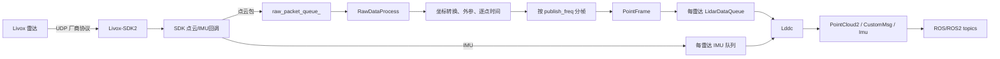
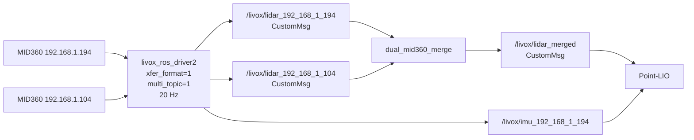

# livox_ros_driver2 相对官方源码的修改说明

## 1. 文档目的

本文档说明当前仓库中的 `livox_ros_driver2` 相比 Livox 官方版本做了哪些修改、每项修改解决了什么实际问题，以及这些修改在本项目双 MID360 + Point-LIO 导航链路中如何使用。

需要特别区分两层改动：

1. **驱动包自身的修改**：双格式发布、IMU 外参旋转、ROS2 专用化、内置 SDK 等。
2. **当前整车工程的适配**：两台 MID360 的 IP、20 Hz 多话题发布、双雷达融合、时间戳保护以及 Point-LIO 接线等。

第二层中有一部分代码位于 `dual_mid360_merge` 和 `spr_nav_bringup`，并不在 `livox_ros_driver2` 内，但它们决定了实车运行时如何使用这个驱动，因此也在本文中一并说明。

---

## 2. 对比基线和版本关系

当前代码来源关系大致如下：

```text
Livox 官方 livox_ros_driver2 1.2.3
        │
        ├── 双格式发布、IMU 外参处理、ROS2 裁剪、构建调整
        ├── 合入与官方 1.2.4 相同/接近的分帧性能优化
        ▼
北极熊战队 livox_ros_driver2 fork
        │
        ├── 当前工作区进一步修改双雷达 IP
        ├── RViz 改为双雷达多话题、20 Hz
        ▼
当前 SPR_Sentry_27 工作区版本
```

从源码内容看，当前驱动核心最接近 Livox 官方 `1.2.4`，但版本标识存在不一致：

- `src/include/livox_ros_driver2.h` 中运行时版本为 `1.2.4`；
- `CHANGELOG.md` 最高记录到 `1.2.4`；
- `package.xml` 中包版本为 `1.1.0`；
- 战队仓库对应标签也为 `1.1.0`。

因此，排查问题时不要只根据 `package.xml` 的 `1.1.0` 判断官方基线，应以实际代码内容为准。

相关上游链接：

- 官方仓库：<https://github.com/Livox-SDK/livox_ros_driver2>
- 官方 `1.2.4`：<https://github.com/Livox-SDK/livox_ros_driver2/tree/1.2.4>
- 战队 fork：<https://github.com/SMBU-PolarBear-Robotics-Team/livox_ros_driver2>

---

## 3. Livox 官方原驱动详细讲解

本章先说明未经本项目定制时，Livox 官方 `livox_ros_driver2` 的职责、模块划分和完整数据路径。理解这一部分后，才能明确后续章节中的修改发生在哪一层、改变了哪一步。

### 3.1 原驱动要解决的问题

MID360 等 Livox 雷达通过以太网发送厂商协议数据包，ROS2 节点不能直接消费这些二进制网络包。官方驱动位于 Livox-SDK2 与 ROS/ROS2 生态之间，主要完成以下工作：

1. 读取 JSON 网络和雷达配置；
2. 调用 Livox-SDK2 发现、连接和配置雷达；
3. 接收点云与 IMU 网络包；
4. 把原始点转换为统一的米制笛卡尔坐标；
5. 按指定频率把连续网络包切成点云帧；
6. 把帧送入每台雷达各自的缓存队列；
7. 将缓存帧编码为 ROS 消息；
8. 根据单话题或多话题设置发布点云和 IMU。

原驱动本质上同时承担了三种角色：

```text
设备管理器 + 数据解码/分帧器 + ROS 消息发布器
```

它不是 SLAM、点云配准或多雷达融合算法。官方驱动可以接收多台雷达，但它不会自动求取两台雷达之间的外参，也不会把异步的两台雷达严格融合成一帧适合 LIO 的统一点云。

### 3.2 原驱动的模块划分

| 模块/类 | 主要文件 | 原始职责 |
| --- | --- | --- |
| `DriverNode` | `src/livox_ros_driver2.cpp`、`src/driver_node.cpp` | 创建 ROS 节点、读取参数、管理点云和 IMU 发布线程 |
| `LdsLidar` | `src/lds_lidar.cpp` | 解析配置、初始化 SDK、注册 SDK 回调、管理 Livox 雷达数据源 |
| `LivoxLidarCallback` | `src/call_back/livox_lidar_callback.cpp` | 响应设备上线，设置工作模式、点类型、扫描模式、盲区、双回波和 IMU |
| `PubHandler` | `src/comm/pub_handler.cpp` | 接收 SDK 网络包、解析时间、转换点、应用点云外参、按频率分帧 |
| `LidarPubHandler` | `src/comm/pub_handler.cpp` | 保存单台雷达当前帧中的点并完成坐标转换 |
| `Lds` | `src/lds.cpp` | 把分好的点云帧和 IMU 数据放入每台雷达各自的队列 |
| `LidarDataQueue` | `src/comm/ldq.cpp` | 点云帧环形队列，连接生产线程和 ROS 发布线程 |
| `LidarImuDataQueue` | `src/comm/lidar_imu_data_queue.cpp` | IMU 消息队列 |
| `Lddc` | `src/lddc.cpp` | 从队列取帧、生成 ROS 消息、选择话题并发布 |
| 配置解析器 | `src/parse_cfg_file/` | 使用 RapidJSON 解析网络配置、雷达列表和外参 |
| 消息定义 | `msg/CustomMsg.msg`、`msg/CustomPoint.msg` | 定义 Livox 自有点云消息格式 |

可以把这些模块归纳为四层：

```text
ROS 节点层：DriverNode
    ↓
设备和 SDK 层：LdsLidar + LivoxLidarCallback
    ↓
点云处理层：PubHandler + LidarPubHandler + Lds + Queue
    ↓
ROS 发布层：Lddc
```

### 3.3 原驱动启动过程

ROS2 启动文件创建 `livox_ros_driver2_node` 后，原驱动按以下顺序工作：

1. `DriverNode` 构造并打印驱动版本；
2. 声明并读取 ROS 参数；
3. 把 `publish_freq` 限制到 `0.5~100 Hz`；
4. 创建 `Lddc`，把消息格式、话题模式、发布频率和 `frame_id` 交给它；
5. 读取 `user_config_path`；
6. 获取 `LdsLidar` 单例并注册到 `Lddc`；
7. `LdsLidar` 解析 JSON 配置；
8. 调用 `LivoxLidarSdkInit(config_path)` 初始化 SDK2；
9. 为配置中的每个 IP 分配内部索引并缓存外参；
10. 注册设备状态、点云和 IMU 回调；
11. SDK 发现设备后，异步下发雷达工作参数并切换到正常工作模式；
12. 创建点云发布线程和 IMU 发布线程；
13. 两个发布线程启动时先等待约 3 秒，再分别消费点云队列和 IMU 队列。

这个过程说明：ROS 节点成功启动不等于雷达已经进入采样状态。只有 SDK 发现设备、设备参数设置完成、连接状态进入 `kConnectStateSampling` 后，`Lddc` 才会从该设备队列取数据并发布。

### 3.4 原驱动的 ROS 参数

官方 ROS2 节点的主要参数如下：

| 参数 | 默认值 | 含义 |
| --- | --- | --- |
| `xfer_format` | `0` | 点云 ROS 消息格式 |
| `multi_topic` | `0` | 所有雷达共用话题，或每台雷达独立话题 |
| `data_src` | `0` | 数据来源；`0` 表示实时雷达 |
| `publish_freq` | `10.0` | 点云分帧和发布频率，范围被限制为 `0.5~100 Hz` |
| `output_data_type` | `0` | 输出到 ROS 或其他输出方式；ROS2 主要使用 `0` |
| `frame_id` | `frame_default` | 写入点云消息头的坐标系名称 |
| `user_config_path` | `path_default` | Livox JSON 配置文件路径 |
| `cmdline_input_bd_code` | `000000000000001` | 旧设备发现/广播码相关兼容参数 |
| `lvx_file_path` | `/home/livox/livox_test.lvx` | LVX 文件数据源相关参数；当前实时 MID360 路径不使用 |

其中最影响输出行为的是 `xfer_format`、`multi_topic`、`publish_freq`、`frame_id` 和 `user_config_path`。

### 3.5 原驱动 JSON 配置结构

MID360 配置大致分为三层：

```json
{
  "lidar_summary_info": {},
  "MID360": {
    "lidar_net_info": {},
    "host_net_info": {}
  },
  "lidar_configs": []
}
```

#### `lidar_summary_info`

用于告诉驱动要初始化哪一类雷达协议。MID360 配置使用 Livox LiDAR 类型位。

#### `MID360.lidar_net_info`

描述雷达侧命令、状态推送、点云、IMU 和日志使用的 UDP 端口。

#### `MID360.host_net_info`

描述上位机用于接收对应数据的 IP 和端口。这里的 IP 必须是上位机连接雷达网段的实际网卡地址，而不是雷达 IP。

#### `lidar_configs`

这是雷达设备列表，每项至少通过 `ip` 标识一台雷达。可选字段包括：

| 字段 | 含义 |
| --- | --- |
| `ip` | 雷达 IP，也是驱动内部 handle 的来源 |
| `pcl_data_type` | 雷达输出的原始点类型，例如高精度笛卡尔坐标 |
| `pattern_mode` | 扫描模式 |
| `blind_spot_set` | 盲区距离配置 |
| `dual_emit_en` | 双回波开关 |
| `extrinsic_parameter` | 安装外参 RPY 和 XYZ |

缺少可选字段时，解析器一般将对应配置记为 `-1` 或使用零外参，表示不主动下发该项或采用默认值。

原驱动 `1.2.4` 要求 `lidar_configs` 存在且至少含一项有效 IP。官方后续版本才修复“省略全部配置项时没有点云输出”的问题。

### 3.6 设备发现与配置状态机

SDK 发现雷达或设备信息发生变化时，会进入 `LidarInfoChangeCallback()`。原驱动随后执行：

1. 根据 SDK handle 查找内部 `LidarDevice`；
2. 若设备在 JSON 中有配置，则按需下发点类型、扫描模式、盲区和双回波；
3. 把安装姿态通过 `SetLivoxLidarInstallAttitude()` 下发给设备；
4. 把雷达工作模式切换到 `kLivoxLidarNormal`；
5. 调用 `EnableLivoxLidarImuData()` 开启内置 IMU；
6. 每项异步设置成功后清除对应 `set_bits`；
7. 所有待设置位清空后，将设备状态置为 `kConnectStateSampling`。

如果设置工作模式或其他参数超时，部分回调会再次发起设置请求。因此启动阶段看到数次 retry 日志，不一定代表最终连接失败。

原驱动使用 `CacheIndex` 把“雷达协议类型 + handle”映射到固定数组索引。每个索引对应一个 `LidarDevice`，其中包含连接状态、点云队列、IMU 队列和该雷达的配置。

### 3.7 原驱动完整数据流



这是一条多级生产者—消费者链路：

- SDK 回调负责尽快接收数据，避免在网络回调中做完整 ROS 消息构造；
- `RawDataProcess` 专门进行点解析和分帧；
- `Lds` 把帧复制到按雷达区分的缓存；
- `Lddc` 的两个线程负责生成并发布 ROS 点云和 IMU 消息。

这种设计把网络接收和 ROS 发布解耦。ROS 订阅者短暂变慢时，网络回调不会直接被发布过程阻塞，但缓存满时仍可能丢弃新的帧。

### 3.8 原始网络包如何变成统一点

SDK 的点云回调收到 `LivoxLidarEthernetPacket` 后，原驱动先区分 IMU 包和点云包。

点云包会被整理成内部 `RawPacket`，主要字段包括：

| 字段 | 作用 |
| --- | --- |
| `handle` | 标识来自哪台雷达 |
| `data_type` | 高精度笛卡尔、低精度笛卡尔或球坐标 |
| `point_num` | 当前网络包的点数 |
| `line_num` | 激光线数，MID360 为 4 |
| `time_stamp` | 当前包的起始时间 |
| `point_interval` | 相邻点的时间间隔 |
| `raw_data` | SDK 原始点数据副本 |

`LidarPubHandler` 再按 `data_type` 处理：

- 高精度笛卡尔坐标：原始整数毫米除以 `1000` 转换成米；
- 低精度笛卡尔坐标：按其分辨率除以 `100` 转换；
- 球坐标：使用深度、俯仰角和方位角计算 XYZ；
- 反射率写入 `intensity`；
- tag 原样保留；
- `line = point_index % line_num`；
- 每个点的绝对时间为 `packet_timestamp + index × point_interval`。

内部统一点结构为 `PointXyzlt`：

```text
x, y, z, intensity, tag, line, offset_time
```

这里内部的 `offset_time` 实际暂存的是逐点绝对纳秒时间；构造 `CustomMsg` 时才减去帧 `base_time`，转换为相对时间。

### 3.9 原驱动的时间戳来源

原驱动根据 SDK 包中的 `time_type` 决定时间来源：

| `time_type` | 时间来源 |
| --- | --- |
| `kTimestampTypeGptpOrPtp` | 使用雷达包中的 gPTP/PTP 时间 |
| `kTimestampTypeGps` | 使用雷达包中的 GPS 时间 |
| `kTimestampTypeNoSync` | 使用上位机 `high_resolution_clock` 的当前时间 |

有外部时间同步时，包时间能够落在统一时间轴上；无同步时，每个包的时间由上位机收到回调时生成，因此会包含网络传输和线程调度抖动。

这一差异不仅影响消息头，也会改变官方分帧逻辑使用哪一种计时策略。

### 3.10 原驱动如何按频率分帧

Livox 雷达持续发送小批量 UDP 点包，而 ROS 通常希望收到 10 Hz、20 Hz 等完整点云帧。`PubHandler::CheckTimer()` 根据 `publish_freq` 决定何时把累计点集合发布成一帧。

设目标频率为 `f`，目标周期近似为：

```text
publish_interval = 1 s / f
```

#### 有 PTP/GPS 同步时

原驱动使用雷达时间判断帧边界：

1. 检查最新点时间是否落在目标周期的毫秒边界；
2. 检查当前累计点的时间跨度是否达到目标周期减 1 ms 容差；
3. 条件满足后取出该雷达累计的所有点；
4. 以第一点时间作为帧 `base_time`；
5. 发布当前雷达的 `PointFrame`。

这样做的目标是让帧边界尽量对齐绝对时间，例如 10 Hz 时对齐约 100 ms 的时间栅格。

#### 无时间同步时

原驱动使用上位机时钟控制发布：

1. 保存上次发布时间；
2. 当本地经过一个 `publish_interval` 后触发；
3. 遍历当前所有雷达的累计点；
4. 把有数据的雷达一起放入一个 `PointFrame`；
5. 更新下一次目标发布时间。

这种方式保证平均发布频率，但多雷达数据只是“触发时一起取出”，不等于经过严格消息同步。不同雷达累计点的实际起止时刻仍可能不同。

### 3.11 原驱动的队列和线程模型

原驱动至少包含以下并行执行路径：

| 执行路径 | 主要职责 |
| --- | --- |
| SDK 内部网络线程 | 接收 UDP 数据并调用注册回调 |
| `PubHandler::RawDataProcess` | 从原始包队列取包、转换点、分帧 |
| `DriverNode::PointCloudDataPollThread` | 等待点云信号量、消费点云帧、发布 ROS 点云 |
| `DriverNode::ImuDataPollThread` | 等待 IMU 信号量、消费 IMU 队列、发布 ROS IMU |

点云帧队列是一个要求容量为 2 的幂的环形队列。初始建议大小根据发布频率计算：

- `publish_freq <= 10 Hz` 时先取 10，初始化时向上取整为 16；
- `publish_freq > 10 Hz` 时先取 `整数频率 + 1`，再向上取整为 2 的幂。

队列通过读写索引判断空和满。点云帧入队后触发 `pcd_semaphore_`，IMU 入队后触发 `imu_semaphore_`，发布线程阻塞等待对应信号量，避免在没有数据时持续轮询。

如果点云队列已满，原驱动不会继续写入该帧。代码会唤醒消费者，但没有完善的丢帧统计，因此现场出现发布频率下降时，需要结合 CPU、网络、队列和订阅端共同判断。

### 3.12 原驱动的点云外参处理

JSON 中的外参包含：

```text
roll, pitch, yaw：角度制
x, y, z：毫米
```

原驱动将 RPY 转成旋转矩阵，把 XYZ 保存为平移量，然后在点转换阶段对点执行刚体变换。笛卡尔高精度点大致执行：

```text
p_out = (R × p_raw_mm + t_mm) / 1000
```

输出单位为米。

代码中的 `extrinsic_enable` 命名和分支语义比较反直觉：当前网络包路径把它设为 `false`，而点处理函数在该分支中执行软件外参。维护时应根据实际分支代码判断，不能仅凭变量名推测“false 表示禁用外参”。

此外，设备上线配置阶段还会调用 SDK 的安装姿态接口。升级 SDK 或调整外参策略时，应同时核对“下发给设备的安装姿态”和“主机侧点坐标变换”两条路径，避免对补偿位置作错误假设。

### 3.13 原驱动支持的点云消息格式

#### `xfer_format=0`：Livox PointCloud2

原驱动构造 `sensor_msgs/msg/PointCloud2`，字段布局为：

| 字段 | 类型 | 含义 |
| --- | --- | --- |
| `x` | `float32` | 米 |
| `y` | `float32` | 米 |
| `z` | `float32` | 米 |
| `intensity` | `float32` | 反射强度 |
| `tag` | `uint8` | Livox 点标签 |
| `line` | `uint8` | 激光线号 |
| `timestamp` | `float64` | 逐点时间 |

这不是只有 XYZ/I 的最简 PointCloud2，而是 Livox 自定义字段布局的 PointCloud2。下游 PCL 结构如果没有声明 tag、line、timestamp，读取时可能忽略这些字段。

#### `xfer_format=1`：Livox CustomMsg

`CustomMsg` 帧级字段：

| 字段 | 含义 |
| --- | --- |
| `header` | ROS 标准消息头 |
| `timebase` | 该帧第一个点的绝对时间，单位 ns |
| `point_num` | 点数量 |
| `lidar_id` | 雷达 handle/IP 数值表示 |
| `rsvd[3]` | 保留字段 |
| `points[]` | CustomPoint 数组 |

每个 `CustomPoint` 包含：

| 字段 | 含义 |
| --- | --- |
| `offset_time` | 相对 `timebase` 的时间偏移，单位 ns |
| `x/y/z` | 点坐标，单位 m |
| `reflectivity` | 反射率 |
| `tag` | Livox 点标签 |
| `line` | 激光线号 |

因此某个点的绝对时间应解释为：

```text
point_time = msg.timebase + point.offset_time
```

这正是 Livox CustomMsg 对 LIO 算法最有价值的部分。

#### `xfer_format=2`：PCL PointXYZI

官方代码在 ROS1 路径中支持 PCL 原生 PointXYZI；ROS2 路径明确不支持该发布方式，选择后只会输出错误提示。因此 ROS2 应使用 `0` 或 `1`。

### 3.14 原驱动的话题创建规则

原驱动不是在节点初始化时一次性创建所有点云 publisher，而是在首次真正发布某台雷达数据时按需创建。

#### `multi_topic=0`

所有雷达共用：

```text
/livox/lidar
/livox/imu
```

优点是话题简单；缺点是多台雷达共用同一话题时，下游需要依赖消息内信息区分来源，而且无法仅靠话题为不同雷达绑定独立处理链路。

#### `multi_topic=1`

驱动把 IP 中的 `.` 替换为 `_`，生成：

```text
/livox/lidar_<ip_with_underscore>
/livox/imu_<ip_with_underscore>
```

例如：

```text
192.168.1.12
  → /livox/lidar_192_168_1_12
  → /livox/imu_192_168_1_12
```

这种模式适合多雷达标定、单独诊断和外部融合。

### 3.15 原驱动的 IMU 路径

SDK 回调识别到 `kLivoxLidarImuData` 后，不进入点云分帧流程，而是：

1. 提取包时间；
2. 读取三轴角速度和三轴加速度；
3. 通过 `LidarImuDataCallback` 找到所属雷达；
4. 写入该雷达的 `LidarImuDataQueue`；
5. IMU 发布线程消费队列；
6. 构造 `sensor_msgs/msg/Imu` 并发布。

官方 `1.2.4` 仅填充：

```text
header.stamp
header.frame_id
angular_velocity
linear_acceleration
```

它不会估计姿态，也没有填充 orientation 和 covariance。消费者不能把未填充的 orientation 当成有效姿态。

原驱动默认把 IMU `frame_id` 写成固定的 `livox_frame`，与点云参数化的 `frame_id` 并非完全同一套逻辑。使用 TF 或多传感器融合时应显式检查消息头。

### 3.16 原驱动的退出和资源释放

节点析构时，原驱动大致执行：

1. 向 `Lds` 设置退出标志；
2. 通过 promise/future 通知点云和 IMU 发布线程退出；
3. 等待两个发布线程结束；
4. 移除 SDK 点云 observer；
5. 停止 `RawDataProcess`；
6. 调用 `LivoxLidarSdkUninit()`；
7. 释放点云环形队列。

这种退出流程依赖各线程能从等待状态中被唤醒并观察到退出条件。实际调试时如果节点无法及时退出，应重点检查信号量等待、SDK 回调线程和析构顺序。

### 3.17 原驱动设计边界

在阅读后续修改前，需要明确原驱动没有直接提供以下能力：

- 同一帧同时发布 CustomMsg 和 PointCloud2；
- 为多台雷达做严格的帧级时间同步；
- 将第二台雷达变换到第一台雷达坐标系后合并；
- 对合并后的逐点 `offset_time` 重新统一基准；
- 保证提供给 LIO 的融合消息时间戳严格单调；
- 自动标定雷达间外参；
- 完整的 IMU 姿态或协方差估计；
- 在 ROS2 中直接输出 PCL 原生 PointXYZI；
- 在官方 `1.2.4` 中省略全部雷达配置项仍稳定发布点云。

后续章节中的本项目修改，主要就是围绕“双格式消费、双雷达实车部署、Point-LIO 时间要求和整仓构建”补齐其中一部分能力。

---

## 4. 修改总览

| 修改项 | 主要位置 | 作用 | 当前实车导航是否使用 |
| --- | --- | --- | --- |
| 新增 `xfer_format=4` | `src/lddc.h`、`src/lddc.cpp` | 同一帧同时发布 `CustomMsg` 和 `PointCloud2` | 否，当前导航使用 `xfer_format=1` |
| 双 MID360 IP 配置 | `spr_nav_bringup` 实车配置 | 同时连接 `192.168.1.194` 和 `192.168.1.104` | 是 |
| 多雷达独立话题 | `multi_topic=1` | 按雷达 IP 分开发布点云和 IMU | 是 |
| 发布频率改为 20 Hz | `spr_nav_bringup` 导航参数 | 降低单帧周期，提高导航更新频率 | 是 |
| 双雷达 CustomMsg 融合 | `dual_mid360_merge` | 外参变换、时间同步后生成统一点云 | 是 |
| IMU 外参旋转 | `src/comm/pub_handler.cpp` | 将 IMU 数据旋转到安装后的坐标方向 | 代码存在；当前 JSON 外参为零，实际等价于不旋转 |
| 内置预编译 Livox-SDK2 | `Livox-SDK2/`、`CMakeLists.txt` | 无需单独安装 SDK，便于整仓构建和部署 | 是 |
| ROS2 专用化 | `CMakeLists.txt` 和多处源码 | 去除 ROS1/catkin 分支，简化 Humble 构建 | 是 |
| 分帧性能优化 | `src/comm/pub_handler.cpp` | 去掉每包固定休眠，降低处理延迟 | 是 |

---

## 5. 新增同时发布 CustomMsg 和 PointCloud2 的模式

### 5.1 官方行为

官方驱动通过 `xfer_format` 选择一种点云格式：

| `xfer_format` | 格式 |
| --- | --- |
| `0` | `sensor_msgs/msg/PointCloud2`，Livox PointXYZRTLT 字段布局 |
| `1` | `livox_ros_driver2/msg/CustomMsg` |
| `2` | PCL `PointXYZI`，ROS2 下不支持 |

每次启动只能选择其中一种格式。

### 5.2 当前驱动的修改

在 `src/lddc.h` 的 `TransferType` 中增加：

```cpp
kAllMsg = 4
```

在 `src/lddc.cpp` 中增加 `PublishPointcloud2AndCustomMsg()`。该函数只从点云队列取出一次 `StoragePacket`，然后基于同一帧依次构造并发布：

1. `sensor_msgs/msg/PointCloud2`；
2. `livox_ros_driver2/msg/CustomMsg`。

在单话题模式下，对应话题为：

| 话题 | 消息类型 | 典型用途 |
| --- | --- | --- |
| `/livox/lidar` | `livox_ros_driver2/msg/CustomMsg` | Point-LIO、保留逐点 `offset_time` |
| `/livox/lidar/pointcloud` | `sensor_msgs/msg/PointCloud2` | RViz、通用 ROS2 点云节点 |
| `/livox/imu` | `sensor_msgs/msg/Imu` | 雷达内置 IMU |

该能力由节点参数 `xfer_format=4` 和 `multi_topic=0` 启用。驱动包原有的 `msg_MID360_launch.py` 只是独立运行示例，整车从未通过它启动，现已删除。

### 5.3 实际作用

这一修改适合**单雷达、单话题**使用场景：算法节点可以直接订阅包含逐点相对时间的 `CustomMsg`，RViz 或其他通用节点可以同时订阅 `PointCloud2`，不必额外启动格式转换节点。

### 5.4 已知限制

当前 `xfer_format=4` 的实现没有正确支持 `multi_topic=1`：

- `GetCurrentPublisher2()` 的多话题分支复用了 `private_pub_`；
- 创建 publisher 时会把 `transfer_format_=4` 传给只认识 PointCloud2、CustomMsg 和 IMU 的 `CreatePublisher()`；
- 可能返回空 publisher，进而在发布时发生空指针问题。

因此：

```text
xfer_format=4 + multi_topic=0：可用于单话题双格式发布
xfer_format=4 + multi_topic=1：禁止使用，当前实现有缺陷
```

实车导航配置中已经加入了对应注释提醒。

---

## 6. 双 MID360 的实际网络配置

### 6.1 IP 修改

当前整车配置为：

| 设备 | 当前 IP | 用途 |
| --- | --- | --- |
| 上位机 | `192.168.1.50` | 接收两台雷达的数据 |
| MID360-1 | `192.168.1.194` | 参考雷达、融合输出的基准雷达 |
| MID360-2 | `192.168.1.104` | 第二雷达，点云变换到 194 雷达坐标系 |

整车导航读取的是：

```text
../spr_nav_bringup/config/reality/mid360_user_config.json
```

原 `config/MID360_config.json` 与实车运行无关，现已作为示例文件删除。修改 IP 时只维护 `spr_nav_bringup` 下的实际配置，并通过启动日志确认 `user_config_path`。

### 6.2 多话题命名

当 `multi_topic=1` 时，驱动把 IP 中的点号替换为下划线，分别生成话题：

| 雷达 | 点云话题 | IMU 话题 |
| --- | --- | --- |
| `192.168.1.194` | `/livox/lidar_192_168_1_194` | `/livox/imu_192_168_1_194` |
| `192.168.1.104` | `/livox/lidar_192_168_1_104` | `/livox/imu_192_168_1_104` |

这使融合节点可以明确区分两台雷达，而不是让两台设备把消息混到同一个 `/livox/lidar` 话题中。

---

## 7. 当前实车导航的数据链路

整车导航使用的并不是“驱动内部双格式发布”，而是“驱动多话题 CustomMsg + 外部融合节点”。数据流如下：



导航参数位于：

```text
../spr_nav_bringup/config/reality/nav2_params.yaml
```

关键配置为：

```yaml
livox_ros_driver2:
  ros__parameters:
    xfer_format: 1
    multi_topic: 1
    publish_freq: 20.0
    frame_id: front_mid360

point_lio:
  ros__parameters:
    common:
      lid_topic: "livox/lidar_merged"
      imu_topic: "livox/imu_192_168_1_194"
```

### 为什么导航使用 CustomMsg

Point-LIO 需要每个点相对一帧起始时刻的时间偏移。`CustomMsg.points[].offset_time` 能直接提供纳秒级逐点时间，因此比普通 PointCloud2 更适合当前去畸变和状态估计链路。

### 为什么不用驱动直接把两台雷达混到一个话题

两台雷达存在不同安装位置、姿态和采样时刻。如果直接发布到同一个话题：

- 无法可靠区分点来自哪台雷达；
- 无法为第二台雷达施加独立外参；
- 两帧的 `timebase` 和逐点 `offset_time` 没有统一；
- Point-LIO 可能把不同坐标系的数据当成同一帧处理。

因此当前工程先让驱动分别发布，再由专用融合节点统一坐标和时间。

---

## 8. dual_mid360_merge 的实际适配

该节点位于：

```text
../dual_mid360_merge/src/dual_mid360_merge.cpp
```

虽然不属于官方驱动源码，但它是当前双 MID360 能进入 Point-LIO 的关键。

### 8.1 近似时间同步

节点使用 `message_filters::ApproximateTime` 对两路 `CustomMsg` 配对。当前主要参数为：

```yaml
sync_queue_size: 30
max_sync_slop_sec: 0.03
```

即允许两台雷达帧时间最多相差约 30 ms。相差过大时不会进入同一次融合回调。

### 8.2 第二雷达外参变换

194 雷达被作为参考坐标系，104 雷达点云通过以下外参变换到 194 雷达坐标系：

```yaml
extrinsic_cloud2_rpy: [0.0, 1.0471975511965976, 3.141592653589793]
extrinsic_cloud2_xyz: [-0.3204640400194386, 0.0, -0.18502]
```

其中：

- RPY 单位为弧度；
- XYZ 单位为米；
- 当前含义是“雷达 2（104）到雷达 1（194）”的刚体变换。

### 8.3 统一 timebase 和 offset_time

融合节点取两帧 `timebase` 的较小值作为输出 `timebase`，再根据每个点的绝对时间重新计算输出 `offset_time`：

```text
点绝对时间 = 输入 timebase + 输入 offset_time
输出 offset_time = 点绝对时间 - 输出 timebase
```

这样可以避免简单拼接两组点后，第二组点仍引用原有时间基准，导致逐点时间错误。

### 8.4 异常时间过滤

融合节点会丢弃：

- 计算后 `offset_time` 小于 0 的点；
- 超过 `uint32` 表示范围的点；
- 超过 `max_point_offset_ns` 的点。

默认 `max_point_offset_ns` 为 150 ms，用于避免两台雷达时间基严重错位时产生异常大偏移。

### 8.5 输出时间戳单调保护

如果融合输出的 `header.stamp` 不大于上一帧，节点会把它钳位为：

```text
last_stamp + 1 ns
```

作用是避免 Point-LIO 检测到 lidar time loop back 后清空缓存或重置处理状态。

### 8.6 输出

最终输出：

| 字段 | 当前取值/规则 |
| --- | --- |
| 话题 | `/livox/lidar_merged` |
| 类型 | `livox_ros_driver2/msg/CustomMsg` |
| `frame_id` | `front_mid360` |
| `lidar_id` | 沿用 194 参考雷达 |
| `header.stamp` | 沿用 194 雷达时间轴，并保证单调 |
| `timebase` | 两路输入 timebase 的较小值 |
| 点坐标 | 全部统一到 194 雷达坐标系 |

---

## 9. IMU 外参旋转

### 9.1 官方行为

官方版本收到 MID360 IMU 数据后，直接把原始值写入 ROS 消息：

```text
gyro_x/y/z -> angular_velocity.x/y/z
acc_x/y/z  -> linear_acceleration.x/y/z
```

### 9.2 当前驱动的修改

`src/comm/pub_handler.cpp` 增加了一个全局旋转矩阵 `extrinsic_global`。雷达配置的 RPY 会生成旋转矩阵，然后对陀螺仪和加速度分别执行：

```text
gyro_out = R × gyro_raw
acc_out  = R × acc_raw
```

### 9.3 作用

当 MID360 倾斜安装时，可以让 IMU 输出方向与施加雷达安装姿态后的坐标方向一致，减少下游算法重复做坐标旋转。

### 9.4 当前实际效果和限制

当前两台雷达在驱动 JSON 中的 `roll/pitch/yaw` 都为 `0`，因此：

```text
R = I
```

IMU 数值实际上不会发生变化。

此外，当前实现使用一个全局静态矩阵，而不是按雷达 handle 保存独立矩阵。双雷达配置不同的非零 RPY 时，后设置的外参可能覆盖前一个外参，导致两台 IMU 共用错误旋转矩阵。若后续要启用不同的驱动内 IMU 外参，应改为按雷达 ID/handle 保存旋转矩阵。

---

## 10. ROS2 专用化和构建方式修改

### 10.1 删除 ROS1 构建和运行分支

官方版本同时包含 ROS1 和 ROS2：

- ROS1/catkin CMake 分支；
- `launch_ROS1`；
- ROS1 publisher；
- ROS1 rosbag 输出；
- `ros1_headers.h` 等条件编译代码。

当前版本固定：

```cmake
add_definitions(-DBUILDING_ROS2)
```

并只保留 ROS2 `rclcpp` 实现，目标环境是 Ubuntu 22.04 + ROS2 Humble，也保留了部分 Foxy 的消息类型支持逻辑。

实际作用：

- 减少与 catkin、ROS1 消息和 rosbag 的编译冲突；
- 目录结构更适合直接放进当前 colcon 工作区；
- 降低整仓构建的依赖数量。

代价：

- 该 fork 不能再直接作为 ROS1 驱动使用；
- `CreateBagFile()` 当前为空实现；
- `output_data_type` 选择 rosbag 输出时不会真正写包，不应依赖驱动内部录包功能。

当前工程应使用 ROS2 自带的 `ros2 bag record` 录制话题。

### 10.2 内置预编译 Livox-SDK2

官方版本通常从系统路径查找：

```text
/usr/local/lib/liblivox_lidar_sdk_shared.so
```

当前版本在包内加入：

```text
Livox-SDK2/include/
Livox-SDK2/lib/amd64/liblivox_lidar_sdk_shared.so
Livox-SDK2/lib/arm64/liblivox_lidar_sdk_shared.so
```

CMake 根据 `CMAKE_SYSTEM_PROCESSOR` 选择：

| 架构 | 使用的库 |
| --- | --- |
| `x86_64` | `Livox-SDK2/lib/amd64/liblivox_lidar_sdk_shared.so` |
| `aarch64` | `Livox-SDK2/lib/arm64/liblivox_lidar_sdk_shared.so` |
| 其他 | CMake 直接报不支持 |

实际作用：

- 克隆整车仓库后即可构建，不必再单独克隆、编译和安装 Livox-SDK2；
- 避免不同机器 `/usr/local` 中 SDK 版本不一致；
- 方便 x86 工控机和 ARM64 计算平台部署。

需要注意：

- 当前工作区版本没有包含战队 fork 后续新增的 RISC-V 支持；
- 预编译 `.so` 与操作系统、glibc 和目标架构有关，升级系统后需要重新验证；
- 若要升级 SDK，应同时替换头文件和对应架构的共享库，不能只替换其中一项。

### 10.3 APR 和其他构建清理

该 fork 删除了 APR 的实际查找逻辑，并清理部分未使用库、头文件和编译 warning。PCL 查找改为 `QUIET`，源码增加了 `.clang-format` 和 `.clang-tidy`。

这些改动主要改善构建体验和代码维护性，不改变雷达协议或点云字段含义。

---

## 11. 分帧性能修改

早期官方 `1.2.3` 的点云处理线程在弹出数据包后，如果队列剩余包数较少，会固定休眠约 `50 us`：

```cpp
if (raw_packet_queue_.size() < 3) {
  std::this_thread::sleep_for(std::chrono::microseconds(50));
}
```

当前版本删除了这段休眠。

作用：

- 减少每个网络包的额外等待；
- 在高频点云、双雷达输入时降低积压概率；
- 改善分帧和发布延迟。

可能的代价：处理线程更积极，CPU 空闲时间略少。不过线程在队列完全为空时仍会等待条件变量，并不是持续忙轮询。

该修改后来也进入了 Livox 官方 `1.2.4`，因此它是相对官方 `1.2.3` 的变化，但相对官方 `1.2.4` 已不再是本 fork 独有特性。

---

## 12. 已确认并删除的示例资源

清理前，驱动包包含官方风格的 HAP、MID360、混合雷达和 RViz 独立运行示例。全仓引用检查表明，这些文件只在示例 launch 与旧 README 之间相互引用；当前实车 bringup 没有加载其中任何文件。

已删除配置和 RViz 示例：

- `config/HAP_config.json`；
- `config/MID360_config.json`；
- `config/mixed_HAP_MID360_config.json`；
- `config/display_point_cloud.rviz`。

已删除独立启动示例：

- `launch/msg_HAP_launch.py`；
- `launch/msg_MID360_launch.py`；
- `launch/rviz_HAP_launch.py`；
- `launch/rviz_MID360_launch.py`；
- `launch/rviz_mixed.py`。

同时将 `CMakeLists.txt` 末尾从安装 `config`、`launch` 两个目录改为单独调用：

```cmake
ament_auto_package()
```

这项清理不删除任何驱动功能。`livox_ros_driver2_node`、消息定义、双格式发布逻辑和内置 SDK 均保留。实车仍由以下文件提供启动和参数：

- `../spr_nav_bringup/launch/rm_navigation_reality_lio_launch.py`；
- `../spr_nav_bringup/config/reality/nav2_params.yaml`；
- `../spr_nav_bringup/config/reality/mid360_user_config.json`。

若需要 RViz，应使用整车 bringup 的 RViz 配置，或在实际导航链路中增加明确的 CustomMsg → PointCloud2 转换节点；不再恢复与实车参数脱节的驱动包示例。

---

## 13. 当前主要话题说明

### 13.1 整车导航模式

| 话题 | 类型 | 发布者 | 订阅者/用途 |
| --- | --- | --- | --- |
| `/livox/lidar_192_168_1_194` | `CustomMsg` | livox_ros_driver2 | dual_mid360_merge 输入 1 |
| `/livox/lidar_192_168_1_104` | `CustomMsg` | livox_ros_driver2 | dual_mid360_merge 输入 2 |
| `/livox/imu_192_168_1_194` | `Imu` | livox_ros_driver2 | Point-LIO 参考 IMU |
| `/livox/imu_192_168_1_104` | `Imu` | livox_ros_driver2 | 当前 Point-LIO 不使用 |
| `/livox/lidar_merged` | `CustomMsg` | dual_mid360_merge | Point-LIO 点云输入 |

### 13.2 单话题双格式模式

| 话题 | 类型 | 用途 |
| --- | --- | --- |
| `/livox/lidar` | `CustomMsg` | LIO/逐点时间算法 |
| `/livox/lidar/pointcloud` | `PointCloud2` | RViz/通用点云处理 |
| `/livox/imu` | `Imu` | 雷达内置 IMU |

---

## 14. 相比当前官方 master 尚未同步的内容

当前本地驱动核心停留在官方 `1.2.4` 附近。官方后续版本还包含：

- Mid-360s 支持；
- Ubuntu 24.04 支持；
- ROS2 Jazzy 支持；
- Avia2 支持；
- 配置项全部省略时不发布点云的问题修复。

当前实车平台若继续使用 Ubuntu 22.04 + ROS2 Humble + MID360，这些缺失通常不会直接影响现有链路。但升级系统、ROS 发行版或雷达型号时，不应直接假设本 fork 与官方最新版本兼容。

升级官方驱动时需要重新移植和验证：

1. `kAllMsg=4` 双格式发布；
2. 双 MID360 IP 和启动参数；
3. IMU 外参处理；
4. `dual_mid360_merge` 的 CustomMsg 字段兼容性；
5. Point-LIO 对 `timebase`、`offset_time` 和 `header.stamp` 的使用；
6. 内置 SDK 与新官方驱动 API 是否匹配。

---

## 15. 已知问题和维护建议

### 15.1 `xfer_format=4` 不支持多话题

现状：`xfer_format=4 + multi_topic=1` 可能空指针。

建议：继续保持当前导航的 `xfer_format=1 + multi_topic=1`。如果确实需要双雷达同时输出两种格式，应分别维护每台雷达的 CustomMsg publisher 和 PointCloud2 publisher，例如增加 `private_pub_2_[kMaxSourceLidar]`。

### 15.2 IMU 外参是全局的

现状：两台雷达无法安全使用不同的驱动内 IMU 旋转矩阵。

建议：按 handle 保存旋转矩阵；或让驱动只发布原始 IMU，在下游用 TF/专用节点处理坐标变换。

### 15.3 实车配置已收敛到 bringup

现状：驱动包内的示例配置已经删除，MID360 实车网络配置只保留在 `spr_nav_bringup`。

维护要求：只修改 `spr_nav_bringup/config/reality/mid360_user_config.json`，修改后通过启动日志确认 `user_config_path`。

### 15.4 版本号不统一

现状：头文件为 `1.2.4`，包清单为 `1.1.0`。

建议：下次维护时统一 `package.xml`、版本头文件、CHANGELOG 和 Git tag，避免排查时误判。

### 15.5 内置二进制 SDK 的可追溯性

现状：包内包含预编译 `.so`，但仅从文件本身不容易确认对应的 SDK tag、编译器和构建参数。

建议：记录 SDK2 的上游 commit/tag、编译系统、架构和校验和；升级时成套更新头文件及共享库。

### 15.6 驱动内部 rosbag 功能已不可用

现状：ROS1 bag 相关代码被删除，`CreateBagFile()` 是空函数。

建议：统一使用工程中的 ROS2 录包脚本或 `ros2 bag record`，不要设置 `output_data_type=1` 期待驱动自行录包。

---

## 16. 快速验证方法

### 16.1 确认两台雷达话题

```bash
ros2 topic list | grep livox
```

导航模式至少应看到：

```text
/livox/lidar_192_168_1_194
/livox/lidar_192_168_1_104
/livox/imu_192_168_1_194
/livox/imu_192_168_1_104
/livox/lidar_merged
```

### 16.2 确认消息类型

```bash
ros2 topic type /livox/lidar_192_168_1_194
ros2 topic type /livox/lidar_merged
```

预期均为：

```text
livox_ros_driver2/msg/CustomMsg
```

### 16.3 确认频率

```bash
ros2 topic hz /livox/lidar_192_168_1_194
ros2 topic hz /livox/lidar_192_168_1_104
ros2 topic hz /livox/lidar_merged
```

单雷达发布目标约为 20 Hz。融合输出频率受两雷达同步情况影响，可能略低于输入频率。

### 16.4 检查生效参数

```bash
ros2 param get /livox_ros_driver2 xfer_format
ros2 param get /livox_ros_driver2 multi_topic
ros2 param get /livox_ros_driver2 publish_freq
ros2 param get /livox_ros_driver2 user_config_path
```

导航模式预期：

```text
xfer_format = 1
multi_topic = 1
publish_freq = 20.0
```

### 16.5 检查融合是否工作

```bash
ros2 topic echo /livox/lidar_merged --once
```

重点检查：

- `frame_id` 是否为 `front_mid360`；
- `point_num` 是否大于单台雷达常见点数；
- `points` 是否非空；
- 连续消息的 `header.stamp` 是否递增；
- 控制台是否出现 invalid offset、over max 或尚未发布融合消息的警告。

---

## 17. 关键文件索引

| 文件 | 说明 |
| --- | --- |
| `README.md` | 战队 fork 的简要修改说明 |
| `src/lddc.h` | 新增 `kAllMsg=4`、第二 publisher 接口 |
| `src/lddc.cpp` | 双格式构造与发布、多话题 publisher 逻辑 |
| `src/comm/pub_handler.cpp` | 点云分帧、IMU 外参旋转、数据包处理 |
| `CMakeLists.txt` | ROS2 专用构建、内置 SDK 链接，不再安装示例目录 |
| `Livox-SDK2/` | 内置 SDK2 头文件及预编译动态库 |
| `../spr_nav_bringup/config/reality/mid360_user_config.json` | 整车导航实际使用的雷达网络配置 |
| `../spr_nav_bringup/config/reality/nav2_params.yaml` | 驱动、融合节点和 Point-LIO 的实际参数 |
| `../dual_mid360_merge/src/dual_mid360_merge.cpp` | 双雷达时空对齐与 CustomMsg 融合实现 |

---

## 18. 总结

当前版本相对官方源码的核心价值可以概括为：

1. 增加单雷达场景下 `CustomMsg + PointCloud2` 同时发布能力；
2. 将驱动裁剪成更适合 Ubuntu 22.04 / ROS2 Humble 的工程内组件；
3. 内置 x86_64 和 ARM64 Livox-SDK2，降低部署成本；
4. 增加 IMU 安装角旋转能力；
5. 针对双 MID360 实车设置固定网络地址、多话题和 20 Hz 发布；
6. 通过独立融合节点完成双雷达外参变换、时间统一和时间戳保护，再将融合 CustomMsg 提供给 Point-LIO。

当前真正的导航主链路是：

```text
双 MID360
  → livox_ros_driver2 分别发布 CustomMsg
  → dual_mid360_merge 做时空融合
  → /livox/lidar_merged
  → Point-LIO
```

因此，后续维护时不能只关注驱动包本身，还需要把 `livox_ros_driver2`、`dual_mid360_merge`、`spr_nav_bringup` 和 Point-LIO 的话题/时间字段作为一个整体进行验证。

---

## 19. Odin1 + 单 MID360 的具体改造方案

### 19.1 本节范围与最终目标

本节假设以下条件已经满足：

- Odin1 的 ROS2 驱动源码已经克隆到当前工作空间；
- Odin1 驱动包名为 `odin1_ros2_driver`，可执行文件为 `odin1_ros2_driver_node`；
- 保留现有两台 MID360 中的前雷达，即当前地址为 `192.168.1.194`、坐标系为 `front_mid360` 的设备；
- 删除另一台地址为 `192.168.1.104` 的 MID360；
- Point-LIO 继续作为整车唯一的激光惯性里程计；
- Odin1 首先作为补充点云传感器，用于近场障碍物和地形感知，不直接参与 Point-LIO 状态估计。

如果实际保留的是 `192.168.1.104`，应将下文所有 `192.168.1.194` 及对应外参替换为实际设备，不能只交换 IP 而继续使用前雷达的安装外参。

推荐改造后的主链路如下：

```text
单 MID360
  ├─ livox/lidar（Livox CustomMsg）
  └─ livox/imu
          ↓
       Point-LIO
          ├─ aft_mapped_to_init
          └─ cloud_registered
                    ↓
              loam_interface
          ├─ lidar_odometry
          └─ registered_scan ───────────────┐
                                            │
Odin1                                       │
  └─ odin1/cloud_raw                        │
          ↓                                 │
  odin1_cloud_adapter                       │
  （过滤、TF 变换、时间检查）                 │
          ↓                                 │
  odin1/cloud_registered                    │
          └──────── registered_cloud_fusion ┘
                            ↓
                  registered_scan_fused
                            ↓
              terrain_analysis / terrain_analysis_ext
                            ↓
                       局部代价地图
```

采用这条链路的原因是：单 MID360 的点云和内置 IMU 来自同一设备，时间关系最明确，继续交给 Point-LIO 风险最低；Odin1 点云先在 Point-LIO 已建立的 `odom` 坐标系内参与障碍物感知，可以获得额外视野，同时不改变定位主链路。

### 19.2 需要修改和新增的文件总表

| 类型 | 文件或包 | 具体动作 | 作用 |
| --- | --- | --- | --- |
| 修改 | `spr_nav_bringup/config/reality/mid360_user_config.json` | 删除第二台 MID360 配置 | 驱动只连接一台 MID360 |
| 修改 | `spr_nav_bringup/config/reality/nav2_params.yaml` | Livox 改为单设备单话题；Point-LIO 改订阅单雷达话题；增加 Odin1 和点云适配参数 | 建立新的话题、参数和时间策略 |
| 修改 | `spr_nav_bringup/launch/rm_navigation_reality_lio_launch.py` | 删除双 MID360 融合节点；增加 Odin1 驱动、Odin1 点云适配和注册点云融合节点 | 启动新的运行链路 |
| 修改 | `spr_nav_bringup/launch/navigation_launch.py` | 将两个地形分析节点的输入 remap 到融合点云 | 让地形和代价地图使用 Odin1 补充视野 |
| 修改 | `spr_nav_bringup/package.xml` | 增加 Odin1 驱动和新适配包运行依赖 | 保证 bringup 依赖完整 |
| 修改 | `spr_robot_description/resource/xmacro/spr2025_sentry_robot.sdf.xmacro` | 删除第二台 MID360；增加 Odin1 固定坐标系 | 将 Odin1 接入整车唯一 TF 树 |
| 修改 | `odin1_ros2_driver/src/odin1_driver.cpp` | 让静态 `map -> odom` 的发布同时受 `sendodom` 控制 | 防止 Odin1 与现有定位系统争用同一 TF |
| 新增 | `odin1_cloud_adapter` | 过滤 Odin1 点云并变换到 `odom` | 让 Odin1 点云可被现有地形感知使用 |
| 新增 | `registered_cloud_fusion` | 融合 Point-LIO 注册点云与 Odin1 注册点云 | 向下游提供统一点云入口 |
| 可选新增 | `odin1_imu_adapter` | 处理 Odin1 IMU 轴向、单位、协方差和时间戳 | 仅在决定用 Odin1 IMU 驱动 Point-LIO 时需要 |
| 可选新增 | `mid360_odin1_merge` | 将两种点云转换并按点时间融合 | 仅用于后续实验性双传感器 LIO |

建议保留当前双 MID360 配置文件作为历史配置，并新建一套专用文件，例如：

```text
spr_nav_bringup/config/reality/mid360_odin1_params.yaml
spr_nav_bringup/config/reality/mid360_single_user_config.json
spr_nav_bringup/launch/rm_navigation_reality_mid360_odin1_launch.py
```

这样可以在不破坏原双 MID360 方案的情况下切换和回滚。下文为便于说明，仍以直接修改当前文件为例。

### 19.3 将 Livox 网络配置改成单 MID360

修改：

```text
src/spr_sentry_nav/spr_nav_bringup/config/reality/mid360_user_config.json
```

当前配置中同时存在 `192.168.1.194` 和 `192.168.1.104`。删除 `192.168.1.104` 对应的整段设备配置，只保留实际使用的 `192.168.1.194`。主机地址继续使用当前实际网卡地址 `192.168.1.50`；如果 Odin1 接入导致网卡或网段变化，也必须同步修改这里的 host IP。

按当前地址，删除后完整配置应为：

```json
{
  "lidar_summary_info": {
    "lidar_type": 8
  },
  "MID360": {
    "lidar_net_info": {
      "cmd_data_port": 56100,
      "push_msg_port": 56200,
      "point_data_port": 56300,
      "imu_data_port": 56400,
      "log_data_port": 56500
    },
    "host_net_info": {
      "cmd_data_ip": "192.168.1.50",
      "cmd_data_port": 56101,
      "push_msg_ip": "192.168.1.50",
      "push_msg_port": 56201,
      "point_data_ip": "192.168.1.50",
      "point_data_port": 56301,
      "imu_data_ip": "192.168.1.50",
      "imu_data_port": 56401,
      "log_data_ip": "",
      "log_data_port": 56501
    }
  },
  "lidar_configs": [
    {
      "ip": "192.168.1.194",
      "pcl_data_type": 1,
      "pattern_mode": 0,
      "extrinsic_parameter": {
        "roll": 0.0,
        "pitch": 0.0,
        "yaw": 0.0,
        "x": 0,
        "y": 0,
        "z": 0
      }
    }
  ]
}
```

修改后必须满足：

- `lidar_configs` 数组只有一个元素；
- 保留雷达的 `ip` 与实物一致；
- `host_ip` 是运行驱动的工控机网卡地址，不是雷达地址；
- 点云、IMU和命令端口不能被 Odin1 驱动占用；
- 工控机到 MID360 的链路仍能正常 ping 通。

Odin1 通常通过 USB 接入，但如果实际型号或驱动使用网络接口，也要确认它和 Livox UDP 端口及网段没有冲突。

### 19.4 修改 `nav2_params.yaml` 中的 Livox 和 Point-LIO 参数

修改：

```text
src/spr_sentry_nav/spr_nav_bringup/config/reality/nav2_params.yaml
```

#### 19.4.1 Livox 改为单设备单话题

建议配置为：

```yaml
livox_ros_driver2:
  ros__parameters:
    xfer_format: 1
    multi_topic: 0
    data_src: 0
    publish_freq: 20.0
    output_data_type: 0
    frame_id: front_mid360
    user_config_path: $(find-pkg-share spr_nav_bringup)/config/reality/mid360_user_config.json
    cmdline_input_bd_code: livox0000000001
    lvx_file_path: ""
```

各关键项的作用是：

- `xfer_format: 1`：继续发布 `livox_ros_driver2/msg/CustomMsg`，保持与当前 Point-LIO 的 `lidar_type: 1` 一致；
- `multi_topic: 0`：单设备不再按 IP 生成话题后缀，点云和 IMU 分别使用 `livox/lidar`、`livox/imu`；
- `publish_freq: 20.0`：保持现有导航点云频率；
- `frame_id: front_mid360`：点云仍使用保留下来的 MID360 坐标系；
- `user_config_path`：指向已经删去第二台设备的 JSON。

这里不要使用 `xfer_format: 4`。Point-LIO 只需要 CustomMsg，同时发布 PointCloud2 会增加内存复制和 DDS 带宽，对本方案没有必要。

#### 19.4.2 删除双雷达融合参数

删除或注释整个：

```yaml
merge_cloud_node:
  ros__parameters:
    ...
```

原因是单 MID360 不再需要 `dual_mid360_merge`。如果节点仍被启动，它会一直等待已经不存在的 `livox/lidar_192_168_1_104`，最终没有 `livox/lidar_merged` 输出，Point-LIO 也就收不到点云。

#### 19.4.3 Point-LIO 改为读取单 MID360

将：

```yaml
point_lio:
  ros__parameters:
    common:
      lid_topic: "livox/lidar_merged"
      imu_topic: "livox/imu_192_168_1_194"
```

改为：

```yaml
point_lio:
  ros__parameters:
    common:
      lid_topic: "livox/lidar"
      imu_topic: "livox/imu"
```

以下参数初期保持不变：

```yaml
    preprocess:
      lidar_type: 1
      scan_line: 4
      timestamp_unit: 3

    mapping:
      imu_en: True
      acc_norm: 1.0
      extrinsic_T: [-0.011, -0.02329, 0.04412]
      extrinsic_R: [1.0, 0.0, 0.0,
                    0.0, 1.0, 0.0,
                    0.0, 0.0, 1.0]
```

这里的 `extrinsic_T` 和 `extrinsic_R` 表示 MID360 点云坐标系与所用 IMU 坐标系之间的外参，不能换成 Odin1 的安装外参。若原参数是按融合点云或另一台雷达调出的，应重新进行 LiDAR–IMU 外参验证。

#### 19.4.4 增加 Odin1 驱动参数

在同一参数文件中增加：

```yaml
odin1_ros2_driver:
  ros__parameters:
    start_stream_on_attach: 1
    sendrgb: 0
    sendimu: 0
    sendodom: 0
    senddtof: 1
    sendcloudslam: 0
    sendcloudrender: 0
    sendrgbcompressed: 0
    sendpath: 0
    senddepth: 0
    recorddata: 0
    custom_map_mode: 0
    use_host_ros_time: 1
    tf_base_frame: ""
    sensor_frame: "odin1_base_link"
```

这是“Odin1 仅提供辅助原始点云”的推荐配置：

- `senddtof: 1`：开启 `/odin1/cloud_raw`；
- `sendimu: 0`：Point-LIO 仍使用 MID360 内置 IMU，避免引入跨设备时间同步和外参误差；
- `sendodom: 0`、`sendpath: 0`、`sendcloudslam: 0`：禁止 Odin1 发布第二套定位结果或 TF 链；
- RGB、压缩图像、深度图和渲染点云默认关闭，减少 USB、CPU 和 DDS 带宽；
- `use_host_ros_time: 1`：初次联调使用主机接收时间，保证消息处在 ROS 系统时钟域；
- `tf_base_frame` 留空：Odin1 驱动不负责发布整车 `odom` TF；
- `sensor_frame` 与整车模型中的 `odin1_base_link` 保持一致。

若后续确实要使用 Odin1 图像，只开启所需的 `sendrgb` 或 `sendrgbcompressed`。不要为了“可能会用”而一次性打开所有数据流。

Odin1 驱动原始参数位于其包内 `config/control_command.yaml`。本工程通过 `RewrittenYaml` 将导航参数传入命名空间，因此应把实际运行参数放入 `nav2_params.yaml`，避免同时维护两套值不一致的配置。

#### 19.4.5 必须修改 Odin1 驱动的 TF 发布条件

仅设置 `sendodom: 0` 还不够。当前 Odin1 驱动在初始化时执行的逻辑是：

```cpp
if (custom_map_mode_ != 2) {
    publishStaticMapToOdomTF();
}
```

这意味着即使关闭 Odin1 里程计，它仍会发布一条静态单位变换 `map -> odom`。本工程已经由导航定位链路负责这条 TF，两个发布者会造成 TF 抖动、覆盖或来源不确定。

修改 Odin1 驱动中的：

```text
odin1_ros2_driver/src/odin1_driver.cpp
```

将初始化条件改为：

```cpp
if (sendodom_ && custom_map_mode_ != 2) {
    publishStaticMapToOdomTF();
}
```

该改动使 `sendodom: 0` 真正表示“Odin1 不发布里程计及其相关 TF”。不要用 `custom_map_mode: 2` 绕过静态 TF，因为模式 2 是重定位模式，还要求有效地图并会改变设备运行行为。

更完整的长期做法是给 Odin1 驱动增加独立的 `publish_tf` 参数，并让 `publishStaticMapToOdomTF()`、`publishBaseToOdomTF()` 和 `publishOdomToMapTF()` 全部受其控制；但在当前仅使用原始 DTOF 点云的方案中，上述条件修改已经能够阻止初始化时的静态 TF 冲突。

### 19.5 修改实车启动文件

修改：

```text
src/spr_sentry_nav/spr_nav_bringup/launch/rm_navigation_reality_lio_launch.py
```

#### 19.5.1 删除双 MID360 融合节点

删除 `start_merge_cloud_node = Node(...)` 定义，并删除：

```python
ld.add_action(start_merge_cloud_node)
```

Livox 驱动节点保留不变。

#### 19.5.2 增加 Odin1 驱动节点

在 Livox 节点附近增加：

```python
start_odin1_driver_node = Node(
    package="odin1_ros2_driver",
    executable="odin1_ros2_driver_node",
    name="odin1_ros2_driver",
    output="screen",
    namespace=namespace,
    parameters=[configured_params],
)
```

并在 `LaunchDescription` 尾部增加：

```python
ld.add_action(start_odin1_driver_node)
```

不要直接 `IncludeLaunchDescription` Odin1 驱动自带的完整 launch。该 launch 还会启动一套只包含 Odin1 的 `robot_state_publisher`；整车已经有自己的机器人模型，再启动一套会产生重复或割裂的 TF 树。这里应只启动驱动可执行文件，由 `spr_robot_description` 统一发布所有静态安装关系。

#### 19.5.3 增加两个点云处理节点

完成 19.8 和 19.9 所述新包后，在同一 launch 中增加：

```python
start_odin1_cloud_adapter_node = Node(
    package="odin1_cloud_adapter",
    executable="odin1_cloud_adapter_node",
    name="odin1_cloud_adapter",
    output="screen",
    namespace=namespace,
    parameters=[configured_params],
)

start_registered_cloud_fusion_node = Node(
    package="registered_cloud_fusion",
    executable="registered_cloud_fusion_node",
    name="registered_cloud_fusion",
    output="screen",
    namespace=namespace,
    parameters=[configured_params],
)
```

并增加：

```python
ld.add_action(start_odin1_cloud_adapter_node)
ld.add_action(start_registered_cloud_fusion_node)
```

使用当前默认命名空间后，实际话题会类似：

```text
/red_standard_robot1/livox/lidar
/red_standard_robot1/livox/imu
/red_standard_robot1/odin1/cloud_raw
/red_standard_robot1/odin1/cloud_registered
/red_standard_robot1/registered_scan_fused
```

配置文件内部继续使用相对话题名，不要一部分写绝对话题、一部分写相对话题。

### 19.6 修改 bringup 运行依赖

修改：

```text
src/spr_sentry_nav/spr_nav_bringup/package.xml
```

增加：

```xml
<exec_depend>odin1_ros2_driver</exec_depend>
<exec_depend>odin1_cloud_adapter</exec_depend>
<exec_depend>registered_cloud_fusion</exec_depend>
```

如果保留双 MID360 的旧 launch 和旧配置，则保留：

```xml
<exec_depend>dual_mid360_merge</exec_depend>
```

如果仓库彻底删除双 MID360 运行方案，才同时删除该依赖。推荐保留旧方案，因此只增加依赖，不必删除 `dual_mid360_merge` 包。

### 19.7 修改整车模型和 TF 树

修改：

```text
src/spr_robot_description/resource/xmacro/spr2025_sentry_robot.sdf.xmacro
```

#### 19.7.1 删除第二台 MID360

当前模型包含：

```xml
<!--livox 1-->
<xmacro_block name="livox" prefix="front_" parent="gimbal_yaw"
              pose="0.0 -0.18502 0.19112 0.0 ${pi/6} -${pi/2}"
              update_rate="20" samples="1875"/>
<!--livox 2-->
<xmacro_block name="livox" prefix="other_" parent="gimbal_yaw"
              pose="0 0.18502 0.19112 0.0 ${pi/6} ${pi/2}"
              update_rate="20" samples="1875"/>
```

保留 `front_`，删除或注释 `other_` 块。这样模型中不再残留不存在的 `other_mid360` 坐标系和仿真传感器。

#### 19.7.2 增加 Odin1 安装坐标系

应在整车描述中增加一个名为 `odin1_base_link` 的 link，并用 fixed joint 连接到真实安装父坐标系。示意结构为：

```xml
<link name="odin1_base_link">
  <!-- 可先只定义惯性极小的占位 link；有模型后再增加 visual/collision -->
</link>

<joint name="odin1_mount_joint" type="fixed">
  <parent>base_footprint</parent>
  <child>odin1_base_link</child>
  <pose>X Y Z ROLL PITCH YAW</pose>
</joint>
```

注意：该仓库使用 SDF/xmacro，最终写法应与现有模型展开规则一致；上面的重点是 frame 名、父子关系和实测六自由度外参，而不是要求原样复制 XML。

父坐标系按机械安装位置选择：

- Odin1 固定在底盘上：父坐标系使用 `base_footprint` 或实际底盘刚性 link；
- Odin1 固定在随云台旋转的结构上：父坐标系使用 `gimbal_yaw`；
- 不要为了方便直接挂到 `odom` 或 `map`，传感器安装关系必须是机器人内部的刚性 TF。

`X Y Z ROLL PITCH YAW` 必须通过实物测量和标定填写。轴约定应验证为 ROS 常用的 x 前、y 左、z 上；若 Odin1 驱动输出轴和整车定义不同，应在静态外参中表达真实旋转，不能在多个节点里重复“补旋转”。

如果开启 Odin1 IMU，而驱动消息的 `frame_id` 为 `imu_link`，还需要增加 `odin1_base_link -> imu_link` 的固定坐标关系。若整车其他部件已经使用 `imu_link`，应将 Odin1 驱动及模型统一改成唯一名称，例如 `odin1_imu_link`，避免同名 frame。

### 19.8 新增 `odin1_cloud_adapter` 包

Odin1 的 `/odin1/cloud_raw` 不能直接送进现有 `terrain_analysis`。当前 Point-LIO 发布 `cloud_registered` 和 `aft_mapped_to_init`，随后 `loam_interface` 将它们转换为 `odom` 下的 `registered_scan` 和 `lidar_odometry`；地形分析使用的是这一路已经注册的点云。Odin1 原始点云仍在 `odin1_base_link` 下，直接混用会导致障碍物随车运动、重影或落在错误位置。

因此新增 ROS2 包：

```text
src/spr_sentry_nav/odin1_cloud_adapter/
```

节点接口建议固定为：

```text
订阅：odin1/cloud_raw                 sensor_msgs/msg/PointCloud2
发布：odin1/cloud_filtered            sensor_msgs/msg/PointCloud2
发布：odin1/cloud_registered          sensor_msgs/msg/PointCloud2
目标坐标系：odom
```

该包至少实现以下功能：

1. 校验输入 `header.stamp` 是否有效且单调；
2. 去除 NaN、Inf 和零距离点；
3. 根据 `confidence` 字段过滤低置信度点；
4. 按最小/最大距离和高度裁剪，去除机身自反射；
5. 可选体素降采样，限制 Odin1 对 CPU 和 DDS 的压力；
6. 查询消息时刻的 `odom -> odin1_base_link` TF；
7. 将点云变换到 `odom`，发布 `odin1/cloud_registered`；
8. 保留输入消息的时间戳，不要在变换后无条件改成 `now()`；
9. 统计消息延迟、TF 查询失败次数、输入/输出点数并输出诊断；
10. 使用适合传感器的 QoS，订阅端优先采用 `SensorDataQoS`。

该包的 `package.xml`/`CMakeLists.txt` 至少需要声明 `rclcpp`、`sensor_msgs`、`tf2_ros`、`tf2_sensor_msgs`、`pcl_ros`、`pcl_conversions` 和 `diagnostic_msgs`；如果使用 PCL 滤波器，还要链接对应 PCL components。TF 查询和点云处理应放在独立回调组或工作线程中，避免高密度点云阻塞整个组合容器。

在 `nav2_params.yaml` 增加：

```yaml
odin1_cloud_adapter:
  ros__parameters:
    input_topic: "odin1/cloud_raw"
    filtered_topic: "odin1/cloud_filtered"
    registered_topic: "odin1/cloud_registered"
    target_frame: "odom"
    min_range: 0.20
    max_range: 30.0
    min_z: -1.0
    max_z: 2.5
    confidence_min: 35
    voxel_leaf_size: 0.05
    tf_timeout_sec: 0.05
    max_message_age_sec: 0.20
```

阈值只是初始值，必须通过实车 rosbag 调整。尤其是 `confidence_min`，Odin1 驱动源码本身已经对部分数据布局使用 35 作为过滤阈值；适配节点应确认字段存在，再决定是否二次过滤。

点云转换必须使用消息时间对应的 TF。不能总是查询最新 TF，否则车辆运动时会出现与速度相关的空间拖影。

### 19.9 新增 `registered_cloud_fusion` 包

为了不侵入修改 `terrain_analysis` 和 `sensor_scan_generation`，建议再新增一个职责单一的包：

```text
src/spr_sentry_nav/registered_cloud_fusion/
```

节点接口：

```text
订阅 1：registered_scan                 Point-LIO 注册点云
订阅 2：odin1/cloud_registered          Odin1 注册点云
发布：  registered_scan_fused           合并后的统一点云
```

该节点应实现：

- 确认两路输入 `frame_id` 都是 `odom`；
- 使用消息时间差阈值进行近似同步；
- Odin1 数据超时或缺失时仍允许只发布 MID360 点云，不阻断导航；
- 合并字段时至少保留标准 `x/y/z/intensity`，对不一致的自定义字段显式丢弃或填默认值；
- 合并后进行一次可配置的体素降采样；
- 输出时间戳采用作为主时基的 MID360/Point-LIO 点云时间；
- 输出诊断信息，包括两路点云时间差、点数和降级状态。

对应参数建议为：

```yaml
registered_cloud_fusion:
  ros__parameters:
    primary_topic: "registered_scan"
    auxiliary_topic: "odin1/cloud_registered"
    output_topic: "registered_scan_fused"
    output_frame: "odom"
    sync_queue_size: 20
    max_sync_slop_sec: 0.05
    auxiliary_timeout_sec: 0.20
    publish_primary_when_aux_missing: true
    voxel_leaf_size: 0.05
```

然后把需要补充障碍物视野的下游节点改为订阅 `registered_scan_fused`。当前应检查：

- `terrain_analysis`；
- `terrain_analysis_ext`；
- RViz 中显示注册点云的配置；
- 任何直接由注册点云生成 `terrain_map`、`terrain_map_ext` 或 LaserScan 的节点。

`sensor_scan_generation` 必须继续订阅原始 `registered_scan`。该节点并非单纯消费点云，它还利用 `lidar_odometry + registered_scan` 发布 `odom -> base_footprint` 动态 TF；而 `odin1_cloud_adapter` 又需要这条 TF 才能把 Odin1 点云变换到 `odom`。如果 `sensor_scan_generation` 反过来等待 `registered_scan_fused`，就会形成以下循环依赖：

```text
sensor_scan_generation 等待融合点云
  → odom -> base_footprint 尚未发布
  → odin1_cloud_adapter 无法完成 TF 变换
  → registered_cloud_fusion 收不到 Odin1 注册点云
  → 融合点云无法发布
```

因此 TF/里程计链继续只依赖 MID360 主点云，Odin1 只扩展地形分析输入。

具体做法优先使用 launch remapping，例如：

```python
remappings=[("registered_scan", "registered_scan_fused")]
```

如果这些节点的话题是参数化的，则直接在 `nav2_params.yaml` 改输入参数。不要同时把原始和融合后的点云都 remap 到同一个输入名，否则会造成重复障碍物和频率翻倍。

当前 `terrain_analysis` 和 `terrain_analysis_ext` 在源码中直接订阅相对话题 `registered_scan`，所以现状应修改：

```text
src/spr_sentry_nav/spr_nav_bringup/launch/navigation_launch.py
```

给 `start_terrain_analysis_cmd` 和 `start_terrain_analysis_ext_cmd` 两个地形分析 `Node` 增加：

```python
remappings=[("registered_scan", "registered_scan_fused")],
```

不要修改普通节点分支或组件化分支中的 `sensor_scan_generation` remapping。无论 `use_composition` 取何值，它都应继续消费 Point-LIO 经 `loam_interface` 输出的原始 `registered_scan`，以保证动态 TF 无条件建立。当前两个 `terrain_analysis` 节点始终作为普通 `Node` 在组合容器外启动，因此只需修改它们各自的 `Node` 定义。

`registered_cloud_fusion` 至少依赖 `rclcpp`、`sensor_msgs`、`message_filters`、`pcl_ros`、`pcl_conversions` 和 `diagnostic_msgs`。如果两路点云已经在 `odom`，融合节点不应再次套用静态外参；它只负责时间配对、字段归一、拼接、降采样和掉线降级。

### 19.10 时间同步必须单独处理

Odin1 驱动提供三种时间模式：

| `use_host_ros_time` | 含义 | 本方案建议 |
| --- | --- | --- |
| `0` | 直接使用设备时间 | 只有确认 Odin1 与 MID360/主机处于同一时钟域时才能使用 |
| `1` | 用主机收到数据时的 ROS 时间 | 初次联调推荐，简单但包含 USB 和调度延迟 |
| `2` | 设备时间加平滑后的 PTP 偏移 | 已正确部署并验证 PTP 时优先使用 |

第一阶段建议使用 `1`，同时记录 rosbag 测量 Odin1 与 MID360 点云的最近时间差。若 Odin1 支持的 PTP 数据和整车主机时钟已经正确配置，再切换到 `2`。不能仅看到参数名中有 PTP 就默认时间已经同步。

至少检查：

```bash
ros2 topic hz /red_standard_robot1/livox/lidar
ros2 topic hz /red_standard_robot1/livox/imu
ros2 topic hz /red_standard_robot1/odin1/cloud_raw
ros2 topic echo /red_standard_robot1/odin1/cloud_raw --once
```

还应通过 rosbag 离线统计：

- Odin1 与 MID360 最近帧的时间差均值；
- 时间差的标准差和最大值；
- 是否出现时间戳倒退；
- 设备重连后时间是否跳变；
- 高 CPU 负载时 USB 接收延迟是否显著增加。

如果使用主机接收时间，融合窗口初值可设为 50 ms，但最终应依据实测结果缩小。窗口过大会把不同运动时刻的点拼在一起，车辆旋转时尤其明显。

### 19.11 为什么不建议初版直接把 Odin1 点云送进 Point-LIO

当前 Odin1 驱动的 `/odin1/cloud_raw` 虽然声明了：

```text
x, y, z, intensity, confidence, offset_time
```

但其源码中 `dtof_subframe_odr` 当前被固定为 `0.0f`，只有该值大于 0 时才会写入并递增 `offset_time`。因此现状下不能把 `offset_time` 视为可靠的逐点采样时间。

Livox `CustomMsg` 的每个点有以纳秒表示的 `offset_time`，Point-LIO 用它进行帧内运动补偿。若直接将 Odin1 点云伪装成 Livox CustomMsg，所有点被当成同一时刻或使用未初始化时间，车辆运动时可能造成：

- 点云畸变不能正确补偿；
- 平面残差变大；
- 位姿抖动或漂移；
- 快速旋转时地图分层、拉花；
- 严重时滤波器发散。

此外，两种传感器的扫描方式、视场、噪声模型和强度定义不同。简单按空间拼接并不等于可以作为同一台 Livox 输入。

因此第一阶段应让单 MID360 独占 Point-LIO 输入，让 Odin1 只进入定位之后的环境感知链路。

### 19.12 如果以后必须让 Odin1 参与 Point-LIO

这是实验性方案，需要先修改 Odin1 驱动，再新增 `mid360_odin1_merge`，不能只改一个话题名。

#### 19.12.1 先修正 Odin1 驱动逐点时间

在 Odin1 驱动生成 `/odin1/cloud_raw` 的代码中完成：

1. 从 SDK 取得真实 DTOF 子帧输出频率或每行/每组采样周期；
2. 为每一个有效点写入 `offset_time`；
3. 明确 `offset_time` 的单位是秒、毫秒、微秒还是纳秒；
4. 明确 `header.stamp` 表示一帧起始时刻还是结束时刻；
5. 过滤点后仍保证写迭代器和点数量一致；
6. 验证一帧内 offset 单调且范围与实际帧周期一致；
7. 设备重连后保证时间戳连续或让融合节点明确重置。

同时建议将原始点云的 `frame_id` 从硬编码改为使用参数 `sensor_frame`，避免配置写了 `odin1_base_link` 但消息仍固定成另一名称。

#### 19.12.2 新增 `mid360_odin1_merge`

该包应：

- 订阅 `livox/lidar`，类型为 `livox_ros_driver2/msg/CustomMsg`；
- 订阅 `odin1/cloud_raw`，类型为 `sensor_msgs/msg/PointCloud2`；
- 以 MID360 消息作为主时基进行近似同步；
- 查询并应用 `front_mid360 <- odin1_base_link` 的静态外参；
- 将 Odin1 点转换为 Livox `CustomPoint`；
- 将两传感器时间统一到同一 `timebase`；
- 将 Odin1 逐点时间换算为 Livox CustomMsg 所需的纳秒 offset；
- 检查 offset 不超过 `uint32` 范围且不发生负值回绕；
- 输出统一的 `livox/lidar_merged` CustomMsg；
- 在 Odin1 超时或时间异常时自动降级成单 MID360。

字段映射可以从以下规则开始：

| Odin1 字段 | Livox `CustomPoint` 字段 | 处理方式 |
| --- | --- | --- |
| `x/y/z` | `x/y/z` | 先做外参变换，再写入 |
| `intensity` | `reflectivity` | 直接映射或标定后缩放 |
| `offset_time` | `offset_time` | 统一单位并换算到共同 `timebase` |
| 无对应值 | `tag` | 暂填 0 |
| 有组织点云行号 | `line` | 能可靠映射时填写，否则填 0 并验证预处理兼容性 |
| `confidence` | 无直接字段 | 融合前用于过滤，不写入 CustomPoint |

完成后，Point-LIO 才重新改为：

```yaml
point_lio:
  ros__parameters:
    common:
      lid_topic: "livox/lidar_merged"
      imu_topic: "livox/imu"
```

即使实现了以上功能，也要通过“单 MID360”和“MID360 + Odin1”两组相同路线 rosbag 对比里程计漂移、平面残差和 CPU 占用，确认融合确实带来收益后才能用于比赛。

### 19.13 如果要改用 Odin1 IMU

默认不建议这样做。MID360 点云与 MID360 IMU 的硬件时间关系更直接，而 Odin1 IMU 是另一设备的数据，必须额外解决时钟、轴向和外参。

若确实需要使用 Odin1 IMU，具体改动为：

1. Odin1 参数将 `sendimu` 改为 `1`；
2. Point-LIO 的 `imu_topic` 改为 `odin1/imu`；
3. 在整车模型中补齐 `odin1_base_link -> odin1_imu_link`；
4. 修改 Odin1 驱动，使 IMU `frame_id` 使用唯一且参数化的 `odin1_imu_link`；
5. 标定 `front_mid360 -> odin1_imu_link` 的旋转和平移；
6. 把标定结果写入 Point-LIO 的 `extrinsic_T`、`extrinsic_R`；
7. 标定并填写 `time_diff_lidar_to_imu`；
8. 实测 Odin1 加速度单位，再决定 Point-LIO 的 `acc_norm` 使用 `1.0` 还是 `9.81`；
9. 检查静止时三轴加速度和绕各轴旋转时角速度符号；
10. 必要时新增 `odin1_imu_adapter`，统一轴向、单位、时间和协方差。

Odin1 驱动当前给 IMU orientation 填单位四元数且未提供有效姿态估计含义，不能把它当成真实姿态。Point-LIO 主要使用角速度和线加速度，但仍需保证消息单位、符号和时间戳正确。

### 19.14 构建与静态检查

完成上述改动后，至少构建：

```bash
colcon build --symlink-install --packages-select \
  livox_ros_driver2 \
  odin1_ros2_driver \
  odin1_cloud_adapter \
  registered_cloud_fusion \
  spr_robot_description \
  spr_nav_bringup
```

如果修改了下游订阅代码，再将 `terrain_analysis`、`terrain_analysis_ext` 和 `sensor_scan_generation` 加入构建列表。

构建后先做静态检查：

```bash
ros2 pkg executables odin1_ros2_driver
ros2 pkg executables odin1_cloud_adapter
ros2 pkg executables registered_cloud_fusion
```

并检查参数文件能被解析，launch 中没有残留 `start_merge_cloud_node`。

### 19.15 实车启动后的验收顺序

#### 第一步：只验收单 MID360 定位

先暂时不启动 Odin1 适配和融合节点，确认：

```bash
ros2 topic list | grep livox
ros2 topic hz /red_standard_robot1/livox/lidar
ros2 topic hz /red_standard_robot1/livox/imu
```

预期只有无 IP 后缀的单雷达点云和 IMU；不应再依赖 `livox/lidar_merged`。

随后确认 Point-LIO 的 `aft_mapped_to_init`、`cloud_registered` 持续输出，并确认 `loam_interface` 的 `lidar_odometry`、`registered_scan` 持续输出；静止时应无明显漂移，运动时应无地图撕裂。

#### 第二步：只验收 Odin1 原始数据和 TF

```bash
ros2 topic hz /red_standard_robot1/odin1/cloud_raw
ros2 topic echo /red_standard_robot1/odin1/cloud_raw --once
ros2 run tf2_ros tf2_echo odom odin1_base_link
```

检查点云 `frame_id` 为 `odin1_base_link`，时间戳递增，并且 `odom` 到 Odin1 的 TF 连通。

#### 第三步：验收 Odin1 点云适配

```bash
ros2 topic hz /red_standard_robot1/odin1/cloud_registered
ros2 topic echo /red_standard_robot1/odin1/cloud_registered --once
```

预期输出 frame 为 `odom`。车辆静止和运动时，RViz 中固定障碍物都应保持在同一位置。

#### 第四步：验收感知融合和降级

确认 `registered_scan_fused` 正常后，拔掉或停止 Odin1 数据流。融合节点应继续用 MID360 点云发布，导航不能因为辅助传感器掉线而停止。

#### 第五步：检查 TF 唯一性

系统中只能有一套主定位 TF 发布者。重点确认：

- Odin1 不发布第二个 `map -> odom`；
- Odin1 不发布第二个 `odom -> base_footprint`；
- 只有整车 `robot_state_publisher` 发布 Odin1 安装静态 TF；
- `odin1_base_link` 没有两个父节点；
- Point-LIO、里程计接口和 Nav2 原有 TF 责任不变。

#### 第六步：检查资源占用

同时记录 CPU、内存、USB 带宽和 DDS 流量。若负载过高，按以下顺序优化：

1. 关闭不使用的 Odin1 RGB、SLAM 点云、路径和里程计；
2. 在 `odin1_cloud_adapter` 增大体素尺寸；
3. 降低辅助点云进入下游的频率；
4. 缩小距离和高度范围；
5. 最后才考虑降低 MID360 或定位链路频率。

### 19.16 最终验收清单

完成 Odin1 + 单 MID360 改造后，应同时满足：

- [ ] Livox JSON 中只有一台 MID360；
- [ ] `multi_topic=0`，Point-LIO 读取 `livox/lidar` 和 `livox/imu`；
- [ ] 实车 launch 不再启动 `dual_mid360_merge`；
- [ ] Odin1 驱动只启动一个驱动节点，不启动独立的 `robot_state_publisher`；
- [ ] Odin1 驱动的静态 `map -> odom` 已改为受 `sendodom` 控制，`sendodom=0` 时不发布任何定位 TF；
- [ ] `odin1_base_link` 已加入整车模型，安装外参来自实测或标定；
- [ ] Point-LIO 仍只使用 MID360 点云和 MID360 IMU；
- [ ] Odin1 原始点云经 `odin1_cloud_adapter` 变换到 `odom`；
- [ ] 下游通过 `registered_scan_fused` 使用两路环境点云；
- [ ] `sensor_scan_generation` 仍订阅原始 `registered_scan`，没有引入 TF 启动环路；
- [ ] Odin1 掉线时系统自动退化为单 MID360 感知，不影响定位与导航；
- [ ] 没有重复的 `map -> odom`、`odom -> base_footprint` 或传感器静态 TF；
- [ ] 已验证两路点云时间差、时间戳单调性和重连行为；
- [ ] 已在静止、直线、快速旋转和颠簸路面分别检查点云重影；
- [ ] 已记录并对比改造前后的 CPU、内存、USB 和 DDS 带宽；
- [ ] 若启用 Odin1 参与 LIO，已先修复并验证逐点 `offset_time`，而不是只做消息类型转换。

推荐方案最终应保持“定位主链路简单、辅助感知可降级”的原则：

```text
MID360 决定 Point-LIO 定位是否可用；
Odin1 扩展环境感知能力，但 Odin1 故障不应拖垮 Point-LIO 和 Nav2。
```

Odin1 话题、参数和源码行为参考：[`xiayip/odin1_ros2_driver`](https://github.com/xiayip/odin1_ros2_driver)。具体设备固件或驱动分支若不同，应再次核对消息字段、时间模式和 TF 发布逻辑。
