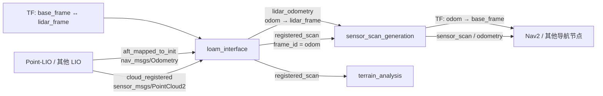

# loam_interface

`loam_interface` 是一个 ROS 2 坐标系适配节点，用于把 LOAM/LIO 前端输出的里程计和已注册点云接入本项目的导航坐标系。

它本身**不执行激光里程计、建图、点云匹配或重定位**。当前工程中，上游通常是 Point-LIO，下游通常是 `sensor_scan_generation`、`terrain_analysis` 和 Nav2。节点完成两件事：

1. 根据机器人基准坐标系到雷达坐标系的 TF，在启动阶段建立 LIO 初始坐标系到 `odom` 的固定对齐关系；
2. 使用该关系转换 LIO 位姿和已注册点云，分别发布 `lidar_odometry` 与 `registered_scan`。

## 1. 在系统中的位置



在当前整车配置中，典型数据链是：

```text
Point-LIO
  ├─ aft_mapped_to_init ─┐
  └─ cloud_registered ───┤
                         v
                   loam_interface
                     ├─ lidar_odometry ─┐
                     └─ registered_scan ┤
                                        v
                              sensor_scan_generation
                                ├─ odom -> base_footprint TF
                                ├─ odometry
                                └─ sensor_scan
```

所有话题名均为相对名称，因此会自动继承节点命名空间。例如命名空间为 `red_standard_robot1` 时，`registered_scan` 的完整名称为 `/red_standard_robot1/registered_scan`。

## 2. 坐标系约定与转换原理

### 2.1 坐标系含义

| 名称 | 当前整车配置 | 含义 |
| --- | --- | --- |
| LIO 初始坐标系 | Point-LIO 中通常为 `camera_init` | LIO 启动时建立的内部世界坐标系；本文也记作 `lidar_odom` |
| `odom_frame` | `odom` | 导航系统使用的局部里程计坐标系 |
| `base_frame` | `base_footprint` | 用于定义机器人在 `odom` 中初始原点和朝向的基准坐标系 |
| `lidar_frame` | `front_mid360` | 主雷达坐标系，也是输出里程计的 child frame |

节点第一次收到里程计消息时查询：

```text
lookupTransform(base_frame, lidar_frame, odometry_stamp)
```

该查询得到一个把 `lidar_frame` 中的数据变换到 `base_frame` 的变换。实现将它缓存为 LIO 初始坐标系到真实 `odom` 的固定对齐变换，后续不再查询。

### 2.2 位姿转换

记：

- `T_odom_lio0`：启动时由 `base_frame <- lidar_frame` TF 得到的固定初始对齐；
- `T_lio0_lidar(t)`：输入里程计消息中的实时位姿；
- `T_odom_lidar(t)`：输出到导航系统的雷达位姿。

当前代码执行：

```text
T_odom_lidar(t) = T_odom_lio0 × T_lio0_lidar(t)
```

输出 `lidar_odometry` 的坐标系字段固定为：

```text
header.frame_id = odom_frame
child_frame_id  = lidar_frame
```

需要注意：实现直接把输入 `pose.pose` 当作雷达在 LIO 初始坐标系中的位姿，不根据输入消息的 `header.frame_id` 或 `child_frame_id` 自动推导额外变换。因此，接入不同 LIO 实现时必须先确认其位姿语义与这里的假设一致。

### 2.3 点云转换

输入点云已经由 LIO 注册到其内部世界坐标系，所以这里只应用同一个**固定初始对齐**：

```text
P_odom = T_odom_lio0 × P_lio0
```

输出点云的 `header.frame_id` 为 `odom_frame`。这里不应再叠加实时雷达位姿，否则已经注册的点云会被重复变换。

### 2.4 TF 责任边界

`loam_interface` 只发布 `nav_msgs/msg/Odometry` 和 `sensor_msgs/msg/PointCloud2`，**不广播 TF**。

当前工程的典型 TF 发布责任为：

```text
map -> odom                         定位/重定位节点
odom -> base_footprint              sensor_scan_generation
base_footprint -> front_mid360      robot_state_publisher 或静态 TF
```

不要让多个节点同时广播同一对 TF。当前 Point-LIO 整车参数中 `publish.tf_send_en` 为 `False`，以避免它的内部 TF 与导航 TF 链冲突。

## 3. ROS 接口

### 3.1 订阅话题

| 逻辑用途 | 参数/话题 | 消息类型 | 队列深度 | 要求 |
| --- | --- | --- | --- | --- |
| LIO 状态估计 | `state_estimation_topic` | `nav_msgs/msg/Odometry` | 5 | `pose.pose` 表示 LIO 初始坐标系中的雷达位姿；时间戳应可用于查询静态/历史 TF |
| LIO 注册点云 | `registered_scan_topic` | `sensor_msgs/msg/PointCloud2` | 5 | 点云必须已经注册在 LIO 初始世界坐标系中，不是雷达本体坐标系中的原始点云 |

当前 Point-LIO 对应关系：

| 参数 | 配置值 | Point-LIO 输出语义 |
| --- | --- | --- |
| `state_estimation_topic` | `aft_mapped_to_init` | LIO 位姿 |
| `registered_scan_topic` | `cloud_registered` | 已注册点云 |

### 3.2 发布话题

| 话题 | 消息类型 | 坐标系 | 内容 |
| --- | --- | --- | --- |
| `lidar_odometry` | `nav_msgs/msg/Odometry` | parent 为 `odom_frame`，child 为 `lidar_frame` | 经过初始对齐后的雷达位姿 |
| `registered_scan` | `sensor_msgs/msg/PointCloud2` | `header.frame_id = odom_frame` | 转换到导航 `odom` 下的已注册点云 |

发布端和订阅端均使用深度为 5 的 ROS 2 默认 QoS。若上游使用不兼容的 QoS，可通过 `ros2 topic info -v` 检查端点兼容性。

### 3.3 参数

| 参数 | 类型 | 源码默认值 | 当前整车值 | 是否必须配置 | 说明 |
| --- | --- | --- | --- | --- | --- |
| `state_estimation_topic` | string | `""` | `aft_mapped_to_init` | 是 | 输入里程计话题，相对名称 |
| `registered_scan_topic` | string | `""` | `cloud_registered` | 是 | 输入注册点云话题，相对名称 |
| `odom_frame` | string | `odom` | `odom` | 建议显式配置 | 输出使用的局部世界坐标系 |
| `base_frame` | string | `""` | `base_footprint` | 是 | 初始对齐使用的机器人基准坐标系 |
| `lidar_frame` | string | `""` | `front_mid360` | 是 | 主雷达坐标系及输出里程计 child frame |
| `use_sim_time` | bool | ROS 2 默认值 | `False`/按场景设置 | 仿真或 bag 回放时必须核对 | 控制节点是否使用 `/clock` |

空字符串默认值只用于参数声明，并不是可工作的配置。直接运行可执行文件时，至少要提供两个输入话题及 `base_frame`、`lidar_frame`。

## 4. 启动时序

节点的关键启动过程如下：

1. 创建 TF buffer/listener、两个订阅者和两个发布者；
2. 第一次收到里程计时，以该消息时间戳查询 `base_frame <- lidar_frame`；
3. TF 查询最长等待 0.5 秒；失败时打印 `TF lookup failed ... Retrying...`，丢弃本帧里程计，并在下一帧重试；
4. 查询成功后缓存固定初始对齐，发布转换后的里程计；
5. 后续里程计直接复用缓存，不再查询 TF；
6. 注册点云使用同一个固定变换转换后发布。

因此，在 LIO 开始发布前，应确保以下条件成立：

- `base_frame` 到 `lidar_frame` 的 TF 已存在；
- TF 的时间范围覆盖首帧里程计时间戳；
- 仿真或 rosbag 回放时，所有节点的 `use_sim_time` 设置一致且 `/clock` 正常发布。

当前实现的点云回调没有等待“初始对齐已完成”的显式保护。为了避免启动最初几帧点云使用尚未就绪的变换，应让 TF 先就绪，并确保里程计与点云正常、同步地开始输出。详见“已知限制”。

## 5. 构建

该包使用 `ament_cmake_auto` 和 C++14，可同时构建为独立可执行节点与 ROS 2 component。

在工作空间根目录执行：

```bash
rosdep install --from-paths src --ignore-src -r -y
colcon build \
  --packages-select loam_interface \
  --symlink-install \
  --cmake-args -DCMAKE_BUILD_TYPE=Release
source install/setup.bash
```

主要依赖：

- `rclcpp`、`rclcpp_components`
- `tf2`、`tf2_ros`、`tf2_geometry_msgs`
- `nav_msgs`、`sensor_msgs`
- `pcl_ros`

## 6. 运行

### 6.1 使用包内 launch

```bash
source install/setup.bash
ros2 launch loam_interface loam_interface_launch.py \
  namespace:=red_standard_robot1
```

包内 launch 的固定参数为：

```yaml
state_estimation_topic: aft_mapped_to_init
registered_scan_topic: cloud_registered
odom_frame: odom
base_frame: gimbal_yaw
lidar_frame: front_mid360
```

注意：该独立 launch 使用 `gimbal_yaw` 作为 `base_frame`；当前 `spr_nav_bringup` 的整车参数使用 `base_footprint`。二者代表不同的初始对齐基准，不能在不了解 TF 设计的情况下互换。运行整车导航时，以对应 `nav2_params.yaml` 为准。

launch 还把绝对名称 `/tf`、`/tf_static` 重映射为相对名称 `tf`、`tf_static`，使 TF 话题跟随机器人命名空间。在多机器人系统中，TF 发布端和消费端必须采用一致的命名空间策略。

### 6.2 直接运行节点

```bash
ros2 run loam_interface loam_interface_node --ros-args \
  -r __ns:=/red_standard_robot1 \
  -p state_estimation_topic:=aft_mapped_to_init \
  -p registered_scan_topic:=cloud_registered \
  -p odom_frame:=odom \
  -p base_frame:=base_footprint \
  -p lidar_frame:=front_mid360
```

如果系统使用命名空间内的 TF，再追加：

```bash
-r /tf:=tf -r /tf_static:=tf_static
```

### 6.3 随整车导航启动

`spr_nav_bringup/launch/navigation_launch.py` 同时支持普通进程和 component 两种模式：

- `use_composition:=False`：运行 `loam_interface_node` 独立进程；
- `use_composition:=True`：加载插件 `loam_interface::LoamInterfaceNode`。

节点参数来自：

```text
spr_nav_bringup/config/reality/nav2_params.yaml
```

当前配置使用：

```yaml
loam_interface:
  ros__parameters:
    state_estimation_topic: "aft_mapped_to_init"
    registered_scan_topic: "cloud_registered"
    odom_frame: "odom"
    base_frame: "base_footprint"
    lidar_frame: "front_mid360"
```

## 7. 更换车辆或改变雷达安装位置

### 7.1 先看结论

本项目约定：**新车默认沿用当前话题名称和消息类型**。因此仅更换车辆或改变雷达安装位置时，不需要修改 `loam_interface` 的输入、输出 topic：

| 方向 | 相对话题名 | 消息类型 | 换车默认处理 |
| --- | --- | --- | --- |
| 输入 | `aft_mapped_to_init` | `nav_msgs/msg/Odometry` | 保持不变 |
| 输入 | `cloud_registered` | `sensor_msgs/msg/PointCloud2` | 保持不变 |
| 输出 | `lidar_odometry` | `nav_msgs/msg/Odometry` | 保持不变 |
| 输出 | `registered_scan` | `sensor_msgs/msg/PointCloud2` | 保持不变 |

以上均为相对话题名。如果新车使用不同的机器人命名空间，例如从 `/red_standard_robot1` 改为 `/red_standard_robot2`，完整话题名会随命名空间变化，但参数中的相对话题名仍然不变。

一般情况下，**不需要修改 `loam_interface.cpp`**。换车时主要修改 TF、LIO 标定和整车参数：

| 变化 | 必须检查/修改 | `loam_interface` 自身是否要改 |
| --- | --- | --- |
| 雷达在车上的平移或安装角变化，但雷达与 IMU 的相对位置不变 | 机器人描述或静态 TF 中的 `base_frame -> lidar_frame` | 通常不用改源码；frame 名不变时参数也可不改 |
| 雷达相对 IMU 的位置或朝向变化 | 上述 TF，以及 Point-LIO 的 `mapping.extrinsic_T/R` | 通常不用改源码 |
| 雷达坐标系改名 | 驱动、TF、`loam_interface.lidar_frame`、`sensor_scan_generation.lidar_frame` 及其他引用该 frame 的配置 | 不用改源码 |
| LIO 输入话题改名 | 新车默认不改；只有上游主动改名时才修改 `state_estimation_topic`、`registered_scan_topic` | 不用改源码 |
| 换成另一型号雷达 | 驱动、Point-LIO 预处理参数、话题、frame、时间戳单位和外参 | 接口消息仍相同时通常不用改源码 |
| 双雷达之间的位置关系变化 | 点云合并节点的雷达间外参，以及机器人描述中的两路 TF | 通常不用改源码 |
| 车体尺寸或导航基准点变化 | `base_frame` 的定义、机器人 footprint、costmap 和控制器相关配置 | `loam_interface` 通常只需同步 `base_frame` |
| 希望使用不同的局部世界坐标系名 | `odom_frame` 以及所有 TF/导航配置中的对应引用 | 不用改源码 |

换车后最容易出现的问题不是代码不能运行，而是节点仍能发布数据，但坐标方向、初始原点或点云位置悄悄出错。因此不要只以“有输出”为验收标准。

### 7.2 必须分清的两组外参

#### A. 车体到雷达的外参

这是 TF 树中的：

```text
base_frame -> lidar_frame
```

当前整车配置对应：

```text
base_footprint -> front_mid360
```

它描述雷达在车上的安装位置和朝向。`loam_interface` 在第一帧里程计到达时读取这组关系，用于建立 LIO 初始坐标系到 `odom` 的对齐。因此，只要雷达在车上的安装位置发生变化，这组 TF 就必须更新。

该 TF 通常来自：

- 完整机器人系统中的 URDF/SDF 和 `robot_state_publisher`；
- 独立导航模式下加载的机器人描述；
- 临时调试时使用的 `static_transform_publisher`。

本仓库的仿真机器人安装位姿可在以下文件中找到：

```text
spr_robot_description/resource/xmacro/spr2025_sentry_robot.sdf.xmacro
```

其中 MID360 通过 `xmacro_block name="livox"` 的 `parent` 和 `pose` 定义安装关系。实车完整系统可能由独立的机器人启动模块提供 TF，应以运行时 `ros2 node info` 和 `tf2_echo` 的结果为准，不能只修改仿真模型。

#### B. 雷达到 IMU 的外参

这是 Point-LIO 参数中的：

```yaml
point_lio:
  ros__parameters:
    mapping:
      extrinsic_T: [x, y, z]
      extrinsic_R: [r00, r01, r02,
                    r10, r11, r12,
                    r20, r21, r22]
```

其定义为雷达在 IMU body 坐标系中的位姿：

```text
p_imu = R_lidar_to_imu × p_lidar + T_lidar_in_imu
```

- `extrinsic_T` 单位为米；
- `extrinsic_R` 是按行展开的 3×3 旋转矩阵，不是 RPY，也不是四元数；
- 当前实车参数位于 `spr_nav_bringup/config/reality/nav2_params.yaml`；
- Point-LIO 独立配置还可见 `point_lio/config/mid360.yaml`。

这组外参与车体到雷达的 TF 不是同一个概念，不能把机械图纸上的 `base_footprint -> lidar` 数值直接填入 `extrinsic_T/R`，除非 IMU 坐标系恰好就是该 base frame。

### 7.3 常见换车场景

#### 场景一：雷达和 IMU 作为刚性模块一起移动

例如把完整的 MID360+IMU 模块从车顶前部移到后部，但两者之间没有拆装：

- 修改新车机器人描述中的 `base_frame -> lidar_frame`；
- 检查 `base_frame`、`lidar_frame` 参数是否仍使用原名称；
- `mapping.extrinsic_T/R` 通常保持不变；
- 重新验证点云和车体 TF，不要直接复用旧车的验收结果。

#### 场景二：雷达相对 IMU 重新安装

例如 IMU 留在底盘，雷达被移高或旋转：

- 重新标定雷达到 IMU 的平移和旋转；
- 更新 Point-LIO 的 `mapping.extrinsic_T/R`；
- 同时更新机器人描述中的 `base_frame -> lidar_frame`；
- 若硬件时间同步方式也改变，重新检查 `common.time_diff_lidar_to_imu`；
- 先验地图、历史点云和重定位效果都应重新验证。

只更新其中一组外参通常会导致 LIO 漂移、地面倾斜、转弯时墙体重影，或者 `registered_scan` 与车体位置出现固定偏差。

#### 场景三：更换雷达型号

除外参外，还应检查：

- 驱动发布的消息类型是否仍被 Point-LIO 支持；
- 点云和 IMU 话题名；
- 驱动发布的 `frame_id`；
- Point-LIO 的 `preprocess.lidar_type`、`scan_line`、`timestamp_unit` 和 `blind`；
- 发布频率与 QoS；
- 雷达和 IMU 的硬件/软件时间同步；
- 新雷达是否仍输出 `aft_mapped_to_init` 与 `cloud_registered` 对应的数据链。

本项目的新车默认继续使用现有 topic 和消息类型，所以这一部分通常无需调整。只要上游最终仍提供 `nav_msgs/msg/Odometry` 和已注册的 `sensor_msgs/msg/PointCloud2`，`loam_interface` 通常不需要源码级适配。

#### 场景四：双雷达的相对位置发生变化

当前实车参数中，`merge_cloud_node` 先把第二路雷达点云转换并合并到主雷达坐标系：

```yaml
merge_cloud_node:
  ros__parameters:
    output_frame_id: "front_mid360"
    extrinsic_cloud2_rpy: [roll, pitch, yaw]
    extrinsic_cloud2_xyz: [x, y, z]
```

任一雷达移动后，应重新测量/标定 `extrinsic_cloud2_rpy` 和 `extrinsic_cloud2_xyz`，并同步更新机器人描述中的两路雷达 TF。`loam_interface` 只看到合并后的主雷达坐标系，因此它不能修正错误的雷达间外参。

#### 场景五：雷达安装在可运动云台上

需要先判断雷达与 IMU 是否始终刚性连接：

- 如果雷达相对 IMU 会随云台运动，Point-LIO 的固定 `extrinsic_T/R` 假设不再成立，不能只靠修改 `loam_interface` 参数解决；
- 如果雷达和 IMU 一起刚性安装在云台上，LIO 外参可以保持固定，但车体到传感器模块的 TF 必须由关节状态持续更新；
- `loam_interface` 只在首次成功的里程计回调中缓存一次 `base_frame <- lidar_frame`。这组数据在本节点中用于初始坐标对齐，不会持续跟踪云台角度；若需求是让该节点实时应用动态外参，需要修改当前实现和整体 TF 设计。

### 7.4 推荐迁移步骤

#### 第一步：确定新车坐标系命名

建议先确定并记录：

```text
odom_frame   = odom
base_frame   = base_footprint
lidar_frame  = <新车主雷达 frame>
imu_frame    = <新车 IMU frame>
```

按照 ROS 常用约定，车体坐标系通常为 x 向前、y 向左、z 向上。若硬件原生坐标轴不同，应由驱动、静态 TF 或机器人描述明确转换，不能只改 frame 名称。

如果名称不变，可以减少下游配置修改；但名称不变不代表可以沿用旧外参。

#### 第二步：测量或标定新外参

至少准备：

1. `base_frame -> lidar_frame` 的三维平移和旋转；
2. 雷达相对 IMU 的 `extrinsic_T/R`；
3. 双雷达系统中，辅助雷达到主雷达的 `extrinsic_cloud2_xyz/rpy`；
4. 如有必要，雷达与 IMU 的时间偏差。

外参应来自机械测量加实际点云验证，或使用专门标定工具。旋转方向必须通过坐标轴和变换的 source/target 语义核对，不能只凭欧拉角正负号猜测。

#### 第三步：更新机器人描述或实车 TF 发布端

确保运行时存在完整链路：

```text
base_footprint -> ... -> <new_lidar_frame>
```

如果雷达固定安装，该链路可以是静态 TF；如果中间包含云台关节，则应由 `robot_state_publisher` 配合实时 joint state 发布。

修改后，在启动 LIO 前验证：

```bash
ros2 run tf2_ros tf2_echo base_footprint <new_lidar_frame>
```

输出的平移和旋转应与新车实测值一致。

#### 第四步：更新整车参数

实车主要修改：

```text
spr_nav_bringup/config/reality/nav2_params.yaml
```

至少核对以下节点：

```yaml
livox_ros_driver2:
  ros__parameters:
    frame_id: <new_lidar_frame>

merge_cloud_node:
  ros__parameters:
    output_frame_id: <new_lidar_frame>
    # 双雷达相对安装变化时更新：
    extrinsic_cloud2_rpy: [new_roll, new_pitch, new_yaw]
    extrinsic_cloud2_xyz: [new_x, new_y, new_z]

point_lio:
  ros__parameters:
    mapping:
      extrinsic_T: [new_x, new_y, new_z]
      extrinsic_R: [new_r00, new_r01, new_r02,
                    new_r10, new_r11, new_r12,
                    new_r20, new_r21, new_r22]

loam_interface:
  ros__parameters:
    # 新车默认保持以下两个输入 topic 不变
    state_estimation_topic: "aft_mapped_to_init"
    registered_scan_topic: "cloud_registered"
    odom_frame: "odom"
    base_frame: "base_footprint"
    lidar_frame: <new_lidar_frame>

sensor_scan_generation:
  ros__parameters:
    lidar_frame: <new_lidar_frame>
    base_frame: "base_footprint"
    robot_base_frame: <导航里程计使用的车体 frame>
```

topic 默认保持不变，换车时主要修改 frame 和外参。随后全局搜索旧 frame 名，逐项判断是否需要替换：

```bash
rg -n "front_mid360|base_footprint|gimbal_yaw" src
```

尤其要检查 costmap observation source 的 `sensor_frame`、点云过滤节点的目标 frame、RViz 配置和 bag 回放脚本。不要机械替换所有结果：例如旧 bag 中保存的 frame 名应通过回放适配或 remapping 处理，而不是修改 bag 内容。

如果使用包内 `loam_interface_launch.py`，还要同步修改其中硬编码的 `base_frame` 和 `lidar_frame`，或者直接使用整车参数文件启动。

#### 第五步：按顺序联调

建议按以下顺序启动和验收：

1. 只启动机器人描述/TF，确认车体到雷达的变换；
2. 启动雷达和 IMU 驱动，检查话题、frame、频率和时间戳；
3. 启动 Point-LIO，确认 `aft_mapped_to_init` 和 `cloud_registered`；
4. 启动 `loam_interface`，确认 `lidar_odometry` 和 `registered_scan`；
5. 启动 `sensor_scan_generation`，确认 `odom -> base_frame`；
6. 最后启动地形分析、costmap 和 Nav2。

分阶段启动可以明确区分 TF 错误、LIO 标定错误和导航参数错误，避免整套系统同时运行时难以定位。

### 7.5 换车验收清单

- [ ] `base_frame -> lidar_frame` 的平移与旋转和新车实测一致；
- [ ] 雷达与 IMU 相对位置变化时，已重新标定 `extrinsic_T/R`；
- [ ] 双雷达相对位置变化时，已更新合并外参；
- [ ] 驱动、Point-LIO、`loam_interface` 和 `sensor_scan_generation` 使用同一 `lidar_frame`；
- [ ] 新车继续发布 `aft_mapped_to_init` 和 `cloud_registered`，消息类型与当前系统一致；
- [ ] `state_estimation_topic`、`registered_scan_topic` 保持当前值，没有因换车误改；
- [ ] 若机器人命名空间变化，已确认四个 topic 的完整名称随命名空间正确解析；
- [ ] 静止初始化时，注册点云没有持续漂移；
- [ ] 直线行驶时，墙面不弯曲、地面不倾斜；
- [ ] 原地旋转时，静态障碍物不会形成圆弧重影；
- [ ] `lidar_odometry` 的位置和朝向变化符合实际运动；
- [ ] `odom -> base_frame -> lidar_frame` TF 链连续且只有一个发布源；
- [ ] 新车 footprint、costmap 膨胀参数和控制器几何参数已单独复核；
- [ ] 使用旧地图时已重新验证重定位精度，必要时重新建图。

## 8. 验证与验收

以下示例假设命名空间为 `/red_standard_robot1`。

### 8.1 检查节点和参数

```bash
ros2 node info /red_standard_robot1/loam_interface
ros2 param dump /red_standard_robot1/loam_interface
```

确认两个订阅话题、两个发布话题以及五个业务参数均符合预期。

### 8.2 检查输入输出频率

```bash
ros2 topic hz /red_standard_robot1/aft_mapped_to_init
ros2 topic hz /red_standard_robot1/cloud_registered
ros2 topic hz /red_standard_robot1/lidar_odometry
ros2 topic hz /red_standard_robot1/registered_scan
```

若输入持续而输出没有数据，优先查看节点日志中的 TF 查询错误。

### 8.3 检查消息坐标系

```bash
ros2 topic echo /red_standard_robot1/lidar_odometry --once
ros2 topic echo /red_standard_robot1/registered_scan --field header --once
```

预期：

```text
lidar_odometry.header.frame_id == "odom"
lidar_odometry.child_frame_id  == "front_mid360"
registered_scan.header.frame_id == "odom"
```

### 8.4 检查 TF

若 TF 位于全局 `/tf`：

```bash
ros2 run tf2_ros tf2_echo base_footprint front_mid360
```

若 TF 已放入机器人命名空间，可为诊断命令添加相同 remapping：

```bash
ros2 run tf2_ros tf2_echo base_footprint front_mid360 --ros-args \
  -r /tf:=/red_standard_robot1/tf \
  -r /tf_static:=/red_standard_robot1/tf_static
```

### 8.5 RViz 验收

在 RViz 中将 Fixed Frame 设为 `odom`，显示 `/red_standard_robot1/registered_scan`，并检查：

- 机器人静止时，墙面和地面没有明显漂移；
- 机器人运动时，静态障碍物不会随车移动或产生持续重影；
- 初始朝向与导航系统中的机器人朝向一致；
- `odom -> base_footprint -> front_mid360` TF 链连续且没有跳变；
- 点云时间戳持续更新，频率与上游 `cloud_registered` 基本一致。

## 9. 常见问题

### 9.1 一直提示 `TF lookup failed`

常见原因：

- `base_frame` 或 `lidar_frame` 拼写错误；
- `robot_state_publisher`/静态 TF 发布器尚未启动；
- TF 在 `/tf`，而节点订阅的是命名空间内的 `tf`，或反之；
- rosbag 回放时没有 `/clock`，或 `use_sim_time` 不一致；
- 首帧消息时间戳早于 TF buffer 中最早的变换。

可先运行 `tf2_echo`，再用 `ros2 topic info -v` 检查 TF 话题端点。

### 9.2 输入有数据，但没有 `lidar_odometry`

先确认 `aft_mapped_to_init` 的完整话题名是否位于同一命名空间。随后查看 TF 是否查询成功。TF 初始化失败时，本帧里程计会被直接丢弃。

### 9.3 点云方向错误、整体平移或绕原点旋转

通常由初始对齐配置错误导致：

- `base_frame` 选错，例如误在 `base_footprint` 与 `gimbal_yaw` 之间切换；
- `base_frame -> lidar_frame` 外参方向或数值错误；
- 上游里程计的 `pose.pose` 实际表示 IMU/body，而当前节点按 lidar 位姿解释；
- 上游点云并非已注册世界点云，而是传感器本体坐标系中的原始点云。

不要通过随意交换 `base_frame` 和 `lidar_frame` 来试错；应先用 `tf2_echo` 和上游消息头核对坐标语义。

### 9.4 输出频率低或断续

检查：

- 上游里程计与注册点云频率；
- CPU 和点云带宽；
- `ros2 topic info -v` 中 QoS 是否兼容；
- 是否存在大量 TF 重试日志；
- component 容器是否仍在运行。

### 9.5 `lidar_odometry` 有位姿但速度始终为零

这是当前行为。节点只填写输出里程计的时间戳、父子坐标系和 `pose.pose`，不会转换或复制 `twist` 与协方差。下游 `sensor_scan_generation` 会根据连续位姿计算其自身发布的里程计速度。

### 9.6 为什么节点没有发布 `odom -> lidar_frame` TF

这是职责设计：`loam_interface` 提供雷达里程计消息，下游 `sensor_scan_generation` 结合雷达到车体的外参，广播 `odom -> base_frame`。这样导航 TF 的 child 是机器人基准坐标系，而不是传感器坐标系。

## 10. 已知限制与使用注意事项

1. **点云回调没有初始化保护。** 在首个成功的里程计回调之前到达的点云，当前代码仍会尝试使用缓存变换。生产部署应保证 TF 和里程计先就绪；后续维护可考虑在 `pointCloudCallback()` 中检查 `base_frame_to_lidar_initialized_`。
2. **初始 TF 只查询一次。** 这符合“固定初始对齐”的用途，但不适合需要持续跟踪动态外参的场景。
3. **不校验输入 frame 名称。** 代码不会验证输入里程计和点云的 `frame_id`，错误的上游配置可能产生看似正常但空间位置错误的输出。
4. **里程计信息不完整透传。** 输出不包含输入 `twist`、pose covariance 或 twist covariance。
5. **参数没有启动期合法性检查。** 必填字符串为空时不会得到友好的参数错误；应在启动配置中显式填写。
6. **无时间同步器。** 里程计与点云分别处理。两者使用同一固定初始对齐，但节点不保证输出消息一一配对；需要同步的数据由下游节点处理。
7. **固定话题输出名。** `lidar_odometry` 和 `registered_scan` 不是参数，只能用 ROS 2 remapping 改名。

## 11. 开发说明

### 11.1 目录结构

```text
loam_interface/
├── CMakeLists.txt
├── package.xml
├── README.md
├── include/loam_interface/
│   └── loam_interface.hpp
├── launch/
│   └── loam_interface_launch.py
└── src/
    └── loam_interface.cpp
```

### 11.2 节点形式

类名和组件插件名：

```text
loam_interface::LoamInterfaceNode
```

独立可执行文件：

```text
loam_interface_node
```

节点通过 `RCLCPP_COMPONENTS_REGISTER_NODE` 注册，因此修改构造函数或资源生命周期时，需要同时验证独立进程和 component 两种启动方式。

### 11.3 修改后的建议回归项

- `colcon build --packages-select loam_interface` 编译通过；
- 普通节点与 component 模式均能加载；
- TF 缺失时节点不会崩溃，TF 恢复后可开始输出；
- 输出里程计的 parent/child frame 正确；
- 输出点云的字段、时间戳和点数没有异常变化；
- 静止、直线、旋转三种工况下，点云与环境保持一致；
- 多机器人命名空间下不会串用其他机器人的话题或 TF。

## 12. 许可证

本包使用 Apache License 2.0。作者与维护者信息见 `package.xml`。
