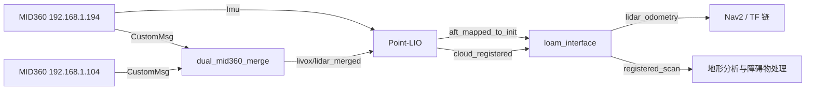

# Point-LIO（ROS 2）使用与维护指南

本文档面向本仓库中的 `point_lio` 包，说明其功能、数据流、编译运行方式、ROS 2
接口、全部主要参数、与整车导航栈的连接关系，以及常见故障的排查方法。

本包基于 [HKU-MARS Point-LIO](https://github.com/hku-mars/Point-LIO) 的 ROS 2
移植版本，并在当前分支中加入了先验 PCD 地图输入、Livox 时间戳回退保护等适配。
当前工程主要使用两台 Livox MID360，经 `dual_mid360_merge` 融合后向 Point-LIO
提供点云，并使用 `192.168.1.194` 设备的内置 IMU。

> 本文描述的是当前仓库中的实际实现。上游项目的参数或启动方式可能与本文不同。

## 1. 包的作用

Point-LIO 是激光—惯性里程计（Lidar-Inertial Odometry，LIO）。它按激光点的实际
采样时刻融合点云和 IMU 数据，完成：

- IMU 初始化、状态传播和饱和检测；
- 基于逐点时间的点云运动补偿；
- 点到平面的迭代误差状态卡尔曼滤波更新；
- 基于增量 iVox 的局部点云地图维护；
- 位姿、轨迹、注册点云和 TF 发布；
- 可选的 PCD 地图保存和先验 PCD 加载。

当前包生成一个可执行文件：

| 项目 | 值 |
| --- | --- |
| ROS 2 包名 | `point_lio` |
| 可执行文件 | `pointlio_mapping` |
| 源码默认节点名 | `laserMapping` |
| 推荐 ROS 2 版本 | Humble |
| 默认配置 | `config/mid360.yaml` |
| 默认启动文件 | `launch/point_lio.launch.py` |

## 2. 当前整车数据流



当前实车参数位于：

```text
spr_nav_bringup/config/reality/nav2_params.yaml
```

关键连接为：

| 数据 | 相对话题名 | 消息类型 | 生产者 | 消费者 |
| --- | --- | --- | --- | --- |
| 两雷达融合点云 | `livox/lidar_merged` | `livox_ros_driver2/msg/CustomMsg` | `dual_mid360_merge` | Point-LIO |
| 参考 IMU | `livox/imu_192_168_1_194` | `sensor_msgs/msg/Imu` | `livox_ros_driver2` | Point-LIO |
| LIO 位姿 | `aft_mapped_to_init` | `nav_msgs/msg/Odometry` | Point-LIO | `loam_interface` |
| 注册点云 | `cloud_registered` | `sensor_msgs/msg/PointCloud2` | Point-LIO | `loam_interface` |
| 导航里程计 | `lidar_odometry` | `nav_msgs/msg/Odometry` | `loam_interface` | 导航栈 |
| 导航注册点云 | `registered_scan` | `sensor_msgs/msg/PointCloud2` | `loam_interface` | 地形分析等 |

这些都是相对话题名。使用默认命名空间 `red_standard_robot1` 时，例如融合点云的完整
名称为：

```text
/red_standard_robot1/livox/lidar_merged
```

## 3. 目录结构

```text
point_lio/
├── config/                  # 各型号雷达的参数文件
│   ├── avia.yaml
│   ├── horizon.yaml
│   ├── mid360.yaml
│   ├── ouster64.yaml
│   └── velody16.yaml
├── include/
│   ├── IKFoM/               # 流形上的迭代卡尔曼滤波库
│   ├── ivox/                # 增量体素地图
│   └── common_lib.h
├── launch/
│   └── point_lio.launch.py  # 独立启动 Point-LIO 和 RViz
├── Log/                     # 运行日志输出目录
├── PCD/                     # PCD 地图输出目录
├── rviz_cfg/                # RViz 配置
├── src/
│   ├── laserMapping.cpp     # 主循环、建图、发布与 PCD 读写
│   ├── li_initialization.*  # 点云/IMU 回调、缓存和时间同步
│   ├── IMU_Processing.*     # IMU 初始化与点云去畸变
│   ├── Estimator.*          # 状态模型和点面残差
│   ├── preprocess.*         # 不同雷达点格式的预处理
│   └── parameters.*         # ROS 2 参数声明与读取
├── CMakeLists.txt
└── package.xml
```

## 4. 依赖与构建

### 4.1 主要依赖

- Ubuntu 20.04 或更高版本；
- ROS 2 Foxy 或更高版本，本仓库按 ROS 2 Humble 使用；
- PCL、Eigen3、OpenMP；
- `pcl_ros`、`pcl_conversions`；
- `livox_ros_driver2`；
- `glog`、`libunwind`；
- Python 开发库和 Matplotlib C++ 头文件。

可通过系统包补齐常见依赖：

```bash
sudo apt update
sudo apt install \
  libeigen3-dev \
  libgoogle-glog-dev \
  libunwind-dev \
  python3-dev \
  ros-humble-pcl-conversions \
  ros-humble-pcl-ros
```

也可以在工作空间根目录使用 `rosdep` 安装已声明依赖：

```bash
source /opt/ros/humble/setup.bash
rosdep install --from-paths src --ignore-src -r -y
```

### 4.2 初始化子模块

`point_lio` 位于 `spr_sentry_nav` 仓库的 Git 子模块中。首次拉取工程后应执行：

```bash
git submodule update --init --recursive
```

### 4.3 编译

在工作空间根目录执行：

```bash
source /opt/ros/humble/setup.bash
colcon build --symlink-install \
  --packages-up-to point_lio \
  --cmake-args -DCMAKE_BUILD_TYPE=Release
source install/setup.bash
```

依赖均已构建时，可只编译本包：

```bash
colcon build --symlink-install \
  --packages-select point_lio \
  --cmake-args -DCMAKE_BUILD_TYPE=Release
source install/setup.bash
```

编译器必须支持 C++17。x86/AMD64 平台拥有足够 CPU 核心时，构建脚本会启用 OpenMP；
其他架构使用单处理线程配置。

## 5. 启动方式

### 5.1 独立启动

先启动雷达驱动和必要的融合节点，再执行：

```bash
source /opt/ros/humble/setup.bash
source install/setup.bash
ros2 launch point_lio point_lio.launch.py
```

该启动文件有三个参数：

| 启动参数 | 默认值 | 说明 |
| --- | --- | --- |
| `namespace` | `red_standard_robot1` | Point-LIO 和 RViz 所在命名空间 |
| `rviz` | `True` | 是否启动 RViz |
| `point_lio_cfg_dir` | 包内 `config/mid360.yaml` | Point-LIO 参数文件绝对路径 |

例如关闭 RViz、使用空命名空间：

```bash
ros2 launch point_lio point_lio.launch.py namespace:="" rviz:=False
```

使用 Velodyne 参数：

```bash
ros2 launch point_lio point_lio.launch.py \
  rviz:=True \
  point_lio_cfg_dir:="$(ros2 pkg prefix point_lio)/share/point_lio/config/velody16.yaml"
```

### 5.2 启动完整实车导航链路

当前工程推荐通过 `spr_nav_bringup` 启动驱动、双雷达融合、Point-LIO、
`loam_interface` 和 Nav2：

```bash
source /opt/ros/humble/setup.bash
source install/setup.bash
ros2 launch spr_nav_bringup rm_navigation_reality_lio_launch.py \
  world:=rmuc2026 \
  slam:=False \
  use_robot_state_pub:=False \
  map_to_odom_x:=0.0 \
  map_to_odom_y:=0.0 \
  map_to_odom_yaw:=0.0
```

本模式读取 `spr_nav_bringup/config/reality/nav2_params.yaml`，而不是包内的
`config/mid360.yaml`。调试整车效果时，应优先修改前者。

### 5.3 录包回放

回放时要保证点云与 IMU 共用同一时钟体系，并让所有使用仿真时间的节点收到
`/clock`：

```bash
ros2 bag play /path/to/bag --clock
```

若回放跳回开头，Point-LIO 会检测到时间回退并重置状态。不要同时运行实车驱动和同名
bag 话题，否则不同时间源交错会持续触发回退。

## 6. 输入接口与时间要求

### 6.1 支持的点云类型

`preprocess.lidar_type` 决定订阅消息类型和点字段解释：

| `lidar_type` | 雷达类型 | 输入消息 | 必需的逐点字段 |
| --- | --- | --- | --- |
| `1` | Livox（Avia、Horizon、MID360） | `livox_ros_driver2/msg/CustomMsg` | `offset_time`、`line`、`tag` |
| `2` | Velodyne | `sensor_msgs/msg/PointCloud2` | `x y z intensity time ring` |
| `3` | Ouster | `sensor_msgs/msg/PointCloud2` | `x y z intensity t ring` 等 |
| `4` | Hesai XT32 | `sensor_msgs/msg/PointCloud2` | `x y z intensity timestamp ring` |

Livox 必须使用 `CustomMsg`。普通 `PointCloud2` 若丢失逐点采样时间，就无法正确完成
帧内去畸变。当前双 MID360 链路因此将驱动设置为 `xfer_format: 1`，融合节点也保持
`CustomMsg` 格式。

### 6.2 QoS

点云和 IMU 订阅均使用 `rclcpp::SensorDataQoS()`，通常对应 best effort、volatile 的
传感器数据策略。自定义发布者或 rosbag 回放必须提供兼容 QoS。

### 6.3 时间戳约束

当前 Point-LIO 同时使用：

- 消息 `header.stamp`：用于帧级排序和点云—IMU 配对；
- Livox `offset_time` 或 PointCloud2 的逐点时间字段：与 `header.stamp` 组合后用于帧内
  运动补偿；
- `common.time_diff_lidar_to_imu`：用于补偿已标定的固定时间偏差。

Livox 原始数据的绝对点时间语义是 `timebase + offset_time`。当前双雷达融合节点先用
`timebase` 统一两路点的时间基准，再生成匹配的输出 `header.stamp`；Point-LIO 本身不
直接读取 `CustomMsg.timebase`。因此自定义融合节点必须同时维护 `header.stamp` 和
`offset_time`，不能只改其中一个。

时间必须满足以下条件：

1. 点云帧的 `header.stamp` 单调不减；
2. IMU 时间戳单调递增；
3. 一帧内每个点的偏移量单位配置正确；
4. 点云帧结束时刻之前存在足够 IMU 数据；
5. 多雷达融合后，所有点的逐点时间仍指向同一个时间基准。

当前代码对 IMU 的不超过 `1 ms` 的小幅回退做钳位，将其调整为上一条时间戳加
`1 ns`；更大的回退会丢弃该条 IMU。点云时间一旦回退，该帧会被拒绝并输出
`lidar loop back`。

## 7. 输出话题

以下名称均为相对名称，会自动继承节点命名空间：

| 话题 | 消息类型 | `frame_id` | 发布条件与含义 |
| --- | --- | --- | --- |
| `aft_mapped_to_init` | `nav_msgs/msg/Odometry` | `camera_init`，child 为 `body` | LIO 位姿；按激光帧或高频传播发布 |
| `cloud_registered` | `sensor_msgs/msg/PointCloud2` | `camera_init` | 当前帧经去畸变、降采样并注册后的点云 |
| `cloud_registered_body` | `sensor_msgs/msg/PointCloud2` | `body` | IMU body 坐标系中的当前帧点云；默认关闭 |
| `path` | `nav_msgs/msg/Path` | `camera_init` | 累积轨迹；可关闭以减少内存和通信开销 |
| `Laser_map` | `sensor_msgs/msg/PointCloud2` | `camera_init` | 初始化完成时发布一次初始观测点云 |
| `cloud_effected` | `sensor_msgs/msg/PointCloud2` | — | 当前源码创建了发布者，但没有实际发布 |

`aft_mapped_to_init` 消息的 child frame 是 `body`，但 Point-LIO 自己发送的 TF child
frame 是 `aft_mapped`。不要仅根据名字推断两者相同，应以实际消息和 TF 树为准。

## 8. 坐标系与 TF

Point-LIO 内部输出坐标系名称目前是源码硬编码的：

- 世界/初始坐标系：`camera_init`；
- IMU 本体坐标系：`body`；
- 可选 TF 子坐标系：`aft_mapped`。

当 `publish.tf_send_en: true` 时，Point-LIO 发布：

```text
camera_init -> aft_mapped
```

当前整车参数将 `publish.tf_send_en` 设为 `False`。`loam_interface` 根据
`base_footprint -> front_mid360` 静态外参把 Point-LIO 的结果转换到真正的 `odom`
坐标系并输出 `lidar_odometry`；随后 `sensor_scan_generation` 发布动态
`odom -> base_footprint`。定位启动文件另外发布 `map -> odom` 静态变换。

典型整车 TF 责任关系是：

```text
map -> odom                         localization_lio_launch.py
odom -> base_footprint              sensor_scan_generation
base_footprint -> front_mid360      robot_state_publisher 或静态外参
```

`loam_interface` 的 `lidar_odometry` 消息以 `odom` 为 parent、`front_mid360` 为 child，
但该节点只发布 Odometry 消息，不直接广播这对 TF。

避免让多个节点同时发布同一对 TF。尤其是整车模式下，不要随意重新打开 Point-LIO 的
`tf_send_en`，除非同时重新设计下游 TF 链。

## 9. 参数详解

ROS 2 YAML 顶层应使用通配节点名：

```yaml
/**:
  ros__parameters:
    # 参数写在这里
```

### 9.1 顶层状态估计与地图参数

| 参数 | 类型 | 包内 MID360 值 | 说明 |
| --- | --- | --- | --- |
| `use_imu_as_input` | bool | `False` | `True` 使用 IMU 作为状态传播输入模型；`False` 使用当前默认的输出/观测模型分支 |
| `prop_at_freq_of_imu` | bool | `True` | 是否按 IMU 到达频率执行状态传播 |
| `check_satu` | bool | `True` | 是否按 `satu_acc`、`satu_gyro` 检测 IMU 饱和 |
| `init_map_size` | int | `10` | 初始化 iVox 前至少累计的点数，不是帧数 |
| `point_filter_num` | int | `4` | 预处理阶段每隔多少个有效点取一个点 |
| `space_down_sample` | bool | `True` | 是否对当前帧做体素降采样 |
| `filter_size_surf` | double | `0.5` | 当前帧降采样体素边长，单位 m |
| `filter_size_map` | double | `0.5` | 向地图增量插点时使用的空间分辨率，单位 m |
| `ivox_nearby_type` | int | `6` | iVox 邻域：`0`、`6`、`18` 或 `26` 邻域 |
| `runtime_pos_log_enable` | bool | `False` | 是否输出详细运行耗时和位姿日志内容 |

整车实车配置使用更密的 `0.2 m` 体素、`point_filter_num: 8` 和 `18` 邻域。更小的
体素能保留更多结构，但会显著增加匹配和地图维护开销。

### 9.2 `common`：输入和同步

| 参数 | 类型 | 包内 MID360 值 | 说明 |
| --- | --- | --- | --- |
| `common.lid_topic` | string | `livox/lidar_merged` | 点云输入话题 |
| `common.imu_topic` | string | `livox/imu_192_168_1_194` | IMU 输入话题 |
| `common.con_frame` | bool | `False` | 是否累积多个点云帧后处理 |
| `common.con_frame_num` | int | `1` | 期望合帧数；见下方实现限制 |
| `common.cut_frame` | bool | `False` | 是否将一帧点云切为多个子帧；见下方实现限制 |
| `common.cut_frame_time_interval` | double | `0.1` | 期望切帧时间间隔，单位 s |
| `common.time_diff_lidar_to_imu` | double | `0.0` | 已标定的雷达到 IMU 固定时间差，单位 s |

时间差在 IMU 回调中按下式使用：

```text
corrected_imu_time = raw_imu_time - time_diff_lidar_to_imu
```

修改符号前应先用标定结果或数据对齐实验确认定义。

### 9.3 `prior_pcd`：先验地图

| 参数 | 类型 | 默认值 | 说明 |
| --- | --- | --- | --- |
| `prior_pcd.enable` | bool | `False` | 是否把 PCD 点加入初始 iVox 地图 |
| `prior_pcd.prior_pcd_map_path` | string | `""` | PCD 文件绝对路径 |
| `prior_pcd.init_pose` | double[3] | `[0, 0, 0]` | 首次发布位姿使用的 XYZ 平移初值，单位 m |

该功能只是“加载先验点云并从给定平移附近开始匹配”，不是完整的全局重定位：

- `init_pose` 只包含 XYZ，不包含 roll、pitch、yaw；
- 代码不会自动通过 GICP/ICP 搜索全局初始位姿；
- 首次位姿赋值发生在发布路径中，使用前必须实测确认地图坐标对齐；
- 路径为空、PCD 无法读取或 `init_pose` 少于 3 个元素时，当前实现缺少完整的安全保护；
- `Laser_map` 发布的是启动时累计的观测点，不是载入的完整先验 PCD。

因此，启用前必须保证 PCD 坐标系、尺度和初始姿态已知，并先离线验证。完整整车定位
启动文件虽然通过 `prior_pcd_file` 传入路径，但实车 YAML 当前仍设置
`prior_pcd.enable: False`，所以默认不会加载该文件。

### 9.4 `preprocess`：点云预处理

| 参数 | 类型 | 包内 MID360 值 | 说明 |
| --- | --- | --- | --- |
| `preprocess.lidar_type` | int | `1` | 雷达类型，取值见第 6.1 节 |
| `preprocess.scan_line` | int | `4` | 接受的最大扫描线数量；Livox 点要求 `line < scan_line` |
| `preprocess.scan_rate` | int | 源码默认 `10` | 旋转式雷达缺少逐点时间时，用于估算转速 |
| `preprocess.timestamp_unit` | int | `3` | PointCloud2 逐点时间单位：`0=s`、`1=ms`、`2=us`、`3=ns` |
| `preprocess.blind` | double | `0.5` | 近距离盲区半径，单位 m |

`timestamp_unit` 主要影响标准 `PointCloud2` 分支。Livox `CustomMsg.offset_time` 固定按
纳秒解释，并在内部换算为毫秒。

### 9.5 `mapping`：滤波、噪声和外参

| 参数 | 类型 | 包内 MID360 值 | 说明 |
| --- | --- | --- | --- |
| `mapping.imu_en` | bool | `True` | 是否使用 IMU |
| `mapping.extrinsic_est_en` | bool | `False` | 是否在线估计雷达—IMU 外参；已标定时建议关闭 |
| `mapping.imu_time_inte` | double | `0.005` | IMU 采样周期，单位 s；当前值对应 200 Hz |
| `mapping.lidar_time_inte` | double | `0.1` | 无有效点云时使用的雷达时间间隔，单位 s |
| `mapping.satu_acc` | double | `3.0` | 加速度计饱和值，数值单位与原始 IMU 数据一致 |
| `mapping.satu_gyro` | double | `35.0` | 陀螺仪饱和值，数值单位与原始 IMU 数据一致 |
| `mapping.acc_norm` | double | `1.0` | IMU 静止重力模长；以 g 为单位填 `1.0`，以 m/s² 填约 `9.81` |
| `mapping.lidar_meas_cov` | double | `0.01` | 激光点面残差测量噪声 |
| `mapping.acc_cov_output` | double | `500.0` | 输出模型中的加速度过程/测量协方差尺度 |
| `mapping.gyr_cov_output` | double | `1000.0` | 输出模型中的角速度过程/测量协方差尺度 |
| `mapping.b_acc_cov` | double | `0.0001` | 加速度计零偏随机游走协方差 |
| `mapping.b_gyr_cov` | double | `0.0001` | 陀螺仪零偏随机游走协方差 |
| `mapping.imu_meas_acc_cov` | double | `0.01` | 加速度观测噪声 |
| `mapping.imu_meas_omg_cov` | double | `0.01` | 角速度观测噪声 |
| `mapping.acc_cov_input` | double | `0.1` | IMU 输入模型中的加速度噪声 |
| `mapping.gyr_cov_input` | double | `0.01` | IMU 输入模型中的角速度噪声 |
| `mapping.vel_cov` | double | 源码默认 `20` | 速度协方差参数；各 YAML 当前未显式设置 |
| `mapping.plane_thr` | float | `0.1` | 邻域拟合平面的判定阈值；越小要求越平 |
| `mapping.match_s` | double | `81.0` | 点面匹配筛选强度参数 |
| `mapping.ivox_grid_resolution` | float | `2.0` | iVox 网格分辨率，单位 m |
| `mapping.gravity` | double[3] | `[0, 0, -9.81]` | 目标世界重力向量；模长必须与内部加速度尺度一致 |
| `mapping.gravity_init` | double[3] | `[0, 0, -9.81]` | 无 IMU 或非静止启动时的初始重力向量，尺度同 `gravity` |
| `mapping.extrinsic_T` | double[3] | `[-0.011, -0.02329, 0.04412]` | 雷达原点在 IMU 坐标系中的平移，单位 m |
| `mapping.extrinsic_R` | double[9] | 单位阵 | 雷达坐标系到 IMU 坐标系的行优先 3×3 旋转矩阵 |

外参定义为：

```text
p_imu = R_lidar_to_imu * p_lidar + T_lidar_in_imu
```

`extrinsic_R` 不是欧拉角，也不是四元数。填入前必须保证旋转矩阵正交、行列式接近
`+1`。如果使用 MID360 内置 IMU，仍需根据设备坐标定义和安装关系核对外参。

实车配置中的 `gravity` 目前为近似 `[0.49, -0.0053, -0.8774]`，其模长约为 `1`，
体现了设备安装倾角及 IMU 以 g 为加速度单位的历史配置。它与包内通用 MID360 配置
不同，不能直接互换。

### 9.6 `odometry`、`publish` 和 `pcd_save`

| 参数 | 类型 | 包内 MID360 值 | 说明 |
| --- | --- | --- | --- |
| `odometry.publish_odometry_without_downsample` | bool | `False` | `True` 时在 IMU 传播过程中高频发布位姿；`False` 时按点云处理周期发布 |
| `publish.path_en` | bool | `True` | 是否发布并持续累积 `path` |
| `publish.scan_publish_en` | bool | `True` | 是否发布注册点云；当前 PCD 累积也依赖它为 `True` |
| `publish.scan_bodyframe_pub_en` | bool | `False` | 是否发布 `cloud_registered_body` |
| `publish.tf_send_en` | bool | `True` | 是否发布 `camera_init -> aft_mapped` |
| `pcd_save.pcd_save_en` | bool | `False` | 是否累积并保存注册点云 |
| `pcd_save.interval` | int | `-1` | 正数表示每 N 帧写一个分片；`-1` 表示退出时统一写 `scans.pcd` |

实车配置将高频里程计发布打开，同时关闭 `path` 和 Point-LIO 自身 TF，以降低开销并
避免与整车 TF 链冲突。

### 9.7 当前实现中不应依赖的参数

以下参数虽然被声明或读取，但当前源码没有完整接入实际处理路径：

| 参数 | 当前情况 |
| --- | --- |
| `common.con_frame_num` | 合帧代码当前使用硬编码计数，没有按该参数控制 |
| `common.cut_frame` | 参数被读取，但没有更新实际判断使用的 `cut_frame_init` |
| `common.cut_frame_time_interval` | 未形成完整的切帧数量计算链路 |
| `mapping.det_range` | 读入 `DET_RANGE`，但当前预处理距离上限没有连接到该值 |
| `mapping.fov_degree` | 被读取，但当前主流程没有使用 |

修改这些值前应先补齐源码接线并增加测试，不能只改 YAML 后假定已经生效。

## 10. 初始化与运行流程

程序启动后的主要阶段如下：

1. 读取参数，初始化 iVox 和两种滤波状态模型；
2. 建立点云与 IMU 的 SensorDataQoS 订阅；
3. 等待点云和覆盖该帧结束时间的 IMU 数据；
4. 静止采样 IMU，估计初始重力、零偏和姿态；
5. 按逐点采样时间传播状态并对点云去畸变；
6. 对当前帧降采样，累计至少 `init_map_size` 个点并建立初始地图；
7. 搜索 iVox 邻域、拟合平面并执行迭代滤波更新；
8. 将当前帧加入地图，发布位姿、注册点云和可选轨迹；
9. 收到 SIGINT 后保存剩余 PCD 数据并正常退出。

启动时应让机器人静止数秒，直到日志中的 `IMU Initializing` 达到 100%。如果必须从
运动状态启动，需要提供可信的 `gravity_init`，并单独验证初始化效果。

## 11. PCD 地图保存

在参数文件中启用：

```yaml
publish:
  scan_publish_en: true

pcd_save:
  pcd_save_en: true
  interval: -1
```

正常按 `Ctrl+C` 退出后，地图写入：

```text
point_lio/PCD/scans.pcd
```

若 `interval` 为正数，会按 `scans_1.pcd`、`scans_2.pcd` 等名称分片，退出时剩余点仍
写入 `scans.pcd`。

注意：

- 保存目录由编译时的 `ROOT_DIR` 决定，实际指向源码包内的 `PCD/`，不是当前终端目录；
- `interval: -1` 会把全部点长期保存在内存中，大场景可能耗尽内存；
- PCD 保存会增加内存复制和磁盘 I/O，影响实时性；
- 当前实现只有在 `scan_publish_en: true` 时才会真正累积待保存点云；
- `kill -9`、掉电或进程崩溃不会执行退出保存逻辑。

查看地图：

```bash
pcl_viewer src/spr_sentry_nav/point_lio/PCD/scans.pcd
```

## 12. 参数调优建议

### 12.1 先保证数据正确

调滤波参数之前，依次确认：

1. 点云和 IMU 话题名正确；
2. 消息类型与 `lidar_type` 一致；
3. IMU 角速度、加速度单位和轴向正确；
4. 逐点时间存在且单位正确；
5. 雷达—IMU 外参方向正确；
6. 两类时间戳单调且相互对齐。

时间或外参错误通常不能靠增大噪声参数解决。

### 12.2 性能不足

按风险从低到高尝试：

- 增大 `point_filter_num`；
- 增大 `filter_size_surf`；
- 增大 `filter_size_map`；
- 将 `ivox_nearby_type` 从 `18/26` 降为 `6`；
- 关闭 `path_en`、`scan_bodyframe_pub_en`、运行日志和 PCD 保存；
- 降低雷达发布频率，但同步修改与频率相关的时间参数。

### 12.3 地图稀疏或匹配不稳

- 适当减小 `point_filter_num` 和体素尺寸；
- 检查 `blind` 是否误删近场结构；
- 核对 `plane_thr` 和 `match_s`，每次只改变一个参数；
- 检查场景是否长时间只有单一平面、走廊或重复结构；
- 优先检查时间同步、振动、外参和传感器固定强度。

### 12.4 IMU 参数

静止时查看原始 IMU：

```bash
ros2 topic echo /red_standard_robot1/livox/imu_192_168_1_194 --once
ros2 topic hz /red_standard_robot1/livox/imu_192_168_1_194
```

若静止加速度模长约为 `1`，使用 `acc_norm: 1.0`；若约为 `9.81`，使用
`acc_norm: 9.81`。`satu_acc` 和 `satu_gyro` 应来自传感器量程或实测饱和值，不能照搬
其他型号配置。

## 13. 运行检查

### 13.1 节点与话题

```bash
ros2 node list | grep -E 'point_lio|laserMapping'
ros2 topic list | grep -E 'lidar_merged|imu_|aft_mapped|cloud_registered'
ros2 topic hz /red_standard_robot1/livox/lidar_merged
ros2 topic hz /red_standard_robot1/livox/imu_192_168_1_194
ros2 topic hz /red_standard_robot1/aft_mapped_to_init
ros2 topic hz /red_standard_robot1/cloud_registered
```

检查输入类型：

```bash
ros2 topic type /red_standard_robot1/livox/lidar_merged
ros2 topic type /red_standard_robot1/livox/imu_192_168_1_194
```

期望分别为：

```text
livox_ros_driver2/msg/CustomMsg
sensor_msgs/msg/Imu
```

### 13.2 参数是否真正加载

整车启动时节点名通常被覆盖为 `point_lio`：

```bash
ros2 param get /red_standard_robot1/point_lio common.lid_topic
ros2 param get /red_standard_robot1/point_lio preprocess.lidar_type
ros2 param get /red_standard_robot1/point_lio mapping.extrinsic_T
ros2 param dump /red_standard_robot1/point_lio
```

独立使用包内启动文件时，节点名可能保持源码默认的 `laserMapping`，可先用
`ros2 node list` 确认完整名称。

### 13.3 TF

```bash
ros2 run tf2_tools view_frames
ros2 run tf2_ros tf2_echo map odom
ros2 run tf2_ros tf2_echo odom front_mid360
```

确认 TF 树不存在断链、环路或同一变换的多个发布者。

## 14. 常见问题

### 14.1 一直没有里程计输出

依次检查：

- 点云与 IMU 的完整话题名是否受命名空间影响；
- `lidar_type: 1` 时输入是否真的是 `CustomMsg`；
- 两路输入是否持续发布，QoS 是否兼容；
- IMU 最新时间是否覆盖点云帧结束时间；
- 点云中是否存在有效点，是否全被 `blind`、`scan_line` 或 tag 规则过滤；
- 初始化时机器人是否保持静止；
- YAML 是否加载到了正确节点。

### 14.2 `lidar loop back`

表示新点云的 `header.stamp` 小于上一帧。常见原因：

- rosbag 循环播放或 seek；
- 驱动重启后时间源改变；
- 两个发布者同时向同一话题写数据；
- 双雷达融合输出时间戳没有保持单调；
- 系统时钟、PTP 或设备时钟跳变。

当前 `dual_mid360_merge` 已有输出时间戳单调性保护。若仍出现问题，应同时观察融合前
两路点云、融合输出和 `/clock`，不要只检查 Point-LIO。

### 14.3 `imu loop back` 或 IMU jitter

小于等于 `1 ms` 的回退会被钳位并节流打印警告；更大回退会丢弃样本。持续出现警告
通常表示 PTP、驱动时间转换或 rosbag 时间源存在问题，不能长期依赖钳位掩盖。

### 14.4 地图重影、撕裂或急转弯漂移

优先检查：

- 逐点 `offset_time` 是否保留并按正确单位解释；
- 双雷达融合是否把第二台雷达正确变换到参考雷达坐标系；
- 点云与参考 IMU 是否硬件或软件同步；
- `extrinsic_T/R` 的方向是否写反；
- IMU 单位、安装轴向和 `gravity` 是否匹配；
- 雷达支架是否松动或存在高频振动。

### 14.5 提示缺少 `time` 或 `t` 字段

标准 PointCloud2 输入缺少 Point-LIO 期待的逐点时间字段。应优先让驱动发布正确字段，
而不是给整帧所有点填同一个时间。旋转式 Velodyne 分支在部分情况下能按恒定转速估算
时间，但精度和鲁棒性不等同于真实逐点时间。

### 14.6 载入先验 PCD 后崩溃或定位错误

- 使用绝对路径并确认文件存在；
- 用 `pcl_viewer` 验证文件可读且包含 XYZ 点；
- 确保 `init_pose` 至少包含 3 个数；
- 确保 PCD 与 `camera_init` 使用同一坐标约定；
- 从接近真实初始位置处启动；
- 不要把该功能当作全局回环或自动重定位模块。

### 14.7 PCD 没有生成

确认 `pcd_save_en` 与 `scan_publish_en` 同时为 `true`，并使用 `Ctrl+C` 正常结束进程。
输出位于编译时源码目录的 `PCD/`，而非 `install/share/point_lio/PCD`。

## 15. 开发与维护注意事项

- 参数数组目前缺少统一长度校验；修改重力、外参和初始位姿时必须保证维度正确；
- 帧名称硬编码在 `laserMapping.cpp` 中，若要参数化，应同时修改消息、TF、RViz 和
  `loam_interface`；
- `cloud_effected` 发布者目前未使用，依赖它的下游不会收到数据；
- `path` 会持续增长，长时间运行建议关闭；
- 主循环目标频率为 500 Hz，但实际吞吐受传感器频率、点数和计算耗时限制；
- PCD 和日志路径通过编译期 `ROOT_DIR` 指向源码树；部署只读源码时需要重新设计路径；
- 日志文件在进程启动时就会打开，`runtime_pos_log_enable: false` 只是不写详细内容；
- 独立启动文件传给 RViz 的配置路径目前将文件名和 `.rviz` 拆成了两个参数；若 RViz
  没有自动载入配置，应修正为完整的 `rviz_cfg/loam_livox.rviz` 路径；
- 更换 Livox 驱动、点云融合方式或 DDS 配置后，应把消息格式、QoS 和时间字段作为一个
  整体回归验证。

建议修改核心算法后至少完成以下验证：

1. 单雷达静止初始化；
2. 平移、原地旋转和快速转向；
3. 双雷达融合输入；
4. rosbag 正常回放和重新开始回放；
5. 长时间运行的内存占用；
6. `cloud_registered` 与真实环境的重合度；
7. 完整 `map -> odom -> base` TF 链；
8. Nav2 地图与实时障碍物对齐。

## 16. 上游项目与论文

- 原始项目：[hku-mars/Point-LIO](https://github.com/hku-mars/Point-LIO)
- ROS 2 移植来源：[LihanChen2004/Point-LIO](https://github.com/LihanChen2004/Point-LIO)
- 论文：*Point-LIO: Robust High-Bandwidth Light Detection and Ranging Inertial Odometry*
- DOI：[10.1002/aisy.202200459](https://doi.org/10.1002/aisy.202200459)

核心作者包括 Dongjiao He（贺东娇）、Wei Xu（徐威）等。许可证见本目录中的
[`LICENSE`](LICENSE)。使用或发布研究结果时，请遵循上游仓库的引用要求。

## 17. 上线前检查清单

- [ ] 点云消息类型与 `lidar_type` 一致；
- [ ] 点云包含有效逐点时间；
- [ ] 点云与 IMU 时间单调、频率稳定并完成同步；
- [ ] `acc_norm` 与 IMU 加速度单位一致；
- [ ] `satu_acc`、`satu_gyro` 与设备量程一致；
- [ ] `extrinsic_T`、`extrinsic_R` 已标定并验证方向；
- [ ] `gravity` 与安装姿态及单位一致；
- [ ] Point-LIO 输入、输出话题均在正确命名空间；
- [ ] TF 发布责任唯一，不存在重复发布者；
- [ ] 静止初始化无明显漂移；
- [ ] 运动时注册点云无持续重影或撕裂；
- [ ] 需要保存地图时已评估内存，并能正常 SIGINT 退出；
- [ ] 先验 PCD 模式已单独验证初始位置和坐标系；
- [ ] Nav2 中地图、里程计和障碍物点云对齐。
