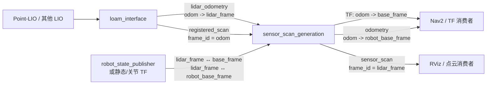

# sensor_scan_generation

`sensor_scan_generation` 是一个 ROS 2 坐标系与点云适配节点。它同步接收雷达里程计和已经注册到局部世界坐标系的点云，结合机器人 TF 外参，生成导航系统需要的机器人位姿、动态 TF 和雷达本体坐标系点云。

这个包本身**不执行激光里程计、点云配准、建图、定位或障碍物提取**。在当前工程中，上游通常是 `loam_interface`，下游通常是 Nav2、RViz 或其他需要车体里程计和传感器系点云的节点。

节点完成三项工作：

1. 把雷达位姿换算为 `base_frame` 位姿，并广播 `odom -> base_frame` 动态 TF；
2. 把雷达位姿换算为 `robot_base_frame` 位姿，发布 `nav_msgs/msg/Odometry`；
3. 把 `odom` 中的已注册点云反变换回 `lidar_frame`，发布 `sensor_scan`。

## 1. 在系统中的位置



当前整车的典型数据链为：

```text
Point-LIO
  ├─ aft_mapped_to_init ─┐
  └─ cloud_registered ───┤
                         v
                   loam_interface
                     ├─ lidar_odometry ─┐
                     └─ registered_scan ┤
                                        v
                              sensor_scan_generation
                                ├─ TF: odom -> base_footprint
                                ├─ odometry: odom -> gimbal_yaw
                                └─ sensor_scan: front_mid360 坐标系
```

所有业务话题均使用相对名称，会继承节点命名空间。例如节点位于命名空间 `red_standard_robot1` 时，`sensor_scan` 的完整名称为 `/red_standard_robot1/sensor_scan`。

## 2. 输入数据要求

节点的两个输入通过 `message_filters::ApproximateTime` 近似时间同步。只有组成同步对后，主处理回调才会运行。

### 2.1 `lidar_odometry`

输入类型为 `nav_msgs/msg/Odometry`，必须满足：

- `header.frame_id` 是局部世界坐标系，当前工程中通常为 `odom`；
- `pose.pose` 表示雷达 `lidar_frame` 在该局部世界坐标系中的位姿；
- 位姿的 child 语义应与参数 `lidar_frame` 一致，当前实现不会检查 `child_frame_id`；
- 时间戳应与 `registered_scan` 接近，并且能够用于查询 TF。

在当前工程中，该话题通常由 `loam_interface` 发布，而不是直接使用 Point-LIO 的原始里程计。

### 2.2 `registered_scan`

输入类型为 `sensor_msgs/msg/PointCloud2`，必须满足：

- 点云已经由 LIO 注册到局部世界坐标系；
- 点云所在坐标系与 `lidar_odometry.header.frame_id` 表示的是同一个坐标系；
- 点云与里程计来自同一条位姿估计链，不能混用不同定位源；
- `header.stamp` 与对应里程计时间戳足够接近。

这里需要的是**已注册点云**，不能直接接入雷达驱动发布的原始点云。原始点云本来就在雷达坐标系中，再执行本节点的反变换会得到错误结果。

## 3. 坐标系约定与转换原理

### 3.1 三个可配置坐标系

| 参数 | 当前整车配置 | 包内独立 launch 默认值 | 用途 |
| --- | --- | --- | --- |
| `lidar_frame` | `front_mid360` | `front_mid360` | 输入里程计所代表的雷达坐标系，也是 `sensor_scan` 的输出坐标系 |
| `base_frame` | `base_footprint` | `chassis` | 动态 TF 的 child frame，通常供 Nav2 建立机器人主 TF 链 |
| `robot_base_frame` | `gimbal_yaw` | `gimbal_yaw` | 输出 `odometry` 的 child frame |

`base_frame` 和 `robot_base_frame` 并非重复参数：

- `base_frame` 决定节点广播哪一条 `odom -> ...` TF；
- `robot_base_frame` 决定节点发布哪个机器人部件的里程计；
- 二者可以相同，也可以分别表示底盘基准与云台航向坐标系。

当前整车使用 `base_footprint` 作为导航 TF 基准，同时发布 `gimbal_yaw` 的里程计，因此两个参数不同。

### 3.2 变换记号

本文用 `T_A_B` 表示“把 `B` 坐标系中的点转换到 `A` 坐标系”的刚体变换。

输入里程计提供：

```text
T_odom_lidar
```

每次同步回调还会按点云时间戳查询：

```text
lookupTransform(lidar_frame, base_frame, stamp)
lookupTransform(lidar_frame, robot_base_frame, stamp)
```

分别得到：

```text
T_lidar_base
T_lidar_robot_base
```

因此输出位姿为：

```text
T_odom_base       = T_odom_lidar × T_lidar_base
T_odom_robot_base = T_odom_lidar × T_lidar_robot_base
```

这要求 TF 树中在消息时间戳处存在 `lidar_frame` 与另外两个 frame 之间的连通关系。变换可以来自 `robot_state_publisher`、静态 TF 发布器或关节状态驱动。

### 3.3 动态 TF

节点广播：

```text
odometry_msg.header.frame_id -> base_frame
```

变换值为 `T_odom_base`，时间戳使用 `registered_scan.header.stamp`。

当前整车的主链通常为：

```text
map -> odom                         定位/重定位节点
odom -> base_footprint              sensor_scan_generation
base_footprint -> ... -> gimbal_yaw robot_state_publisher / joint_states
gimbal_yaw -> front_mid360          robot_state_publisher / 静态外参
```

同一对 parent/child frame 只能有一个权威 TF 发布者。不要让 LIO、仿真插件和本节点同时广播 `odom -> base_frame`。

### 3.4 里程计输出

`odometry` 的位姿为：

```text
T_odom_robot_base = T_odom_lidar × T_lidar_robot_base
```

消息字段为：

```text
header.stamp    = registered_scan.header.stamp
header.frame_id = lidar_odometry.header.frame_id
child_frame_id  = robot_base_frame
pose.pose       = T_odom_robot_base
```

线速度和角速度由相邻两次 `T_odom_robot_base` 做有限差分得到，具体限制见“已知限制”。

### 3.5 点云输出

输入 `registered_scan` 已在 `odom` 中，节点应用雷达实时位姿的逆变换：

```text
P_lidar = inverse(T_odom_lidar) × P_odom
```

输出 `sensor_scan` 因而位于 `lidar_frame`。它表示当前注册点云从雷达自身视角观察到的坐标，而不是重新进行了一次点云匹配。

## 4. ROS 接口

### 4.1 订阅话题

| 话题 | 消息类型 | QoS | 作用 |
| --- | --- | --- | --- |
| `lidar_odometry` | `nav_msgs/msg/Odometry` | Keep Last 1、Best Effort、Volatile | 雷达在局部世界坐标系中的位姿 |
| `registered_scan` | `sensor_msgs/msg/PointCloud2` | Keep Last 1、Best Effort、Volatile | 注册到局部世界坐标系的点云 |

同步器使用 `ApproximateTime` 策略，同步队列大小为 100。源码没有设置显式的最大时间间隔；实际使用时仍应保证两个上游话题使用同一时钟且时间戳接近。

### 4.2 发布话题

| 话题 | 消息类型 | 发布队列深度 | 坐标系/内容 |
| --- | --- | --- | --- |
| `sensor_scan` | `sensor_msgs/msg/PointCloud2` | 2 | 点云变换到 `lidar_frame` |
| `odometry` | `nav_msgs/msg/Odometry` | 2 | `header.frame_id -> robot_base_frame` 的位姿和差分速度 |
| `tf` | `tf2_msgs/msg/TFMessage` | TF broadcaster 默认配置 | 广播 `header.frame_id -> base_frame` |

发布 `sensor_scan` 和 `odometry` 时使用 `create_publisher(..., 2)` 的 ROS 2 默认 QoS 设置，通常为 Keep Last、Reliable、Volatile。

节点没有服务和 action 接口，也不是 ROS 2 lifecycle node。

### 4.3 参数

| 参数 | 类型 | 源码默认值 | 当前整车值 | 是否必须配置 | 说明 |
| --- | --- | --- | --- | --- | --- |
| `lidar_frame` | string | `""` | `front_mid360` | 是 | 雷达坐标系 |
| `base_frame` | string | `""` | `base_footprint` | 是 | 动态 TF 的 child frame |
| `robot_base_frame` | string | `""` | `gimbal_yaw` | 是 | 输出里程计的 child frame |
| `use_sim_time` | bool | ROS 2 默认值 | 实车 `False`、仿真 `True` | 按场景 | 是否使用 `/clock` |

三个 frame 参数的源码默认值都是空字符串，空值不是可工作的配置。包内 launch 和整车参数文件都提供了有效值。

参数只在构造函数中读取一次，当前实现没有参数更新回调。因此运行时执行 `ros2 param set` 即使被 ROS 接受，也不会改变节点内部已经保存的 frame 名称；修改后应重启节点。

### 4.4 固定话题名与 remapping

四个业务话题名不是参数。需要改名时使用 ROS 2 remapping：

```bash
ros2 run sensor_scan_generation sensor_scan_generation_node --ros-args \
  -r lidar_odometry:=my_lidar_odometry \
  -r registered_scan:=my_registered_scan \
  -r sensor_scan:=my_sensor_scan \
  -r odometry:=my_odometry \
  -p lidar_frame:=front_mid360 \
  -p base_frame:=base_footprint \
  -p robot_base_frame:=gimbal_yaw
```

## 5. 启动和运行

### 5.1 构建

该包使用 `ament_cmake_auto` 和 C++14，同时构建共享库、独立可执行节点和 ROS 2 component。

在工作空间根目录执行：

```bash
rosdep install --from-paths src --ignore-src -r -y

colcon build \
  --packages-select sensor_scan_generation \
  --symlink-install \
  --cmake-args -DCMAKE_BUILD_TYPE=Release

source install/setup.bash
```

主要依赖包括：

- `rclcpp`、`rclcpp_components`
- `message_filters`
- `nav_msgs`、`sensor_msgs`
- `tf2`、`tf2_ros`、`tf2_geometry_msgs`
- `pcl_ros`、`pcl_conversions`

### 5.2 使用包内 launch

```bash
source install/setup.bash

ros2 launch sensor_scan_generation sensor_scan_generation.launch.py \
  namespace:=red_standard_robot1 \
  lidar_frame:=front_mid360 \
  base_frame:=chassis \
  robot_base_frame:=gimbal_yaw
```

launch 参数如下：

| launch 参数 | 默认值 | 说明 |
| --- | --- | --- |
| `namespace` | `""` | 节点命名空间 |
| `lidar_frame` | `front_mid360` | 雷达坐标系 |
| `base_frame` | `chassis` | 动态 TF 的 child frame |
| `robot_base_frame` | `gimbal_yaw` | 输出里程计的 child frame |

注意：包内独立 launch 默认使用 `chassis`，当前 `spr_nav_bringup` 的实车和仿真参数都使用 `base_footprint`。独立调试整车链路时，应明确传入与机器人模型一致的值，不要仅依赖 launch 默认值。

该 launch 将绝对名称 `/tf`、`/tf_static` 重映射为相对名称 `tf`、`tf_static`，使 TF 话题可以跟随节点命名空间。多机器人场景中，所有 TF 发布者和消费者必须采用一致的命名空间策略。

### 5.3 直接运行

```bash
source install/setup.bash

ros2 run sensor_scan_generation sensor_scan_generation_node --ros-args \
  -r __ns:=/red_standard_robot1 \
  -r /tf:=tf \
  -r /tf_static:=tf_static \
  -p lidar_frame:=front_mid360 \
  -p base_frame:=base_footprint \
  -p robot_base_frame:=gimbal_yaw
```

如果不使用命名空间，可省略 `__ns` 和两条 TF remapping。

### 5.4 由整车导航启动

`spr_nav_bringup/launch/navigation_launch.py` 已同时支持两种加载方式：

- `use_composition:=False`：运行 `sensor_scan_generation_node` 独立进程；
- `use_composition:=True`：把 `sensor_scan_generation::SensorScanGenerationNode` 加载到组件容器。

实车配置位于：

```text
spr_nav_bringup/config/reality/nav2_params.yaml
```

当前配置为：

```yaml
sensor_scan_generation:
  ros__parameters:
    lidar_frame: front_mid360
    base_frame: base_footprint
    robot_base_frame: gimbal_yaw
```

## 6. 启动时序

推荐按以下顺序建立链路：

1. 启动机器人模型、`robot_state_publisher` 和关节状态发布源；
2. 确认 `lidar_frame`、`base_frame`、`robot_base_frame` 的 TF 连通；
3. 启动雷达驱动和 LIO；
4. 启动 `loam_interface`，确认 `lidar_odometry` 与 `registered_scan` 持续输出；
5. 启动 `sensor_scan_generation`；
6. 最后启动依赖 `odom -> base_frame` 的导航节点。

每次收到同步消息对时，本节点都会进行两次带时间戳的 TF 查询，单次最长等待 0.5 秒。TF 尚未建立、历史缓存不包含该时间戳或仿真时钟不一致时，会出现警告并回退到单位变换。

## 7. 验证方法

以下命令以命名空间 `/red_standard_robot1` 为例；没有命名空间时删除该前缀。

### 7.1 检查节点与参数

```bash
ros2 node info /red_standard_robot1/sensor_scan_generation

ros2 param get /red_standard_robot1/sensor_scan_generation lidar_frame
ros2 param get /red_standard_robot1/sensor_scan_generation base_frame
ros2 param get /red_standard_robot1/sensor_scan_generation robot_base_frame
ros2 param get /red_standard_robot1/sensor_scan_generation use_sim_time
```

### 7.2 检查输入频率和 QoS

```bash
ros2 topic hz /red_standard_robot1/lidar_odometry
ros2 topic hz /red_standard_robot1/registered_scan

ros2 topic info -v /red_standard_robot1/lidar_odometry
ros2 topic info -v /red_standard_robot1/registered_scan
```

输入订阅端应显示 Best Effort。若发布端只提供 Reliable，一般可以兼容 Best Effort 订阅；反过来，Reliable 订阅无法连接只提供 Best Effort 的发布端。

### 7.3 检查输入 frame 和时间戳

```bash
ros2 topic echo /red_standard_robot1/lidar_odometry --once
ros2 topic echo /red_standard_robot1/registered_scan --field header --once
```

当前整车配置下，预期至少满足：

```text
lidar_odometry.header.frame_id == "odom"
lidar_odometry.child_frame_id  == "front_mid360"
registered_scan.header.frame_id == "odom"
```

两个消息的时间戳应接近，并随同一个时间源单调前进。

### 7.4 检查静态/关节 TF

```bash
ros2 run tf2_ros tf2_echo front_mid360 base_footprint
ros2 run tf2_ros tf2_echo front_mid360 gimbal_yaw
```

使用 namespaced TF 时增加 remapping：

```bash
ros2 run tf2_ros tf2_echo front_mid360 base_footprint --ros-args \
  -r /tf:=/red_standard_robot1/tf \
  -r /tf_static:=/red_standard_robot1/tf_static
```

### 7.5 检查输出

```bash
ros2 topic hz /red_standard_robot1/sensor_scan
ros2 topic hz /red_standard_robot1/odometry

ros2 topic echo /red_standard_robot1/sensor_scan --field header --once
ros2 topic echo /red_standard_robot1/odometry --once
```

预期结果：

```text
sensor_scan.header.frame_id == "front_mid360"
odometry.header.frame_id    == "odom"
odometry.child_frame_id     == "gimbal_yaw"
```

再检查动态 TF：

```bash
ros2 run tf2_ros tf2_echo odom base_footprint
```

机器人静止时位姿应基本稳定；推动车体或旋转云台时，输出变化应与机器人模型的 TF 关系一致。

### 7.6 RViz 检查

建议先将 RViz Fixed Frame 设置为 `odom`，同时显示：

- `/red_standard_robot1/registered_scan`；
- `/red_standard_robot1/sensor_scan`；
- TF。

`registered_scan` 应稳定在环境中；`sensor_scan` 以 `front_mid360` 为 frame，但经过 TF 显示到 `odom` 后，应与 `registered_scan` 基本重合。如果两者明显旋转、平移或随车体重复运动，优先检查输入点云 frame、雷达里程计语义和 TF 外参。

## 8. 常见问题排查

### 8.1 输入有频率，但完全没有输出

主回调依赖近似时间同步，单独收到任意一个话题都不会发布。检查：

- 两个输入是否都持续发布；
- 两者是否使用同一个时钟；
- 时间戳是否相差过大或其中一个恒为零；
- 命名空间是否一致；
- 输入发布端与 Best Effort 订阅端的 QoS 是否兼容。

可分别回显两个消息的 `header.stamp`，确认秒和纳秒字段处于同一时间基准。

### 8.2 持续出现 `TF lookup failed`

日志格式为：

```text
TF lookup failed: ... Returning identity.
```

常见原因包括：

- frame 参数拼写错误；
- `robot_state_publisher` 或关节状态源未启动；
- TF 树断裂；
- 查询时间戳早于 TF 缓存或晚于最新 TF；
- bag 回放时 `use_sim_time` 不一致；
- TF 话题的命名空间/remapping 不一致。

当前实现不会在 TF 查询失败时丢弃本帧，而是使用单位变换继续发布。因此警告期间虽然可能看到输出，但 `base_frame` 或 `robot_base_frame` 位姿会退化为雷达位姿，不能视为有效导航数据。

### 8.3 `sensor_scan` 方向相反或随车漂移

重点检查：

- `registered_scan` 是否确实在 `lidar_odometry.header.frame_id` 中；
- 输入是否误用了雷达原始点云；
- `lidar_odometry.pose.pose` 是否确实表示 `odom -> lidar_frame`；
- `lidar_frame` 是否与上游里程计 child 语义一致；
- 上游是否已经对点云重复应用实时位姿。

本节点固定执行 `inverse(T_odom_lidar) × P_odom`。若上游消息语义不同，仅修改 frame 字符串不能纠正数据。

### 8.4 `odom -> base_frame` 跳变或 TF 冲突

使用以下命令查看发布者：

```bash
ros2 topic info -v /red_standard_robot1/tf
```

同时确认 Point-LIO 的 TF 输出已关闭，且没有其他 odometry 插件广播相同 parent/child 关系。多个发布者争用同一 TF 会导致 RViz 抖动、规划器定位跳变或插值异常。

### 8.5 点云输出频率低于输入

可能原因包括：

- 近似时间同步只能配对部分消息；
- 点云较大，`pcl_ros::transformPointCloud` 占用较多 CPU；
- 两个输入订阅队列深度只有 1，处理不及时会主动丢旧帧；
- TF 查询每次最多阻塞 0.5 秒；
- 组件容器中的其他节点占用同一执行器线程。

可同时比较两个输入与 `sensor_scan` 的频率，并观察节点 CPU 使用率和 TF 警告。

### 8.6 `odometry.twist` 首帧异常或数值不稳定

这是当前差分实现的限制。速度使用进程的单调墙上时钟计算，而不是消息时间戳；第一帧还会从默认单位位姿开始做差分。因此：

- 首帧速度可能很大，应由下游忽略或过滤；
- bag 加速、减速、暂停或仿真时间倍率不会正确反映在速度中；
- 调度延迟和丢帧会直接影响速度数值；
- 当前输出未填写速度或位姿协方差。

如果下游需要严格的状态估计速度，应使用可靠的里程计/滤波器速度源，而不是把这里的差分速度作为高精度测量。

### 8.7 独立 launch 正常，但整车启动后坐标不对

首先比较 `base_frame`：

- 包内 launch 默认是 `chassis`；
- 当前整车参数是 `base_footprint`。

还应确认整车加载的是 reality 参数文件，以及节点实际参数是否被同名 YAML 节覆盖。

## 9. 已知限制与实现注意事项

以下内容描述当前源码行为，修改算法或接入高可靠性下游时应特别注意：

1. **TF 失败回退单位变换。** 两次 TF 查询分别捕获异常并返回 identity，回调仍会发布数据，可能形成“有输出但坐标错误”的静默退化。
2. **同步消息使用点云时间戳。** TF、输出 TF 和输出里程计都使用 `registered_scan.header.stamp`，输入位姿则来自与之近似同步的里程计；两者并非严格同一时刻。
3. **速度使用墙上时间。** `dt` 来自 `std::chrono::steady_clock`，不是 ROS 时间或消息时间。
4. **首帧参与差分。** 上一位姿初始为单位变换，第一帧速度可能没有物理意义。
5. **速度表达约定需要下游确认。** 平移差直接在 parent frame 中计算，而 `nav_msgs/Odometry.twist` 通常按 `child_frame_id` 语义解释；存在非零航向时需谨慎使用。
6. **没有协方差。** `pose.covariance` 与 `twist.covariance` 保持全零，不代表真实测量不确定度为零。
7. **不验证消息 frame。** 源码不会检查 `registered_scan.header.frame_id` 或 `lidar_odometry.child_frame_id` 是否符合参数约定。
8. **参数不会热更新。** frame 名称只在构造阶段读取。
9. **每对消息查询两次 TF。** 对高频大点云链路，应关注 TF 等待和点云转换的实时开销。
10. **不是 lifecycle node。** 节点创建后立即订阅和发布，不受 Nav2 lifecycle manager 激活/停用状态控制。

## 10. 开发说明

### 10.1 目录结构

```text
sensor_scan_generation/
├── CMakeLists.txt
├── package.xml
├── include/sensor_scan_generation/
│   └── sensor_scan_generation.hpp
├── src/
│   └── sensor_scan_generation.cpp
├── launch/
│   └── sensor_scan_generation.launch.py
├── .clang-format
└── .clang-tidy
```

### 10.2 组件入口

组件插件名：

```text
sensor_scan_generation::SensorScanGenerationNode
```

独立可执行文件：

```text
sensor_scan_generation_node
```

### 10.3 代码质量检查

包在 `BUILD_TESTING` 打开时通过 `ament_lint_auto` 注册格式和静态检查。可执行：

```bash
colcon test --packages-select sensor_scan_generation
colcon test-result --verbose
```

项目启用了 `-Wall -Werror`，新增编译警告会导致构建失败。

## 11. 接入检查清单

- [ ] `lidar_odometry` 与 `registered_scan` 都在持续输出；
- [ ] 两者使用同一时间源，时间戳可以被近似同步；
- [ ] `lidar_odometry.pose.pose` 表示 `odom -> lidar_frame`；
- [ ] `registered_scan` 已经注册到同一个 `odom`，不是原始雷达点云；
- [ ] `lidar_frame`、`base_frame`、`robot_base_frame` 均非空且拼写正确；
- [ ] 三个 frame 在 TF 树中连通，历史时间戳查询正常；
- [ ] 只有本节点广播目标 `odom -> base_frame` 动态 TF；
- [ ] 多机器人场景中的业务话题和 TF 话题采用一致的命名空间；
- [ ] 仿真或 bag 回放时所有相关节点统一使用 `use_sim_time`；
- [ ] 下游不会把首帧差分速度或全零协方差误当作高可信测量；
- [ ] RViz 中 `sensor_scan` 经 TF 变换后与 `registered_scan` 基本重合。

## 12. 许可证

本包采用 Apache License 2.0，版本号见 `package.xml`。
