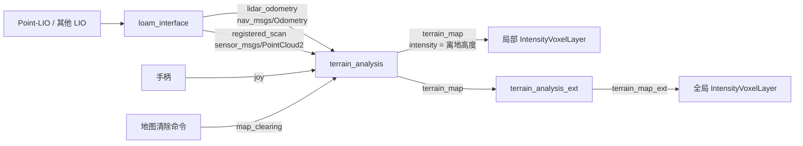

# terrain_analysis

`terrain_analysis` 是一个基于 ROS 2 和 PCL 的局部地形分析节点。它接收已经注册到局部世界坐标系的点云和雷达里程计，在机器人周围维护一份会随车移动、按时间衰减的点云缓存，然后估计局部地面高度，输出带有“离地高度”强度值的 `terrain_map` 点云。

该节点的主要用途是为 Nav2 代价地图提供近场障碍物输入。它不是激光里程计、点云配准、语义分割或完整高程地图模块，也不会发布 TF。

## 1. 在系统中的位置



当前工程中的典型数据链为：

```text
Point-LIO
  ├─ aft_mapped_to_init ─┐
  └─ cloud_registered ───┤
                         v
                   loam_interface
                     ├─ lidar_odometry ─┐
                     └─ registered_scan ┤
                                        v
                                terrain_analysis
                                  └─ terrain_map
                                       ├─ 局部代价地图
                                       └─ terrain_analysis_ext
                                            └─ terrain_map_ext -> 全局代价地图
```

所有话题名称均为相对名称，会继承节点命名空间。例如节点位于命名空间 `red_standard_robot1` 时，`terrain_map` 的完整名称为 `/red_standard_robot1/terrain_map`。

## 2. 输入、输出与坐标系约定

### 2.1 订阅话题

| 话题 | 消息类型 | 队列深度 | 用途与要求 |
| --- | --- | ---: | --- |
| `lidar_odometry` | `nav_msgs/msg/Odometry` | 5 | 提供机器人的位置和姿态。`pose.pose.position` 必须与输入点云处在同一个局部世界坐标系中 |
| `registered_scan` | `sensor_msgs/msg/PointCloud2` | 5 | 已注册的环境点云；必须已经位于局部世界坐标系，而不是雷达本体坐标系中的原始单帧点云 |
| `joy` | `sensor_msgs/msg/Joy` | 5 | 当 `buttons[5] > 0.5` 时触发一次局部点云清除 |
| `map_clearing` | `std_msgs/msg/Float32` | 5 | 消息值作为本次以及后续使用的 `clearingDis`，并触发一次局部点云清除 |

节点没有使用消息同步器。处理一帧 `registered_scan` 时，使用的是主循环当时最近一次收到的 `lidar_odometry`。因此两路消息应使用相同坐标系、接近的时间戳和足够接近的发布频率。

### 2.2 发布话题

| 话题 | 消息类型 | 队列深度 | 内容 |
| --- | --- | ---: | --- |
| `terrain_map` | `sensor_msgs/msg/PointCloud2` | 2 | 经过缓存、地面估计和过滤后的局部点云；每个点的 `intensity` 表示该点相对所在平面栅格地面的高度 |

输出消息的：

```text
header.stamp    = 当前 registered_scan 的时间戳
header.frame_id = "odom"
```

`frame_id` 在源码中固定为 `odom`，不是参数，也不会根据输入消息自动变化。如果系统使用其他局部世界坐标系，必须先保证输入实际处于 `odom`，或者修改源码；仅 remap 话题不能修正坐标系。

### 2.3 点字段语义

输入通过 `pcl::PointXYZI` 读取，点云字段应包含 `x`、`y`、`z`、`intensity`。输入强度不会保留：

1. 点进入内部缓存时，`intensity` 被临时改写为“当前点云时间减去节点首帧点云时间”，用于老化判断；
2. 点进入输出时，`intensity` 再被改写为离地高度 `disZ`。

因此，`terrain_map.intensity` 不是激光反射强度。下游应把它解释为几何高度或通行代价。

## 3. 核心算法

### 3.1 输入点裁剪

对每个输入点，节点计算它到机器人当前位置的水平距离：

```text
d = sqrt((point.x - vehicle.x)^2 + (point.y - vehicle.y)^2)
relative_z = point.z - vehicle.z
```

点必须同时满足：

```text
relative_z > minRelZ - disRatioZ * d
relative_z < maxRelZ + disRatioZ * d
d < 11 m
```

其中 `11 m` 来自源码固定的粗栅格尺寸：

```text
terrainVoxelSize = 1.0 m
terrainVoxelWidth = 21
terrainVoxelHalfWidth = 10
最大输入半径 = 1.0 * (10 + 1) = 11 m
```

`disRatioZ` 使允许的竖直窗口随距离增加而放宽，可容纳坡地和姿态误差，但过大会让远处地面弧、天花板或高处噪声进入缓存。

### 3.2 随车滚动的点云缓存

节点维护 `21 × 21` 个粗栅格，每格 `1 m × 1 m`，名义覆盖约 `21 m × 21 m`。机器人相对当前栅格中心在 X 或 Y 方向移动超过 `1 m` 时，栅格指针循环移位，移出窗口的边缘栅格被清空。

新点会加入对应粗栅格。某个栅格满足以下任一条件时执行降采样和老化清理：

- 自上次更新后累计插入点数达到 `voxelPointUpdateThre`；
- 距上次更新达到 `voxelTimeUpdateThre`；
- 收到了一次清图请求。

降采样使用 PCL `VoxelGrid`，叶子尺寸为 `scanVoxelSize`。随后保留同时满足竖直窗口和以下时间条件的点：

```text
点龄 < decayTime  或  水平距离 < noDecayDis
```

这意味着 `noDecayDis` 内的点不会因超时被移除。若 `noDecayDis = 0`，所有缓存点都按 `decayTime` 衰减。

### 3.3 局部地面估计

地面估计使用另一组源码固定的细栅格：

```text
planarVoxelSize  = 0.2 m
planarVoxelWidth = 51
名义覆盖范围     = 10.2 m × 10.2 m
```

仅取粗缓存中心 `11 × 11` 个栅格中的点参与当前输出。每个满足固定竖直范围 `minRelZ < relative_z < maxRelZ` 的点，会把自己的 Z 值加入目标细栅格及周围一圈的 `3 × 3` 邻域。这样每个细栅格使用附近约 `0.6 m × 0.6 m` 范围内的样本估计地面，可减少单格过于稀疏的问题。

地面高度有两种估计方式：

- `useSorting = true`：对样本 Z 排序，取索引 `floor(quantileZ * N)` 对应的分位点；索引会被限制在 `[0, N-1]`。
- `useSorting = false`：直接取样本中的最低点。

当 `useSorting = true` 且 `limitGroundLift = true` 时，估计值还受到以下限制：

```text
ground_z <= min_sample_z + maxGroundLift
```

这可以阻止地面基准被高点抬得过多。

### 3.4 离地高度与输出筛选

每个候选点的默认离地高度为：

```text
disZ = point.z - ground_z
```

若 `considerDrop = true`，则改为：

```text
disZ = abs(point.z - ground_z)
```

点只有在满足下列条件时才进入 `terrain_map`：

- 位于 `51 × 51` 细栅格范围内；
- `minRelZ < relative_z < maxRelZ`；
- 当前栅格没有被动态/陈旧障碍清理逻辑排除；
- `0 <= disZ < vehicleHeight`；
- 当前栅格的地面样本数不少于 `minBlockPointNum`。

输出点坐标仍是输入的世界坐标，只有 `intensity` 被设置为 `disZ`。`vehicleHeight` 在这里是输出高度的上限，不是机器人模型的精确物理高度；过低会漏掉高障碍，过高则会放入更多高处点。

### 3.5 动态/陈旧障碍清理

`clearDyObs = true` 时，节点会检查缓存中的点是否处于传感器当前可观察的几何区域。判断综合使用：

- 点到机器人的水平距离 `minDyObsDis`；
- 相对参考高度 `minDyObsRelZ` 的仰角 `minDyObsAngle`；
- 使用里程计 roll、pitch、yaw 转入车体朝向后的垂直视场角范围 `minDyObsVFOV`～`maxDyObsVFOV`；
- 点在车体坐标系中的绝对相对高度阈值 `absDyObsRelZThre`；
- 栅格累计候选点数 `minDyObsPointNum`。

如果一个缓存栅格理论上可被当前传感器观察、但当前帧没有点落入该栅格，它可能被判为陈旧或动态障碍并从本次输出排除；当前帧中重新观测到点会清除该栅格的排除计数。

这是一种基于可见性和新旧观测的启发式清理，不是目标检测或多目标跟踪。传感器垂直视场、安装姿态或里程计姿态不准确时，可能误删静态障碍。

### 3.6 无数据区域作为障碍

`noDataObstacle = true` 时，地面样本数少于 `minBlockPointNum` 的细栅格会被当作未知区域。初始化完成后，符合条件的未知栅格会生成四个合成点：

```text
z         = vehicleZ
intensity = vehicleHeight
```

`noDataBlockSkipNum` 用于跳过未知区域靠近已知区域的若干边界层：

- `0`：所有无数据栅格都生成障碍点；
- 增大该值：只保留更深入的未知区域，减少已知/未知边缘上的障碍点。

为避免启动点附近立刻被未知区域封死，该功能会等机器人从记录位置移动至少 `noDecayDis` 后才启用。手柄清图或 `map_clearing` 会重新开始这段初始化过程。

### 3.7 主循环和更新时机

节点主循环频率为 `100 Hz`，但只在收到新的 `registered_scan` 后执行一次完整处理并发布一次 `terrain_map`。因此输出频率通常接近输入点云频率，而不是固定为 100 Hz。

参数只在节点启动时读取一次。当前实现没有参数更新回调，运行中执行 `ros2 param set` 即使显示成功，也不会让算法内部的同名全局变量立即生效；调参后应重启节点。

## 4. 参数

下表同时列出 C++ 源码默认值和包内 `terrain_analysis.launch` 的配置值。使用该 launch 文件时以“launch 值”为准；由 `spr_nav_bringup` 启动时，则以对应 `nav2_params.yaml` 为准。

| 参数 | 类型 | 源码默认值 | launch 值 | 说明 |
| --- | --- | ---: | ---: | --- |
| `scanVoxelSize` | double | `0.05` | `0.05` | 缓存点云的体素降采样叶子边长，单位 m |
| `decayTime` | double | `2.0` | `1.0` | 缓存点最大保留时间，单位 s；`noDecayDis` 内除外 |
| `noDecayDis` | double | `4.0` | `1.75` | 此水平半径内的点不按时间衰减，单位 m；也用于无数据障碍的移动初始化距离 |
| `clearingDis` | double | `8.0` | `8.0` | 清图时删除机器人周围该半径内的缓存点，单位 m |
| `useSorting` | bool | `true` | `true` | `true` 使用 Z 分位点估计地面；`false` 使用最低点 |
| `quantileZ` | double | `0.25` | `0.25` | 地面 Z 分位比例，仅在 `useSorting=true` 时有效；实现会把最终索引限制到合法范围 |
| `considerDrop` | bool | `false` | `false` | 是否对离地高度取绝对值，以把低于地面估计的落差也作为代价 |
| `limitGroundLift` | bool | `false` | `false` | 是否限制分位地面相对最低样本的最大抬升量 |
| `maxGroundLift` | double | `0.15` | `0.15` | 地面估计允许高于最低样本的最大值，单位 m；仅在上述两个相关开关开启时生效 |
| `clearDyObs` | bool | `false` | `true` | 是否启用基于当前可见性的动态/陈旧点清理 |
| `minDyObsDis` | double | `0.3` | `0.3` | 动态点判定的最小水平距离，单位 m |
| `minDyObsAngle` | double | `0.0` | `0.0` | 动态点候选的最小仰角，单位 ° |
| `minDyObsRelZ` | double | `-0.5` | `-0.3` | 计算候选仰角时使用的相对 Z 参考值，单位 m |
| `absDyObsRelZThre` | double | `0.2` | `0.2` | 车体坐标系下靠近水平面的绝对 Z 阈值，单位 m |
| `minDyObsVFOV` | double | `-16.0` | `-28.0` | 动态点清理使用的垂直视场下界，单位 ° |
| `maxDyObsVFOV` | double | `16.0` | `33.0` | 动态点清理使用的垂直视场上界，单位 ° |
| `minDyObsPointNum` | int | `1` | `1` | 将细栅格判为动态/陈旧区域所需的候选点数 |
| `noDataObstacle` | bool | `false` | `false` | 是否将地面样本不足的无数据区域生成为障碍点 |
| `noDataBlockSkipNum` | int | `0` | `0` | 无数据区域向内跳过的边界层数 |
| `minBlockPointNum` | int | `10` | `10` | 有效细栅格所需的最少地面样本数 |
| `vehicleHeight` | double | `1.5` | `1.5` | 输出点允许的最大离地高度，也是合成未知障碍点的强度值，单位 m |
| `voxelPointUpdateThre` | int | `100` | `100` | 触发单个粗栅格降采样和老化清理的新增点数 |
| `voxelTimeUpdateThre` | double | `2.0` | `2.0` | 触发单个粗栅格更新的最长间隔，单位 s |
| `minRelZ` | double | `-1.5` | `-1.5` | 相对机器人 Z 的下界，单位 m |
| `maxRelZ` | double | `0.2` | `0.3` | 相对机器人 Z 的上界，单位 m |
| `disRatioZ` | double | `0.2` | `0.2` | 输入裁剪竖直窗口随水平距离扩张的比例，量纲为 m/m |

### 4.1 当前工程配置

`spr_nav_bringup` 不使用包内 XML launch 的参数，而是通过统一的 `nav2_params.yaml` 启动节点。实车配置中的关键参数如下：

| 参数 | reality |
| --- | ---: |
| `scanVoxelSize` | `0.08` |
| `decayTime` | `0.5` |
| `noDecayDis` | `0.0` |
| `useSorting` | `true` |
| `quantileZ` | `0.28` |
| `limitGroundLift` | `true` |
| `maxGroundLift` | `0.25` |
| `minBlockPointNum` | `35` |
| `vehicleHeight` | `0.35` |
| `voxelTimeUpdateThre` | `1.0` |
| `maxRelZ` | `0.25` |
| `disRatioZ` | `0.2` | `0.15` |

实车配置更强调抑制稀疏地面环和远距离噪声，因此使用更高的地面分位、更高的最少样本数、更窄的 Z 窗口和更低的输出高度上限。

### 4.2 源码固定、不可通过参数修改的量

| 常量 | 值 | 影响 |
| --- | ---: | --- |
| `terrainVoxelSize` | `1.0 m` | 粗缓存栅格尺寸 |
| `terrainVoxelWidth` | `21` | 粗缓存边长，名义覆盖约 21 m |
| `planarVoxelSize` | `0.2 m` | 地面估计细栅格尺寸 |
| `planarVoxelWidth` | `51` | 细栅格边长，名义覆盖约 10.2 m |
| 主循环频率 | `100 Hz` | 回调轮询和新点云处理上限 |
| 输出坐标系 | `odom` | `terrain_map.header.frame_id` |

如需修改这些量，必须编辑 `src/terrainAnalysis.cpp` 并重新编译。

## 5. 编译与运行

### 5.1 依赖

主要依赖包括：

- ROS 2 `rclcpp`；
- `nav_msgs`、`sensor_msgs`、`std_msgs`、`geometry_msgs`；
- `tf2`、`tf2_ros`、`tf2_geometry_msgs`；
- PCL、`pcl_ros`、`pcl_conversions`；
- `ament_cmake`。

在工作空间根目录执行：

```bash
rosdep install --from-paths src --ignore-src -r -y
colcon build --symlink-install --packages-select terrain_analysis
source install/setup.bash
```

### 5.2 使用包内 launch

```bash
ros2 launch terrain_analysis terrain_analysis.launch
```

该 launch 创建的节点名是 `terrainAnalysis`，并使用本 README 参数表中的“launch 值”。

包内 XML launch 没有暴露命名空间参数。需要命名空间时，建议由上层 Python launch 的 `Node(namespace=...)` 启动，或直接使用 `spr_nav_bringup`。

### 5.3 直接运行

```bash
ros2 run terrain_analysis terrainAnalysis
```

直接传参示例：

```bash
ros2 run terrain_analysis terrainAnalysis --ros-args \
  -r __ns:=/red_standard_robot1 \
  -p scanVoxelSize:=0.08 \
  -p decayTime:=0.5 \
  -p useSorting:=true \
  -p quantileZ:=0.28 \
  -p minBlockPointNum:=35 \
  -p vehicleHeight:=0.35
```

输入点云改名时使用 remapping。例如只让地形分析读取双雷达融合点云：

```bash
ros2 run terrain_analysis terrainAnalysis --ros-args \
  -r registered_scan:=registered_scan_fused
```

不要把未变换到 `odom` 的原始雷达点云直接 remap 到 `registered_scan`。否则静态障碍会随车移动并在缓存中形成重影。

### 5.4 在当前导航栈中运行

当前工程由 `spr_nav_bringup/launch/navigation_launch.py` 启动该节点，节点名被设置为 `terrain_analysis`，参数来自：

```text
src/spr_sentry_nav/spr_nav_bringup/config/reality/nav2_params.yaml
```

注意节点名差异：

- C++ 内部默认名：`terrainAnalysis`；
- 包内 XML launch 名：`terrainAnalysis`；
- 当前 bringup 覆盖后的名称：`terrain_analysis`。

YAML 顶层节点键必须与最终节点名匹配，否则参数不会加载。

## 6. 清除局部缓存

### 6.1 通过话题清除

清除机器人周围 8 m 内的缓存：

```bash
ros2 topic pub --once /red_standard_robot1/map_clearing \
  std_msgs/msg/Float32 "{data: 8.0}"
```

收到消息后，清图会在下一帧 `registered_scan` 的处理中执行。实现会先加入当前帧，再删除清除半径内的缓存，因此清图当帧的近场点也会被删除；后续点云会重新建立地图。

消息中的距离还会覆盖内存中的 `clearingDis`，并用于之后的手柄清图，直到节点重启或收到新的 `map_clearing` 消息。

### 6.2 通过手柄清除

发布到 `joy` 的消息满足以下条件时触发：

```text
buttons[5] > 0.5
```

源码直接访问 `buttons[5]`，没有检查数组长度。接入自定义手柄驱动时必须确保 `buttons` 至少包含 6 个元素。

## 7. 与 Nav2 代价地图配合

当前项目使用 `pb_nav2_costmap_2d::IntensityVoxelLayer` 消费 `terrain_map`。典型配置为：

```yaml
intensity_voxel_layer:
  plugin: pb_nav2_costmap_2d::IntensityVoxelLayer
  min_obstacle_intensity: 0.1
  max_obstacle_intensity: 2.0
  observation_sources: terrain_map
  terrain_map:
    data_type: PointCloud2
    topic: <robot_namespace>/terrain_map
    obstacle_min_range: 0.2
    obstacle_max_range: 5.0
```

此时只有离地高度位于强度阈值范围内的点会用于标记障碍。需要联合调节：

- `terrain_analysis.vehicleHeight`：决定上游最多输出多高的点；
- `min_obstacle_intensity`：决定多小的凸起开始被当作障碍；
- `max_obstacle_intensity`：决定下游接受的最大离地高度；
- `obstacle_min_range` / `obstacle_max_range`：决定代价地图采用的水平范围。

例如，`min_obstacle_intensity = 0.1` 表示低于约 10 cm 的离地高度不会由该层标记为障碍。实际阈值还会受到地面估计、点云噪声和机器人通行能力影响。

## 8. 调参指南

建议先关闭动态点和无数据障碍等附加逻辑，只验证地面高度，再逐项开启功能。

### 8.1 地面被大量标成障碍

优先按以下顺序检查：

1. 确认 `registered_scan` 已稳定注册到 `odom`，没有随车体重复运动；
2. 检查 `lidar_odometry` 与点云坐标是否一致；
3. 适当增大 `scanVoxelSize`，减少单帧尖峰；
4. 开启 `useSorting`，微调高 `quantileZ`；
5. 开启 `limitGroundLift` 并调整 `maxGroundLift`；
6. 增大 `minBlockPointNum`，抑制稀疏地面环；
7. 减小 `maxRelZ` 或 `disRatioZ`，减少远处高点进入。

`quantileZ` 过高会把低矮障碍当作地面，过低则更容易让地面噪声具有正的离地高度。

### 8.2 坡道无法通过

- 使用 `useSorting = true`；
- 适当提高 `quantileZ`，让局部地面基准跟随坡面；
- 不要把 `maxGroundLift` 设得过小；
- 检查 `minRelZ`、`maxRelZ` 和 `disRatioZ` 是否容纳坡面；
- 谨慎启用 `considerDrop`，因为它会把低于估计地面的点也变成正代价。

### 8.3 障碍物拖影或长期不消失

- 减小 `decayTime`；
- 减小或设为 `0` 的 `noDecayDis`；
- 减小 `voxelTimeUpdateThre`，让低点数栅格更快执行老化；
- 开启 `clearDyObs`，并按真实雷达垂直视场调整 `minDyObsVFOV`、`maxDyObsVFOV`；
- 检查点云时间戳是否单调且使用正确时钟。

### 8.4 静态障碍被误删

- 暂时关闭 `clearDyObs` 验证是否由动态清理引起；
- 校准里程计 roll、pitch、yaw 和雷达安装姿态；
- 收紧动态清理的 VFOV；
- 增大 `minDyObsPointNum`；
- 检查遮挡区域是否被错误视为“当前可观察”。

### 8.5 点云太稀或障碍漏检

- 减小 `scanVoxelSize`；
- 减小 `minBlockPointNum`；
- 适当增大 `vehicleHeight`；
- 放宽 `minRelZ`、`maxRelZ`；
- 检查下游 `min_obstacle_intensity` 是否过高；
- 检查 `clearDyObs` 是否误删点。

### 8.6 未知区域封死可行空间

- 关闭 `noDataObstacle`；
- 或增大 `noDataBlockSkipNum`，跳过已知/未知交界处；
- 确认 `minBlockPointNum` 没有高到让大部分区域都成为“无数据”；
- 注意 `noDecayDis` 同时影响未知障碍的启动移动距离。

## 9. 验证与排障

### 9.1 检查节点和接口

使用 bringup 时：

```bash
ros2 node info /red_standard_robot1/terrain_analysis
ros2 topic hz /red_standard_robot1/lidar_odometry
ros2 topic hz /red_standard_robot1/registered_scan
ros2 topic hz /red_standard_robot1/terrain_map
ros2 topic info -v /red_standard_robot1/terrain_map
```

检查坐标系和时间戳：

```bash
ros2 topic echo /red_standard_robot1/lidar_odometry --once
ros2 topic echo /red_standard_robot1/registered_scan --field header --once
ros2 topic echo /red_standard_robot1/terrain_map --field header --once
```

预期至少满足：

```text
registered_scan.header.frame_id == "odom"
terrain_map.header.frame_id      == "odom"
lidar_odometry.pose.pose         与 registered_scan 使用同一世界坐标系
```

### 9.2 RViz 验证

将 RViz Fixed Frame 设为 `odom`，同时显示：

- `registered_scan`；
- `terrain_map`；
- 机器人模型或 `base_footprint` TF。

建议把 `terrain_map` 的 PointCloud2 `Color Transformer` 设为 `Intensity`，观察：

- 平坦地面的强度应接近 0；
- 台阶、路沿和低矮障碍的强度应随离地高度增加；
- 机器人静止时，环境点不应整体漂移；
- 机器人运动后，不应留下长时间拖影；
- `terrain_map` 应集中在机器人周围约 10 m 的局部区域。

### 9.3 有输入但没有输出

依次检查：

1. `registered_scan` 是否持续发布；完整算法只由新点云触发；
2. 输入点是否因 `minRelZ`、`maxRelZ`、`disRatioZ` 被全部裁掉；
3. `minBlockPointNum` 是否高于实际局部点密度；
4. `vehicleHeight` 是否过小；
5. `clearDyObs` 是否把栅格排除；
6. 是否刚执行过大半径清图；
7. QoS 是否兼容。

### 9.4 输出频率明显低于输入

节点只用一个 `newlaserCloud` 标志和一份共享的裁剪点云缓存。如果回调批量到达或处理速度低于输入速度，中间帧可能被较新的帧覆盖。可尝试：

- 增大 `scanVoxelSize`；
- 降低输入点数或点云频率；
- 缩短缓存寿命；
- 使用性能分析确认地面排序和 PCL 降采样耗时。

### 9.5 时间衰减异常

内部点龄完全基于 `registered_scan.header.stamp`。时间戳为 0、回跳，或仿真时间与真实时间混用都会影响 `decayTime`。节点本身不读取墙钟来修正点云时间。

## 10. 实现限制与注意事项

1. **不做 TF 变换。** 输入点云和里程计位置必须已经在同一坐标系中。
2. **输出 frame 固定为 `odom`。** 当前没有 `odom_frame` 参数。
3. **点云和里程计未同步。** 算法使用最近一次里程计状态。
4. **参数不是动态生效。** 修改后需要重启节点。
5. **输入 intensity 不保留。** 输出 intensity 专用于离地高度。
6. **地图尺寸固定。** 粗、细栅格尺寸和输出局部范围只能通过改源码调整。
7. **Joy 数组未做边界检查。** `buttons` 少于 6 项可能导致越界访问。
8. **清图等待下一帧。** 没有新 `registered_scan` 时，清图请求不会立即产生新输出。
9. **地面支持样本来自邻域。** `minBlockPointNum` 统计的是细栅格 `3 × 3` 邻域收集到的 Z 样本，不是单个 20 cm 栅格内的原始点数。
10. **`noDecayDis` 有双重含义。** 它既控制近场点不衰减，也控制无数据障碍功能开始前所需的移动距离。
11. **只发布被接受的点。** 节点不会生成规则高程栅格，也不会单独发布 ground/non-ground 分类。

## 11. 验收清单

- [ ] `lidar_odometry` 和 `registered_scan` 持续输出；
- [ ] 两者使用同一个局部世界坐标系；
- [ ] `registered_scan` 是已注册点云，不是雷达坐标系原始点云；
- [ ] `terrain_map.header.frame_id` 为 `odom`；
- [ ] `terrain_map` 输出频率接近 `registered_scan`；
- [ ] RViz 中平地强度接近 0，障碍物强度为合理离地高度；
- [ ] 行驶时静态环境不随车移动、不明显拖影；
- [ ] 坡道、台阶、凹陷和稀疏区域行为符合当前机器人需求；
- [ ] `vehicleHeight` 与下游 intensity 阈值协调；
- [ ] 清图话题和手柄按键可以按预期清除并重建局部缓存；
- [ ] 开启 `clearDyObs` 后不会误删关键静态障碍；
- [ ] 开启 `noDataObstacle` 后不会封死正常可行区域。
